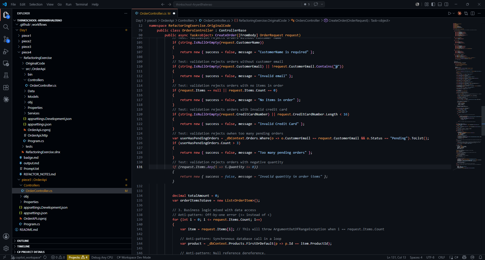

# AI Reflection

## Summary
Claude and Copilot successfully assisted in their tasks. Claude branch was merged with main. Copilot branch was not merged with main, since changes where already covered in existing code.

claude prompt:
<ide_opened_file>The user opened the file c:\Users\aryan\Desktop\thinkschool-AryanBhalerao\Day1\piece5\OrderApi\Controllers\OrderController.cs in the IDE. This may or may not be related to the current task.</ide_opened_file>Reactor the code to strategy-pattern class so new rules can be added without touching the service.

copilot suggestion screenshot:

## What did Claude Code get right?
Claude successfully refactored code with strategy-pattern class so new rules can be added without touching the service. The code was bug free and merged with main branch. It extracted each rule into its own strategy class, injected IEnumerable<IDiscountStrategy> and IEnumerable<ITaxStrategy> into the service, and registered everything in Program.cs. It also added a new rule = add one class + one DI line. Then updated OrderService to consume the strategies instead of the if/else chains. Then registered all the strategies in Program.cs. It compiled and built with zero errors.

## What did Copilot get right?
Github copilot successfully suggested a correct test case using Next Edit Suggestions. However, the comments for other test cases had to be manually editted in the same format. I did not merge this branch into main, because the specific case was already covered. Copilot did not detect any more lacking cases. I removed some cases already present in code and let copilot cover them, which successfully made copilot suggest the missing cases. Thus, in conclusion copilot successfully suggested the test cases as per comment, but cannot work with code with inconsistent comments.

## Which tool I will prefer?
I will prefer both tools and consider the initial output to decide on which tool to stick with. I have observed Claude code is very lenient with making larger edits, while Copilot tries to follow user's code. Copilot needs mmore consistent codebase, while claude can work with inconsistent code. I will prefer claude in time of rush, since it does not requiring tweaking code for inconsistencies.
