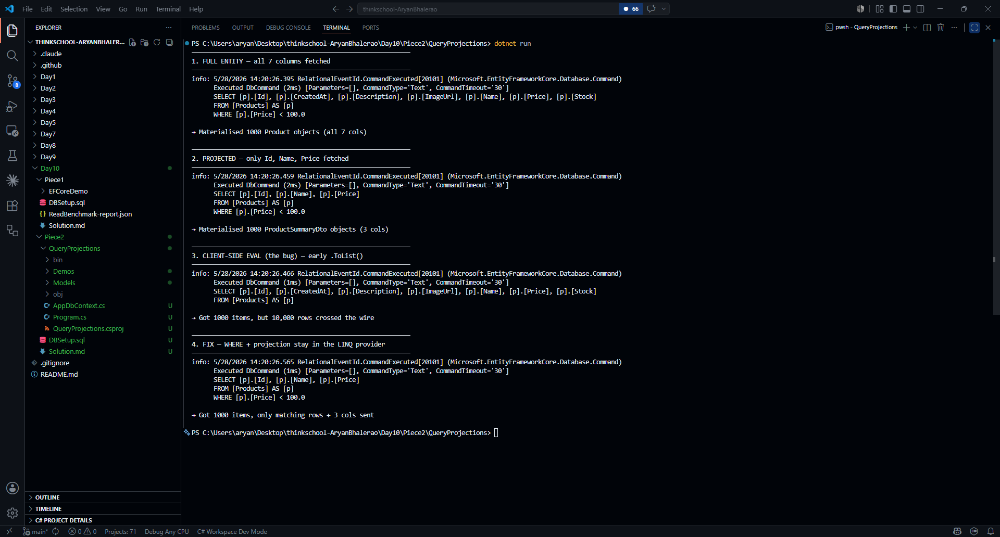

## EF Core SQL Logging Setup

Filters EF logs to SQL commands only and prints them to the console.

`QueryProjections/AppDbContext.cs`
```csharp
public static AppDbContext CreateWithLogging() =>
    new(new DbContextOptionsBuilder<AppDbContext>()
        .UseSqlServer(ConnectionString)
        .LogTo(
            Console.WriteLine,
            new[] { DbLoggerCategory.Database.Command.Name },
            LogLevel.Information)
        .EnableSensitiveDataLogging()
        .Options);
```

---

## Original SQL

Fetches every column of every matching entity from the database.

#### EF LINQ
`Demos/ProjectionDemo.cs`
```csharp
ctx.Products.Where(p => p.Price < 100m).ToList()
```

#### EF Generated SQL
```pwsh
info: 5/28/2026 14:20:26.395 RelationalEventId.CommandExecuted[20101] (Microsoft.EntityFrameworkCore.Database.Command) 
      Executed DbCommand (2ms) [Parameters=[], CommandType='Text', CommandTimeout='30']
      SELECT [p].[Id], [p].[CreatedAt], [p].[Description], [p].[ImageUrl], [p].[Name], [p].[Price], [p].[Stock]
      FROM [Products] AS [p]
      WHERE [p].[Price] < 100.0

→ Materialised 1000 Product objects (all 7 cols)
```

## Projected query

Uses `.Select()` to tell EF to fetch only the columns the DTO actually needs.

#### EF LINQ
`Demos/ProjectionDemo.cs`
```csharp
ctx.Products
    .Where(p => p.Price < 100m)
    .Select(p => new ProductSummaryDto(p.Id, p.Name, p.Price))
    .ToList()
```

#### EF Generated SQL
```pwsh
info: 5/28/2026 14:20:26.459 RelationalEventId.CommandExecuted[20101] (Microsoft.EntityFrameworkCore.Database.Command) 
      Executed DbCommand (2ms) [Parameters=[], CommandType='Text', CommandTimeout='30']
      SELECT [p].[Id], [p].[Name], [p].[Price]
      FROM [Products] AS [p]
      WHERE [p].[Price] < 100.0

→ Materialised 1000 ProductSummaryDto objects (3 cols)
```

`Description`, `ImageUrl`, `Stock`, `CreatedAt` never leave the server.

---

## Client-side evaluation

### Bug

Calling `.ToList()` mid-chain breaks out of `IQueryable`, so EF sends no `WHERE` clause and pulls the entire table into memory.

#### EF LINQ
`Demos/ProjectionDemo.cs`
```csharp
ctx.Products
    .ToList()                           // full table into memory
    .Where(p => p.Price < 100m)
    .Select(p => new ProductSummaryDto(p.Id, p.Name, p.Price))
    .ToList()
```

#### EF Generated SQL
```pwsh
info: 5/28/2026 14:20:26.466 RelationalEventId.CommandExecuted[20101] (Microsoft.EntityFrameworkCore.Database.Command) 
      Executed DbCommand (1ms) [Parameters=[], CommandType='Text', CommandTimeout='30']
      SELECT [p].[Id], [p].[CreatedAt], [p].[Description], [p].[ImageUrl], [p].[Name], [p].[Price], [p].[Stock]
      FROM [Products] AS [p]

→ Got 1000 items, but 10,000 rows crossed the wire
```

### Fix

Keep the entire chain as `IQueryable<T>` so EF translates both the filter and the projection into a single optimised SQL query.

#### EF LINQ
`Demos/ProjectionDemo.cs`
```csharp
ctx.Products
    .Where(p => p.Price < 100m)
    .Select(p => new ProductSummaryDto(p.Id, p.Name, p.Price))
    .ToList()
```

#### EF Generated SQL
```pwsh
info: 5/28/2026 14:20:26.565 RelationalEventId.CommandExecuted[20101] (Microsoft.EntityFrameworkCore.Database.Command) 
      Executed DbCommand (1ms) [Parameters=[], CommandType='Text', CommandTimeout='30']
      SELECT [p].[Id], [p].[Name], [p].[Price]
      FROM [Products] AS [p]
      WHERE [p].[Price] < 100.0

→ Got 1000 items, only matching rows + 3 cols sent
```

Output Screenshot:

