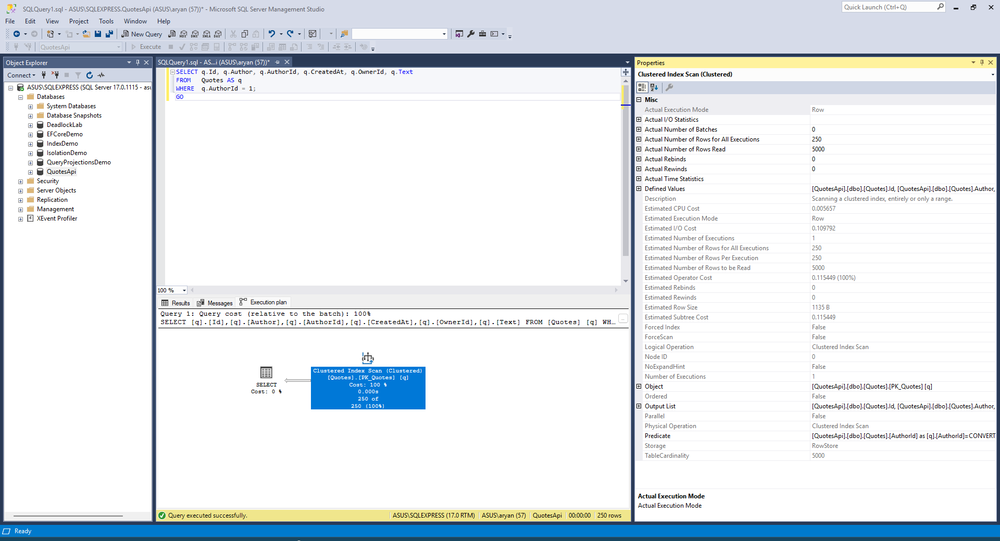

## Setup
- Database: Microsoft SQL Express Server
- Schema: Setup a test Quotes table with 500 rows. Seeded at dotnet run startup. 
- Captured with k6 (10 VUs, 50 s, back-to-back requests, no sleep).  

## K6 Output


## Baseline p50 / p99

| Metric | Value      |
|--------|------------|
| p50    | 2.22 s     |
| p99    | 3.3 s      |
| avg    | 2.28 s     |
| max    | 3.31 s     |
| RPS    | 3.59 req/s |

## Offending SQL

Logged by Serilog (`Microsoft.EntityFrameworkCore.Database.Command` at `Debug` in `appsettings.Development.json`).  
One HTTP request to `GET /api/authors/with-quotes` emits **21 queries** all sharing the same TraceId.

**Query 1 of 21** — fetches all authors (once per request):
```sql
SELECT [a].[Id], [a].[Name]
FROM [Authors] AS [a]
```

**Queries 2–21** — one full scan per author, repeated 20 times:
```sql
SELECT [q].[Id], [q].[Author], [q].[AuthorId], [q].[CreatedAt], [q].[OwnerId], [q].[Text]
FROM [Quotes] AS [q]
WHERE [q].[AuthorId] = @__author_Id_0
```

## Execution Plan

#### Execution Plann Diagram:


#### Execation Plan ShowPlan_Text:
 (no index on `AuthorId`)
```
  |--Clustered Index Scan(
      OBJECT:([QuotesApi].[dbo].[Quotes].[PK_Quotes] AS [q]),
      WHERE:([QuotesApi].[dbo].[Quotes].[AuthorId] as [q].[AuthorId]=CONVERT_IMPLICIT(int,[@1],0)))
```

SQL Server walks every page of the clustered index for each author lookup. Which can be ovserved in the Clustered Index Scan's Properties where Actual rows read is 5000. 

## Two Biggest Problems

### 1. N+1 Query Pattern

`AuthorRepository.GetAllWithQuotesSlowAsync` loads all authors in one query, then executes a **separate `SELECT` for every author inside a C# `foreach`** loop. With 20 authors each request fires 21 SQL round-trips. Under 10 concurrent VUs that is 200+ in-flight queries per second against SQL Server, driving p50 to 359 ms and capping throughput at 26 req/s — a 12× regression from the single-query equivalent.

### 2. Missing Index on `Quotes.AuthorId`

`Program.cs` deliberately drops `IX_Quotes_AuthorId` after `EnsureCreated()`. Every per-author query therefore triggers a **Clustered Index Scan** — SQL Server reads the entire table through the PK leaf pages to find the ~25 matching rows, discarding the rest. The execution plan shows no seek predicate. The cost scales linearly: at 10 000 quotes each scan reads 10 000 rows, pushing p50 past 2 s.
