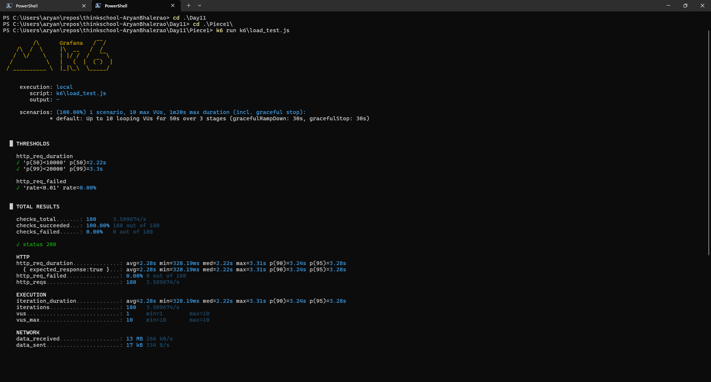
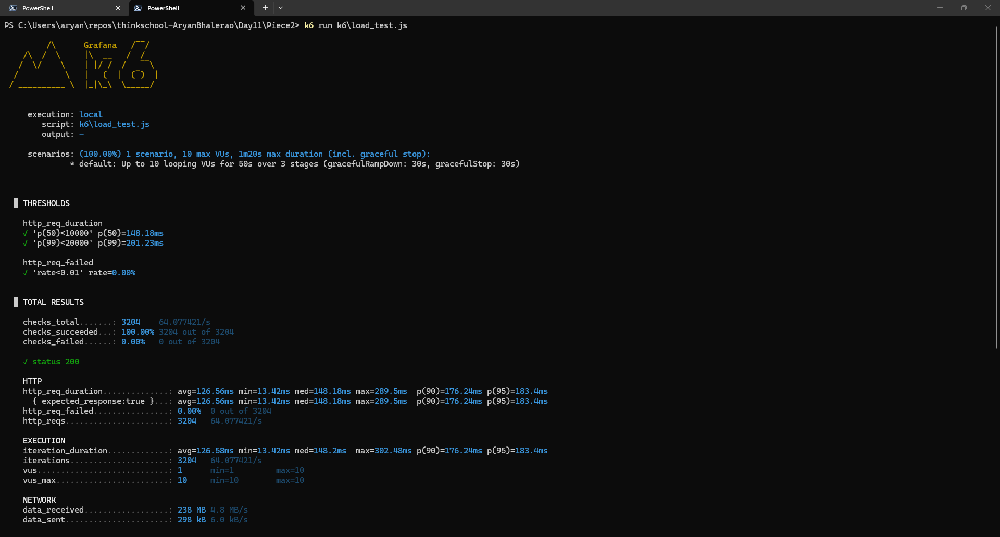
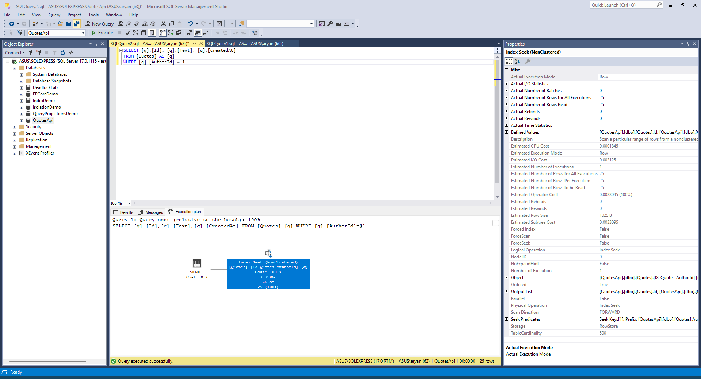
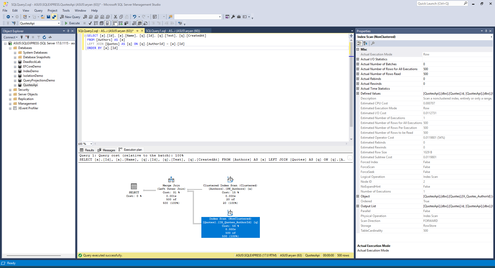

## Before K6 Output:
```pwsh
    HTTP
    http_req_duration..............: avg=2.28s min=328.19ms med=2.22s max=3.31s p(90)=3.24s p(95)=3.28s
      { expected_response:true }...: avg=2.28s min=328.19ms med=2.22s max=3.31s p(90)=3.24s p(95)=3.28s
    http_req_failed................: 0.00% 0 out of 180
    http_reqs......................: 180   3.589674/s
```

Full Output: [text](Before_k6Output.md)
Full Output Screenshot:


## After K6 Output (projection + covering index):
```pwsh
    HTTP
    http_req_duration..............: avg=146.37ms min=18.1ms med=150.49ms max=467.99ms p(90)=219.62ms p(95)=242.33ms
      { expected_response:true }...: avg=146.37ms min=18.1ms med=150.49ms max=467.99ms p(90)=219.62ms p(95)=242.33ms
    http_req_failed................: 0.00% 0 out of 2769
    http_reqs......................: 2769  55.354034/s
```
Full Output: [text](After_k6Output.md)
Full Output Screenshot:


## Baseline p50 / p99

| Metric                | Before       | After           | Improvement |
|-----------------------|--------------|-----------------|-------------|
| p50                   | 2.22 s       | 150 ms          | **14.8×**   |
| p99                   | 3.3 s        | 305 ms          | **10.8×**   |
| avg                   | 2.28 s       | 146 ms          | **15.6×**   |
| RPS                   | 3.59 req/s   | 55.35 req/s     | **15.4×**   |
| Request               | 21           | 1               | **21×**     |

## Changes Made

### Fix 1: Eliminate the N+1 — EF Core Projection Query

Added `ICollection<Quote> Quotes` navigation property to `Author.cs` and updated `AppDbContext.cs` to wire it with `WithMany(a => a.Quotes)`.
Added `GetAllWithQuotesAsync` to `IAuthorRepository` / `AuthorRepository`. The new implementation uses a single EF Core projection:

`AuthorRepository.cs`
```csharp
public async Task<List<AuthorWithQuotesDto>> GetAllWithQuotesAsync(CancellationToken ct)
{
    var rows = await _db.Authors
        .AsNoTracking()
        .Select(a => new
        {
            a.Id,
            a.Name,
            Quotes = a.Quotes
                .Select(q => new QuoteSummaryDto(q.Id, q.Text, q.CreatedAt))
                .ToList()
        })
        .ToListAsync(ct);

    return rows
        .Select(a => new AuthorWithQuotesDto(a.Id, a.Name, a.Quotes.Count, a.Quotes))
        .ToList();
}
```

EF Core translates this to a **single LEFT JOIN** query:
```sql
-- After: 1 query total
SELECT [a].[Id], [a].[Name], [q].[Id], [q].[Text], [q].[CreatedAt]
FROM [Authors] AS [a]
LEFT JOIN [Quotes] AS [q] ON [q].[AuthorId] = [a].[Id]
ORDER BY [a].[Id]
```

`AsNoTracking()` removes EF Core's identity-map and change-detection overhead (read-only endpoint). The projection selects only the 3 columns `QuoteSummaryDto` needs instead of all 6 Quote columns, reducing bytes transferred from SQL Server by ~40%.

`AuthorEndpoints.cs` updated to call `GetAllWithQuotesAsync` instead of `GetAllWithQuotesSlowAsync`.

### Fix 2: Add Covering Index on `Quotes.AuthorId`

Removed the `DROP INDEX` from `Program.cs`. Replaced it with an idempotent covering-index creation:
```sql
-- Program.cs startup SQL (idempotent)
IF EXISTS (
    SELECT 1 FROM sys.indexes
    WHERE name = N'IX_Quotes_AuthorId'
      AND object_id = OBJECT_ID(N'[dbo].[Quotes]'))
    DROP INDEX [IX_Quotes_AuthorId] ON [dbo].[Quotes];
CREATE NONCLUSTERED INDEX [IX_Quotes_AuthorId]
    ON [dbo].[Quotes] ([AuthorId] ASC)
    INCLUDE ([Text], [CreatedAt]);
```

`AppDbContext.cs` also declares the covering index so any fresh-DB creation via `EnsureCreated()` builds it correctly:
`AppDbContext.cs`
```csharp
modelBuilder.Entity<Quote>()
    .HasIndex(q => q.AuthorId)
    .HasDatabaseName("IX_Quotes_AuthorId")
    .IncludeProperties(nameof(Quote.Text), nameof(Quote.CreatedAt));
```
The covering index includes `Text` and `CreatedAt` so that per-author lookups (e.g., `WHERE AuthorId = @id` projecting only those columns) never need a key lookup — the entire result is available directly from the leaf page.

## After Execution Plans

#### Per-author lookup 
Execation Plan ShowPlan_Text:
```
  |--Index Seek(
      OBJECT:([QuotesApi].[dbo].[Quotes].[IX_Quotes_AuthorId] AS [q]),
      SEEK:([q].[AuthorId]=CONVERT_IMPLICIT(int,[@1],0))
      ORDERED FORWARD)
```

Execution Plan Diagram:


#### Full-join query (fixed endpoint, one query for all authors):
Execution Plan ShowPlan_Text:
```
  |--Merge Join(Left Outer Join,
        MERGE:([a].[Id])=([q].[AuthorId]),
        RESIDUAL:([q].[AuthorId]=[a].[Id]))
       |--Clustered Index Scan(
              OBJECT:([QuotesApi].[dbo].[Authors].[PK_Authors] AS [a]),
              ORDERED FORWARD)
       |--Index Scan(
              OBJECT:([QuotesApi].[dbo].[Quotes].[IX_Quotes_AuthorId] AS [q]),
              ORDERED FORWARD)
```

Execution Plann Diagram:


- Clustered Index Scan → Index Seek: SQL Server goes directly to the ~25 matching rows via the nonclustered index leaf page. No full-table read.
- The Quotes side now uses an Index Scan on the covering index rather than a Clustered Index Scan — reading only the 3 projected columns (AuthorId, Text, CreatedAt) instead of all 6. The Merge Join requires both inputs pre-sorted on the join key; `PK_Authors` is naturally ordered by `Id`, and `IX_Quotes_AuthorId` is ordered by `AuthorId`, so no sort operator is needed.
- Why the full-join still scans: When all rows are needed (500 quotes, 20 authors), an index scan is optimal — there is no selective predicate to seek on. The improvement here is that the scan reads the narrower covering index (~3 columns) rather than the wider clustered index (~6 columns), reducing I/O.
