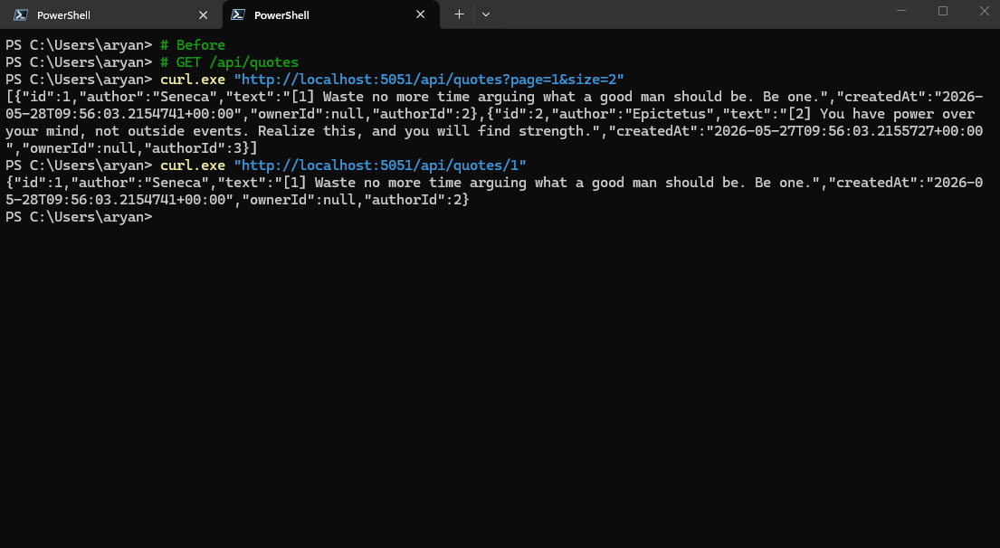
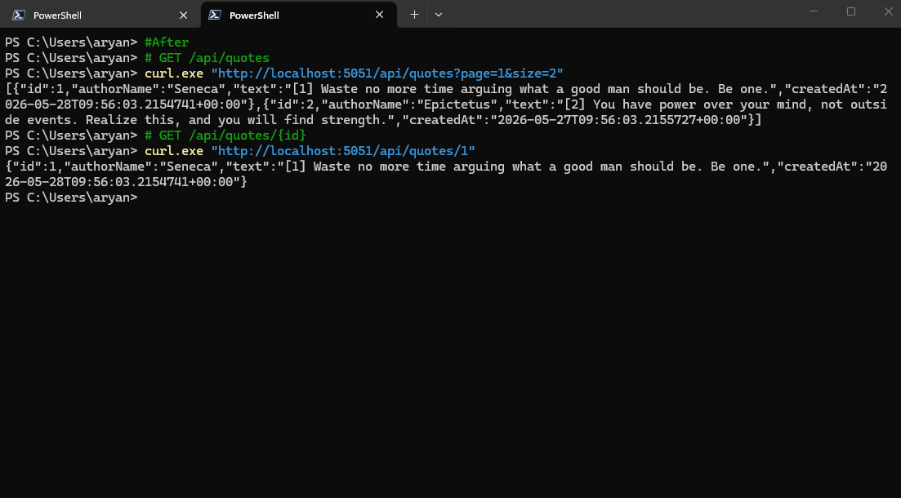

## Command handler

`Commands/CreateQuoteCommandHandler.cs`
```csharp
public class CreateQuoteCommandHandler
{
    private readonly IQuoteRepository _repo;
    private readonly IClock _clock;

    public CreateQuoteCommandHandler(IQuoteRepository repo, IClock clock)
    {
        _repo = repo;
        _clock = clock;
    }

    public async Task<(int? QuoteId, Dictionary<string, string[]>? Errors)> HandleAsync(
        CreateQuoteCommand command, CancellationToken ct)
    {
        var errors = Validate(command);
        if (errors.Count > 0)
            return (null, errors);

        var quote = new Quote
        {
            Author = command.Author,
            Text = command.Text,
            OwnerId = command.OwnerId
        };

        var created = await _repo.CreateAsync(quote, ct);
        return (created.Id, null);
    }

    private static Dictionary<string, string[]> Validate(CreateQuoteCommand cmd)
    {
        var errors = new Dictionary<string, string[]>();

        if (string.IsNullOrWhiteSpace(cmd.Author))
            errors["author"] = ["Author is required"];
        else if (cmd.Author.Length > Quote.AuthorMaxLength)
            errors["author"] = [$"Author must be {Quote.AuthorMaxLength} characters or fewer"];

        if (string.IsNullOrWhiteSpace(cmd.Text))
            errors["text"] = ["Text is required"];
        else if (cmd.Text.Length > Quote.TextMaxLength)
            errors["text"] = [$"Text must be {Quote.TextMaxLength} characters or fewer"];

        return errors;
    }
}
```

## Query / read model

`Queries/QuoteReadModel.cs`
```csharp
public record QuoteReadModel(int Id, string AuthorName, string Text, DateTimeOffset CreatedAt);
```
`Queries/QuoteQueryService.cs`
```csharp
public class QuoteQueryService : IQuoteQueryService
{
    private readonly AppDbContext _db;

    public QuoteQueryService(AppDbContext db) => _db = db;

    public async Task<List<QuoteReadModel>> GetPagedAsync(int page, int size, CancellationToken ct)
    {
        return await _db.Quotes
            .OrderByDescending(q => q.CreatedAt)
            .Skip((page - 1) * size)
            .Take(size)
            .Select(q => new QuoteReadModel(q.Id, q.Author, q.Text, q.CreatedAt))
            .ToListAsync(ct);
    }

    public async Task<QuoteReadModel?> GetByIdAsync(int id, CancellationToken ct)
    {
        return await _db.Quotes
            .Where(q => q.Id == id)
            .Select(q => new QuoteReadModel(q.Id, q.Author, q.Text, q.CreatedAt))
            .FirstOrDefaultAsync(ct);
    }
}
```

## Changes made

- **Commands/CreateQuoteCommand.cs** — new record holding the write-side input (`Author`, `Text`, `OwnerId`)
- **Commands/CreateQuoteCommandHandler.cs** — new handler: validates the command, builds the `Quote` entity, persists via `IQuoteRepository`, returns `(QuoteId, Errors?)`
- **Queries/QuoteReadModel.cs** — new projection record (`Id`, `AuthorName`, `Text`, `CreatedAt`) shaped for the list/detail screen
- **Queries/IQuoteQueryService.cs** — new interface for the read path (`GetPagedAsync`, `GetByIdAsync`)
- **Queries/QuoteQueryService.cs** — new implementation: queries `AppDbContext` with `.Select()` projection, never hydrates write-side fields
- **Endpoints/QuoteEndpoints.cs** — GET endpoints now inject `IQuoteQueryService`; POST maps `CreateQuoteRequest` → `CreateQuoteCommand` → handler
- **Extensions/InfrastructureExtensions.cs** — registered `CreateQuoteCommandHandler` (scoped) and `IQuoteQueryService → QuoteQueryService` (scoped)

## Read Queries

### Before

Curl:

```pwsh
# GET /api/quotes
curl.exe "http://localhost:5051/api/quotes?page=1&size=2"
[{"id":1,"author":"Seneca","text":"[1] Waste no more time arguing what a good man should be. Be one.","createdAt":"2026-05-28T09:56:03.2154741+00:00","ownerId":null,"authorId":2},{"id":2,"author":"Epictetus","text":"[2] You have power over your mind, not outside events. Realize this, and you will find strength.","createdAt":"2026-05-27T09:56:03.2155727+00:00","ownerId":null,"authorId":3}]

# GET /api/quotes/{id}
curl.exe "http://localhost:5051/api/quotes/1"
{"id":1,"author":"Seneca","text":"[1] Waste no more time arguing what a good man should be. Be one.","createdAt":"2026-05-28T09:56:03.2154741+00:00","ownerId":null,"authorId":2}
```

Screenshot:


Both GET endpoints injected `IQuoteRepository` and returned raw `Quote` entities.

EF LINQ
```csharp
// GET /api/quotes
var quotes = await repository.GetPagedAsync(page, size, ct);
return Results.Ok(quotes);
// response: [{ "id":1, "author":"Seneca", "text":"...", "createdAt":"...", "ownerId":42, "authorId":7 }, ...]

// GET /api/quotes/{id}
var quote = await repository.GetByIdAsync(id, ct);
return quote is null ? Results.NotFound() : Results.Ok(quote);
// response: { "id":1, "author":"Seneca", "text":"...", "createdAt":"...", "ownerId":42, "authorId":7 }
```

EF loaded every column; `OwnerId` and `AuthorId` travelled over the wire even though no screen uses them.

SQL
```sql
-- GET /api/quotes  (no explicit ORDER BY → EF emits ORDER BY (SELECT 1))
SELECT [q].[Id], [q].[Author], [q].[AuthorId], [q].[CreatedAt], [q].[OwnerId], [q].[Text]
FROM [Quotes] AS [q]
ORDER BY (SELECT 1)
OFFSET @__p_0 ROWS FETCH NEXT @__p_1 ROWS ONLY

-- GET /api/quotes/{id}
SELECT TOP(1) [q].[Id], [q].[Author], [q].[AuthorId], [q].[CreatedAt], [q].[OwnerId], [q].[Text]
FROM [Quotes] AS [q]
WHERE [q].[Id] = @__id_0
```

### After

Curl:

```pwsh
# GET /api/quotes
curl.exe "http://localhost:5051/api/quotes?page=1&size=2"
[{"id":1,"authorName":"Seneca","text":"[1] Waste no more time arguing what a good man should be. Be one.","createdAt":"2026-05-28T09:56:03.2154741+00:00"},{"id":2,"authorName":"Epictetus","text":"[2] You have power over your mind, not outside events. Realize this, and you will find strength.","createdAt":"2026-05-27T09:56:03.2155727+00:00"}]

# GET /api/quotes/{id}
curl.exe "http://localhost:5051/api/quotes/1"
{"id":1,"authorName":"Seneca","text":"[1] Waste no more time arguing what a good man should be. Be one.","createdAt":"2026-05-28T09:56:03.2154741+00:00"}
```

Screenshot:


Both GET endpoints inject `IQuoteQueryService` and return projected `QuoteReadModel` records:

EF Core LINQ:
```csharp
// GET /api/quotes
var quotes = await queries.GetPagedAsync(page, size, ct);
return Results.Ok(quotes);
// response: [{ "id":1, "authorName":"Seneca", "text":"...", "createdAt":"..." }, ...]

// GET /api/quotes/{id}
var quote = await queries.GetByIdAsync(id, ct);
return quote is null ? Results.NotFound() : Results.Ok(quote);
// response: { "id":1, "authorName":"Seneca", "text":"...", "createdAt":"..." }
```

The `.Select()` projection tells EF exactly which columns to fetch:

SQL:
```sql
-- GET /api/quotes
SELECT [q].[Id], [q].[Author], [q].[Text], [q].[CreatedAt]
FROM [Quotes] AS [q]
ORDER BY [q].[CreatedAt] DESC
OFFSET @__p_0 ROWS FETCH NEXT @__p_1 ROWS ONLY

-- GET /api/quotes/{id}
SELECT TOP(1) [q].[Id], [q].[Author], [q].[Text], [q].[CreatedAt]
FROM [Quotes] AS [q]
WHERE [q].[Id] = @__id_0
```

`OwnerId` and `AuthorId` are absent from both queries — never read from disk, never serialized.

## What got simpler

Before the split, both GET endpoints returned the full `Quote` entity (`OwnerId`, `AuthorId`, `Author`, `Text`, `CreatedAt`, `Id`); after, `QuoteQueryService` projects only the four display fields in SQL via `.Select()`, so write-side internals never leave the database or appear on the wire.
