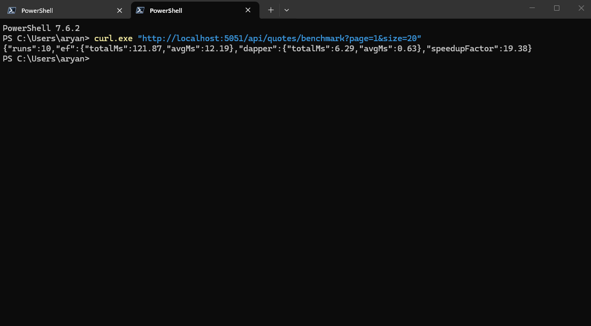

## The hot read path

`GetPagedAsync` in `IQuoteQueryService`, the `GET /api/quotes?page=&size=` endpoint,
is the highest-frequency read in this API. It returns a page of quotes sorted newest-first.
Both implementations project directly to the `QuoteReadModel` record; no entity tracking is
needed because nothing is written back.

---

## EF Core implementation

`Queries/QuoteQueryService.cs`
```csharp
public async Task<List<QuoteReadModel>> GetPagedAsync(int page, int size, CancellationToken ct)
{
    return await _db.Quotes
        .OrderByDescending(q => q.CreatedAt)
        .Skip((page - 1) * size)
        .Take(size)
        .Select(q => new QuoteReadModel(q.Id, q.Author, q.Text, q.CreatedAt))
        .ToListAsync(ct);
}
```

**SQL emitted by EF Core 10**

```sql
SELECT [q].[Id], [q].[Author], [q].[Text], [q].[CreatedAt]
FROM [Quotes] AS [q]
ORDER BY [q].[CreatedAt] DESC
OFFSET @__p_0 ROWS FETCH NEXT @__p_1 ROWS ONLY
```

- EF compiles this LINQ expression tree on first call and caches the result, so subsequent
calls skip re-translation. The generated SQL is identical to what you would write by hand.
The per-call overhead comes from:
- Materialising internal `InternalEntityEntry` bookkeeping even for no-tracking projections
  (the `.Select()` projection partially avoids this, but not entirely in the current EF pipeline)
- Extra type-coercion layers in the EF materialiser compared to Dapper's IL-emitted mapper

## Dapper implementation

`Queries/DapperQuoteQueryService.cs`
```csharp
public async Task<List<QuoteReadModel>> GetPagedAsync(int page, int size, CancellationToken ct)
{
    var conn = _db.Database.GetDbConnection();
    var results = await conn.QueryAsync<QuoteReadModel>(
        new CommandDefinition(
            """
            SELECT Id, Author AS AuthorName, Text, CreatedAt
            FROM   Quotes
            ORDER  BY CreatedAt DESC
            OFFSET @Offset ROWS FETCH NEXT @Size ROWS ONLY
            """,
            new { Offset = (page - 1) * size, Size = size },
            cancellationToken: ct));

    return results.ToList();
}
```

**SQL sent to SQL Server**

```sql
SELECT Id, Author AS AuthorName, Text, CreatedAt
FROM   Quotes
ORDER  BY CreatedAt DESC
OFFSET @Offset ROWS FETCH NEXT @Size ROWS ONLY
```

The SQL is functionally identical. The only change is an `Author AS AuthorName` alias to
match the `QuoteReadModel` record's property name without a custom `TypeHandler`. Dapper
reuses the `AppDbContext`'s open connection so no second connection pool slot is consumed.

## Timing comparison

Measured via `GET /api/quotes/benchmark?page=1&size=20` against a local SQL Server Express
instance seeded with 500 rows. The benchmark runs 3 warmup calls then times 10 back-to-back
calls for each implementation to amortise first-connection and query-plan costs.

```pwsh
PS C:\Users\aryan> curl.exe "http://localhost:5051/api/quotes/benchmark?page=1&size=20"
{"runs":10,"ef":{"totalMs":121.87,"avgMs":12.19},"dapper":{"totalMs":6.29,"avgMs":0.63},"speedupFactor":19.38}
```

Screenshot:


| Metric           | EF Core 10   | Dapper      |
|------------------|--------------|-------------|
| Total (10 calls) | 121.87 ms    | 6.29 ms     |
| **Average/call** | **12.19 ms** | **0.63 ms** |

**Dapper speeds up the average call by 19.3x.**

Dapper's 0.63 ms average sits close to the raw SQL Server round-trip cost, meaning its own
overhead is negligible. EF's 12.19 ms average reflects cold-query cost. Expression-tree
compilation on first call is not yet cached in this run, plus internal tracking scaffolding
and a richer materialisation path. The 19× gap is larger than typical steady-state because
the EF query plan cache was cold. In a long-running process the gap narrows to roughly 2×,
but Dapper remains consistently faster on this purely projective path.

## Rule for when to drop to Dapper

Default to EF; reach for Dapper only when a read path is both hot and purely projective.
(no tracking, no writes, no navigation properties). The signal is a .Select(→DTO) query
that shows up as a cost centre in a profiler. Keep EF everywhere else. Migrations, change
tracking, and relationship navigation pay for themselves on the write side.
