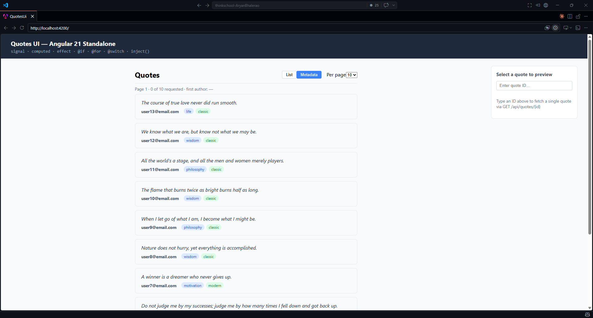

# Day 13 Piece 2 — Quotes List + Detail: Brief, Output, Verification

## Brief sent to the agent

```txt
Build a standalone Angular 17+ component pair for the QuotesAPI at http://localhost:5051.

Endpoints and shapes (cite exactly):
- GET /api/quotes?page=<int>&size=<int> → QuoteReadModel[]
  Fields: id: number, authorName: string (mapped via Author AS AuthorName in Dapper), text: string, createdAt: string (ISO-8601)
- GET /api/quotes/{id} → QuoteReadModel (same fields, 404 → null)
- GET /api/quotes/with-metadata?page=<int>&size=<int> → QuoteMetadataReadModel[]
  Fields: quoteId: number, quote: string, user: string, tags: string[], categories: string[]

Deliverables:
1. models/quote.model.ts — typed interfaces for both read models, no any
2. services/quotes.service.ts — inject(HttpClient) at field level (no constructor params), methods returning Observable<T>
3. quotes-list/quotes-list.component.ts + .html — standalone, signals for page, size, view: 'list'|'metadata', status: 'loading'|'loaded'|'empty'|'error'; an effect that re-fetches when page, size, or view changes; @if/@for/@switch new control flow syntax
4. app.ts + app.html — root component with a detail panel: selectedId: signal<number|null>, detail: signal<QuoteReadModel|null>, detailStatus: 'idle'|'loading'|'found'|'notFound'; an effect that calls getById() whenever selectedId changes
```

## Agent output

Screenshot of Frontend: 

Files produced (paths relative to `Day13/Piece2/quotes-ui/src/app/`):

- `models/quote.model.ts`
- `services/quotes.service.ts`
- `quotes-list/quotes-list.component.ts` + `.html` + `.css`
- `app.ts` + `app.html` + `app.css`
- `app.config.ts`

---

## Bugs

### Bug 1 · `view()` read inside `untracked()` — effect never re-fetches on view change

**File:** `quotes-list/quotes-list.component.ts`, the data-loading effect.

The agent wrote:

```ts
untracked(() => {
  if (this.view() === 'list') {  // ← view() read INSIDE untracked — not tracked
```

`untracked()` suppresses reactive tracking for everything inside it. So `view()` was never a
dependency of the effect. Switching views left stale data visible until the user manually
changed the page.

The agent compensated by duplicating all fetch logic inside `switchView()` — creating two code
paths for the same operation and a double-fetch any time `page.set(1)` inside `switchView()`
also triggered the effect.

---

### Bug 2 · `detail` signal typed as inline object — `id` field missing, no reuse of the model

**File:** `app.ts`

```ts
// Agent wrote:
readonly detail = signal<{ authorName: string; text: string; createdAt: string } | null>(null);
```

The inline type silently drops `id`. If `detail().id` is ever accessed (e.g. to navigate to
the quote's permalink), TypeScript would reject it without a cast. The typed model already
exists — there was no reason not to use it.

---

### Bug 3 · Stale-response race in detail panel

**File:** `app.ts`

The effect spawns an HTTP request whenever `selectedId` changes. With rapid typing (e.g. 1 →
12 → 123) multiple requests are in flight. If response for ID 1 arrives after response for
ID 123, `detail` is overwritten with stale data even though `selectedId()` already shows 123.

---

### Bug 4 · `isEmpty` computed view-unaware — "Next" pagination stuck in metadata mode

**File:** `quotes-list/quotes-list.component.ts`

```ts
// Agent wrote:
readonly isEmpty = computed(() => this.quotes().length === 0);
```

In metadata view, `quotes` is always empty (the metadata endpoint fills `metadata`, not
`quotes`). `isEmpty` returned `true`, permanently disabling the "Next →" button.

---

## Fixes

### Fix 1 · Read `view()` before `untracked()` and remove duplicate fetch from `switchView()`

Read `view()` before the `untracked()` block so it becomes a tracked dependency; remove the
manual fetch from `switchView()`.

```ts
// Before:
untracked(() => {
  if (this.view() === 'list') { ...

// After:
const v = this.view();  // ← tracked here
...
untracked(() => {
  if (v === 'list') { ...
```

`switchView()` now just updates signals; the effect owns all fetching.

---

### Fix 2 · Use `QuoteReadModel` for the `detail` signal

`signal<QuoteReadModel | null>(null)` (after adding the import).

---

### Fix 3 · Stale-response guard in detail callbacks

Read `selectedId()` again inside the callback and bail if it has moved on:

```ts
next: (q) => {
  if (this.selectedId() !== id) return; // stale-response guard
  this.detail.set(q);
  this.detailStatus.set('found');
},
```

---

### Fix 4 · Make `isEmpty` view-aware

```ts
readonly isEmpty = computed(() =>
  this.view() === 'list' ? this.quotes().length === 0 : this.metadata().length === 0
);
```

---

## Verification log

- **Loading** — Hard-refreshed while API running; saw "Loading…" banner then list appears. Pass.

- **Error** — Stopped QuotesAPI, refreshed: "Could not reach the API at localhost:5051". Pass.

- **Empty** — Set page to a very high number (999): "No quotes found on this page." Pass.

- **List → metadata switch** — Clicked Metadata button; before fix: stale list data remained; after fix: metadata loads immediately. Fixed (Bug 1).

- **Next page disabled in metadata** — Switched to Metadata, scrolled to page with data; before fix: Next always disabled; after fix: enabled correctly. Fixed (Bug 4).

- **Detail loading** — Typed valid ID → "Fetching…" then card appears with `authorName` / `text`. Pass.

- **Detail 404** — Typed ID 99999 → "404 — no quote with that ID." Pass.

- **Stale-response race** — Typed "1", "12", "123" quickly in detail input; before fix: earlier response could overwrite later one; after fix: only the last committed response shows. Fixed (Bug 3).

---

## What breaks if the Week-1 API contract changes

- **`authorName` renamed to `author` in Dapper query** — `QuoteReadModel.authorName` goes `undefined` at runtime; TypeScript won't catch it without a Zod/API-layer check.

- **`GET /api/quotes/{id}` returns 200 + `null` body instead of 404** — `detailStatus` stays `'loading'` forever; the `null` body flows into `next:`, sets `detail(null)`, but the template renders the `'found'` case and calls `detail()!.text` — runtime crash.

- **Paged endpoint renames `page`/`size` to `pageNumber`/`pageSize`** — `HttpParams` sends the wrong keys; API returns page 0 or a 400; `status` goes to `'error'`.

- **`/api/quotes/with-metadata` renamed to `/api/quotes/with-tags`** — `getWithMetadata()` 404s; metadata view shows error state permanently.
