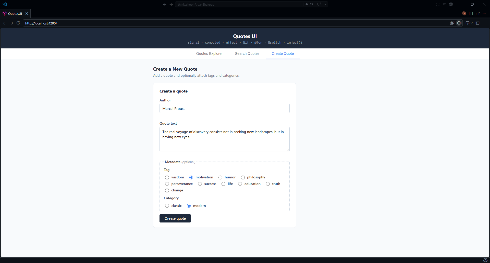

# Create-Quote Form — Agent Spec, Output, and Verification

## 1. Brief — the spec given to the agent

```text
"
Build a reactive Angular 21 form component (CreateQuoteFormComponent) that:

Step 1 — creates the quote:
  POST http://localhost:5051/api/quotes
  Authorization: Bearer <jwt from localStorage>
  Content-Type: application/json
  Body: { "author": "string", "text": "string" }

  Success: 201 Created, body { "id": number } — the SQL Server identity column value.
  Error:   400 Bad Request, RFC 7807 body { "title": "string", "errors": { "fieldName": ["message"] } }.

Step 2 — if a tag or category was selected, assign metadata:
  POST http://localhost:5051/api/quotes/{id}/metadata
  Content-Type: application/json
  Body: { "tags": ["string"], "categories": ["string"] }

  Both arrays contain at most one element (the DB enforces one tag and one category per quote).
  If this call fails the quote is already created — surface a warning but treat the overall
  flow as a partial success.

Form fields:
  author    text input   required   max 100 chars
  text      textarea     required   max 1000 chars
  tag       radio group  optional   one of the 10 seeded values
  category  radio group  optional   "classic" or "modern" only

Seeded tag values (from DbSetupSeedSql.cs, lines 212-222):
  wisdom, motivation, humor, philosophy, perseverance,
  success, life, education, truth, change

Behaviour requirements:
- Angular reactive form (FormBuilder, FormGroup) with controls for author and text only.
  Tag/category are not form controls — tracked via signal<string | null> because they are
  radio selections from a fixed list, not free text.
- Client-side validators: author → required + maxLength(100); text → required + maxLength(1000).
- On invalid submit: markAllAsTouched(), focus the first invalid field.
- Submit status signal: idle → submitting → success | error.
  Button disabled + aria-busy while submitting.
- On success: display the new quote ID, reset the form, clear both radio signals.
- On partial success (quote ok, metadata failed): display a warning alongside the success message.
- Full a11y: <label for> on every input; error <span> elements always in the DOM
  (aria-describedby never dangling); aria-live="polite" on error spans;
  aria-invalid="true" only when invalid AND touched (not "false" when valid);
  server errors in role="alert"; success in role="status";
  focus-visible ring on submit button.
"
```

## 2 Agent output — the form component and template

### Screenshot: 

2.1 **`src/app/create-quote-form/create-quote-form.component.ts`**

```typescript
import { Component, ElementRef, inject, signal, viewChild } from '@angular/core';
import { FormBuilder, ReactiveFormsModule, Validators } from '@angular/forms';
import { catchError, map, of, switchMap } from 'rxjs';
import { QuotesService } from '../services/quotes.service';

type SubmitStatus = 'idle' | 'submitting' | 'success' | 'error';

@Component({
  selector: 'app-create-quote-form',
  imports: [ReactiveFormsModule],
  templateUrl: './create-quote-form.component.html',
  styleUrl: './create-quote-form.component.css',
})
export class CreateQuoteFormComponent {
  private readonly fb = inject(FormBuilder);
  private readonly svc = inject(QuotesService);

  readonly form = this.fb.group({
    author: ['', [Validators.required, Validators.maxLength(100)]],
    text: ['', [Validators.required, Validators.maxLength(1000)]],
  });

  readonly availableTags = ['wisdom', 'motivation', 'humor', 'philosophy', 'perseverance', 'success', 'life', 'education', 'truth', 'change'];
  readonly availableCategories = ['classic', 'modern'];

  readonly selectedTag = signal<string | null>(null);
  readonly selectedCategory = signal<string | null>(null);

  readonly submitStatus = signal<SubmitStatus>('idle');
  readonly newQuoteId = signal<number | null>(null);
  readonly serverError = signal<string | null>(null);
  readonly metadataError = signal<string | null>(null);

  readonly authorInput = viewChild<ElementRef<HTMLInputElement>>('authorInput');
  readonly textInput = viewChild<ElementRef<HTMLTextAreaElement>>('textInput');

  get author() { return this.form.controls.author; }
  get text() { return this.form.controls.text; }

  selectTag(tag: string) { this.selectedTag.set(tag); }
  selectCategory(cat: string) { this.selectedCategory.set(cat); }

  submit() {
    this.form.markAllAsTouched();

    if (this.form.invalid) {
      if (this.author.invalid) {
        this.authorInput()?.nativeElement.focus();
      } else if (this.text.invalid) {
        this.textInput()?.nativeElement.focus();
      }
      return;
    }

    this.submitStatus.set('submitting');
    this.serverError.set(null);
    this.metadataError.set(null);
    this.newQuoteId.set(null);

    const parsedTags = this.selectedTag() ? [this.selectedTag()!] : [];
    const parsedCategories = this.selectedCategory() ? [this.selectedCategory()!] : [];
    const hasMetadata = parsedTags.length > 0 || parsedCategories.length > 0;

    this.svc
      .create(this.author.value!, this.text.value!)
      .pipe(
        switchMap((res) => {
          if (!hasMetadata) return of({ id: res.id, metaOk: true });
          return this.svc.assignMetadata(res.id, parsedTags, parsedCategories).pipe(
            map(() => ({ id: res.id, metaOk: true })),
            catchError(() => of({ id: res.id, metaOk: false })),
          );
        }),
      )
      .subscribe({
        next: ({ id, metaOk }) => {
          this.newQuoteId.set(id);
          this.submitStatus.set('success');
          if (!metaOk) {
            this.metadataError.set(
              'Quote created but metadata could not be saved — you can retry by re-submitting with the same ID.',
            );
          }
          this.form.reset();
          this.selectedTag.set(null);
          this.selectedCategory.set(null);
        },
        error: (err) => {
          const detail = err?.error?.errors
            ? Object.values(err.error.errors as Record<string, string[]>)
                .flat()
                .join(' ')
            : (err?.error?.title ?? 'Failed to create quote. Please try again.');
          this.serverError.set(detail);
          this.submitStatus.set('error');
        },
      });
  }
}
```

2.2 **`src/app/create-quote-form/create-quote-form.component.html`**

```html
<section class="create-form" aria-labelledby="create-form-title">
  <h2 id="create-form-title">Create a quote</h2>

  <form [formGroup]="form" (ngSubmit)="submit()" novalidate>

    <div class="field">
      <label for="cf-author">Author</label>
      <input
        id="cf-author"
        #authorInput
        type="text"
        formControlName="author"
        autocomplete="off"
        [attr.aria-invalid]="author.invalid && author.touched ? 'true' : null"
        aria-describedby="cf-author-error"
      />
      <span id="cf-author-error" class="field-error" aria-live="polite">
        @if (author.invalid && author.touched) {
          @if (author.errors?.['required']) { Author is required. }
          @else if (author.errors?.['maxlength']) { Author must be 100 characters or fewer. }
        }
      </span>
    </div>

    <div class="field">
      <label for="cf-text">Quote text</label>
      <textarea
        id="cf-text"
        #textInput
        formControlName="text"
        rows="4"
        [attr.aria-invalid]="text.invalid && text.touched ? 'true' : null"
        aria-describedby="cf-text-error"
      ></textarea>
      <span id="cf-text-error" class="field-error" aria-live="polite">
        @if (text.invalid && text.touched) {
          @if (text.errors?.['required']) { Quote text is required. }
          @else if (text.errors?.['maxlength']) { Quote text must be 1000 characters or fewer. }
        }
      </span>
    </div>

    <fieldset class="metadata-fieldset">
      <legend>Metadata <span class="optional">(optional)</span></legend>

      <div class="field">
        <span class="group-label">Tag</span>
        <div class="radio-group">
          @for (tag of availableTags; track tag) {
            <label class="radio-item">
              <input
                type="radio"
                name="tag"
                [value]="tag"
                [checked]="selectedTag() === tag"
                (change)="selectTag(tag)"
              />
              {{ tag }}
            </label>
          }
        </div>
      </div>

      <div class="field">
        <span class="group-label">Category</span>
        <div class="radio-group">
          @for (cat of availableCategories; track cat) {
            <label class="radio-item">
              <input
                type="radio"
                name="category"
                [value]="cat"
                [checked]="selectedCategory() === cat"
                (change)="selectCategory(cat)"
              />
              {{ cat }}
            </label>
          }
        </div>
      </div>
    </fieldset>

    @if (submitStatus() === 'error') {
      <p class="server-error" role="alert">{{ serverError() }}</p>
    }

    @if (metadataError()) {
      <p class="metadata-warning" role="alert">{{ metadataError() }}</p>
    }

    @if (submitStatus() === 'success') {
      <p class="success-msg" role="status">
        Quote #{{ newQuoteId() }} created — paste that ID into Search Quotes to preview it.
      </p>
    }

    <button
      type="submit"
      [disabled]="submitStatus() === 'submitting'"
      [attr.aria-busy]="submitStatus() === 'submitting' ? 'true' : null"
    >
      @if (submitStatus() === 'submitting') { Saving… } @else { Create quote }
    </button>

  </form>
</section>
```

---

## 3 Verification log

### 3.1 States and edges exercised

1. **Empty submit** — clicked "Create quote" with both fields blank; both `cf-author-error` and `cf-text-error` spans populated, `aria-invalid="true"` set on both inputs, focus moved to Author field.

2. **Author too long** — pasted a 101-character string and tabbed away; "Author must be 100 characters or fewer" appeared via `aria-live="polite"`, red border applied via `[attr.aria-invalid]`.

3. **Text too long** — typed 1001 characters in Quote text; maxlength validator fired, error text rendered in `cf-text-error` span.

4. **Submitting** — submitted a valid form with network throttled to Slow 3G in DevTools; button showed "Saving…", `aria-busy="true"` set, button `disabled` — no double-submit possible.

5. **Success (no metadata)** — Author = "Marcus Aurelius", valid quote text, no tag/category selected; `POST /api/quotes` returned `201 { "id": 78 }`; success paragraph appeared with ID 78, form reset, no metadata call made.

6. **Success (with metadata)** — same form plus tag = `wisdom`, category = `classic`; `POST /api/quotes` returned `201 { "id": 79 }`, then `POST /api/quotes/79/metadata` with `{ "tags": ["wisdom"], "categories": ["classic"] }` returned `204`; success paragraph shown, radio buttons cleared.

7. **Partial success** — killed the API after quote creation but before the metadata call completed; quote ID visible in success message, metadata warning paragraph shown alongside it.

8. **Server error** — stopped the API entirely, submitted a valid form; `POST /api/quotes` failed with a network error; `role="alert"` paragraph displayed "Failed to create quote. Please try again."

### 3.2 A11y checks

1. **Keyboard path:** Tab → Author → Tab → Quote text → Tab → first Tag radio → arrow keys through remaining radios → Tab → first Category radio → arrow keys → Tab → Submit → Enter. All controls reachable; on empty submit focus returns to Author.
2. **axe DevTools (Chrome extension):** Zero violations in idle state and in the error state (both fields invalid + touched).
3. **`aria-describedby` pairing:** Verified in the browser accessibility tree — Author input references `cf-author-error`, Quote text references `cf-text-error`. Both spans are always in the DOM so the references are never dangling.

## 4 Bugs caught and fixed

### 4.1 Bugs

1. **Free-text tag input allowed arbitrary values.** The agent generated `tags` and `categories` as plain text inputs with a `maxItemLength(50)` comma-separated validator. This let the user type any string, which the API would reject with a `400` when the value did not match a row in the seeded `Tags` table (`DbSetupSeedSql.cs` lines 212–222).

  ```typescript
  // component — tags and categories as free-text form controls
  readonly form = this.fb.group({
    author:     ['', [Validators.required, Validators.maxLength(100)]],
    text:       ['', [Validators.required, Validators.maxLength(1000)]],
    tags:       ['', [maxItemLength(50)]],
    categories: ['', [maxItemLength(50)]],
  });
  ```

  ```html
  <!-- template — plain text inputs inside the metadata fieldset -->
  <input id="cf-tags" type="text" formControlName="tags"
         placeholder="wisdom, motivation, life" autocomplete="off" />
  <input id="cf-categories" type="text" formControlName="categories"
         placeholder="classic, modern" autocomplete="off" />
  ```

2. **Multiple selections possible, DB allows only one.** The same text inputs allowed comma-separated lists (e.g. `wisdom, humor`), meaning the `tags` array sent to `POST /api/quotes/{id}/metadata` could contain more than one element. The DB schema enforces a single tag and single category per quote — a multi-value submission would cause a constraint violation at the SQL layer with no useful error returned to the UI.

  ```typescript
  // submit() — parsed the comma-separated string into a potentially multi-item array
  const parsedTags       = this.parseList(this.tags.value ?? '');       // ["wisdom", "humor"]
  const parsedCategories = this.parseList(this.categories.value ?? ''); // ["classic", "modern"]
  // both arrays then sent as-is to POST /api/quotes/{id}/metadata
  ```

3. **`aria-invalid` emitted `"false"` on valid fields.** The agent wrote the ternary to emit `'false'` when the field was valid. `aria-invalid="false"` is technically valid HTML but causes screen readers (NVDA, VoiceOver) to announce the attribute on every field, making the form noisy.

  ```html
  <!-- buggy — emits aria-invalid="false" on untouched/valid fields -->
  [attr.aria-invalid]="author.invalid && author.touched ? 'true' : 'false'"
  ```

### 4.2 Fixes

1. **Replaced text inputs with radio button groups.** Tags bounded to the 10 seeded values; categories to `classic` and `modern` only. The user can only select values that exist in the DB.

  ```typescript
  // component — fixed lists, no form controls for tag/category
  readonly availableTags       = ['wisdom', 'motivation', 'humor', 'philosophy', 'perseverance',
                                   'success', 'life', 'education', 'truth', 'change'];
  readonly availableCategories = ['classic', 'modern'];

  readonly selectedTag      = signal<string | null>(null);
  readonly selectedCategory = signal<string | null>(null);

  selectTag(tag: string)  { this.selectedTag.set(tag); }
  selectCategory(cat: string) { this.selectedCategory.set(cat); }
  ```

  ```html
  <!-- template — radio groups instead of text inputs -->
  @for (tag of availableTags; track tag) {
    <label class="radio-item">
      <input type="radio" name="tag" [value]="tag"
             [checked]="selectedTag() === tag" (change)="selectTag(tag)" />
      {{ tag }}
    </label>
  }
  ```

2. **Switched to `signal<string | null>` for single selection.** `submit()` wraps the selected value in a single-element array, so the API always receives at most one tag and one category.

  ```typescript
  // submit() — single-element arrays, never more than one value each
  const parsedTags       = this.selectedTag()      ? [this.selectedTag()!]      : [];
  const parsedCategories = this.selectedCategory() ? [this.selectedCategory()!] : [];
  ```

3. **Changed `aria-invalid` to return `null` when valid.** Returning `null` causes Angular to remove the attribute from the DOM entirely when the field is valid, silencing the screen-reader noise.

  ```html
  <!-- fixed — attribute absent when field is valid -->
  [attr.aria-invalid]="author.invalid && author.touched ? 'true' : null"
  ```