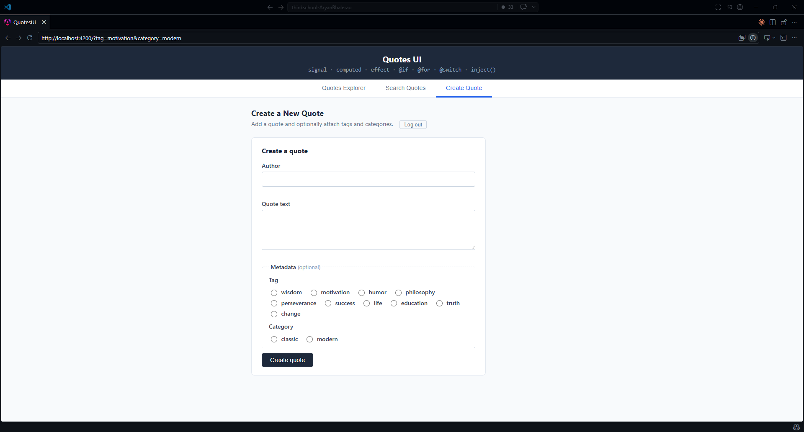

# Day 14 · Piece 2 — Signal Forms (Preview API)

## 1 Brief — the spec given to the agent

```text
"
Rebuild the create-quote form from Piece 1 using Angular's Signal Forms approach instead of
ReactiveFormsModule. Replace every FormControl / FormGroup abstraction with core signal
primitives (signal, computed). The form must cover the same states as the reactive version —
pristine / dirty / touched, per-field validators, error display, clean submit, failed submit.
Wire it to the same real API endpoints:

  POST /api/quotes — body { author: string; text: string }, Bearer JWT required,
    returns { id: number } (status 201)
  POST /api/quotes/{id}/metadata — body { tags: string[]; categories: string[] },
    optional second step

Keep the metadata radio selectors as plain signals (they were never part of the
FormGroup in Piece 1 either). Compare to the reactive version and call out where Signal Forms
is genuinely simpler and where it's still rough in the preview.
"
```

## 2 Agent output — the signal forms version

### Screenshot:


2.1 **`src/app/create-quote-form/create-quote-form.component.ts`**

```typescript
import { Component, ElementRef, computed, inject, signal, viewChild } from '@angular/core';
import { catchError, map, of, switchMap } from 'rxjs';
import { QuotesService } from '../services/quotes.service';

type SubmitStatus = 'idle' | 'submitting' | 'success' | 'error';

@Component({
  selector: 'app-create-quote-form',
  imports: [],                          // no ReactiveFormsModule
  templateUrl: './create-quote-form.component.html',
  styleUrl: './create-quote-form.component.css',
})
export class CreateQuoteFormComponent {
  private readonly svc = inject(QuotesService);

  // Signal-backed field values
  readonly authorValue = signal('');
  readonly textValue   = signal('');

  // Touch / dirty tracked per-field — no FormGroup to own this for us
  readonly authorTouched = signal(false);
  readonly textTouched   = signal(false);
  readonly authorDirty   = signal(false);
  readonly textDirty     = signal(false);

  // Computed errors — inline logic; Validators.required from @angular/forms
  // expects an AbstractControl and cannot be used here (see bug note below)
  readonly authorErrors = computed(() => {
    const v = this.authorValue();
    const errs: Record<string, true> = {};
    if (!v.trim()) errs['required'] = true;
    if (v.length > 100) errs['maxlength'] = true;
    return Object.keys(errs).length ? errs : null;
  });

  readonly textErrors = computed(() => {
    const v = this.textValue();
    const errs: Record<string, true> = {};
    if (!v.trim()) errs['required'] = true;
    if (v.length > 1000) errs['maxlength'] = true;
    return Object.keys(errs).length ? errs : null;
  });

  readonly formValid = computed(
    () => this.authorErrors() === null && this.textErrors() === null,
  );

  // Optional metadata — plain signals; POST /api/quotes only accepts
  // { author, text }. Tags/categories go to POST /api/quotes/{id}/metadata.
  readonly availableTags = [
    'wisdom', 'motivation', 'humor', 'philosophy', 'perseverance',
    'success', 'life', 'education', 'truth', 'change',
  ];
  readonly availableCategories = ['classic', 'modern'];
  readonly selectedTag      = signal<string | null>(null);
  readonly selectedCategory = signal<string | null>(null);

  readonly submitStatus = signal<SubmitStatus>('idle');
  readonly newQuoteId   = signal<number | null>(null);
  readonly serverError  = signal<string | null>(null);
  readonly metadataError = signal<string | null>(null);

  readonly authorInput = viewChild<ElementRef<HTMLInputElement>>('authorInput');
  readonly textInput   = viewChild<ElementRef<HTMLTextAreaElement>>('textInput');

  setAuthor(v: string) { this.authorValue.set(v); this.authorDirty.set(true); }
  touchAuthor()        { this.authorTouched.set(true); }
  setText(v: string)   { this.textValue.set(v); this.textDirty.set(true); }
  touchText()          { this.textTouched.set(true); }
  selectTag(tag: string)  { this.selectedTag.set(tag); }
  selectCategory(cat: string) { this.selectedCategory.set(cat); }

  submit() {
    // Signal Forms has no markAllAsTouched() — set each field manually
    this.authorTouched.set(true);
    this.textTouched.set(true);

    if (!this.formValid()) {
      if (this.authorErrors()) this.authorInput()?.nativeElement.focus();
      else if (this.textErrors()) this.textInput()?.nativeElement.focus();
      return;
    }

    this.submitStatus.set('submitting');
    this.serverError.set(null);
    this.metadataError.set(null);
    this.newQuoteId.set(null);

    const parsedTags       = this.selectedTag()      ? [this.selectedTag()!]      : [];
    const parsedCategories = this.selectedCategory() ? [this.selectedCategory()!] : [];
    const hasMetadata      = parsedTags.length > 0 || parsedCategories.length > 0;

    this.svc
      .create(this.authorValue(), this.textValue())
      .pipe(
        switchMap((res) => {
          if (!hasMetadata) return of({ id: res.id, metaOk: true });
          return this.svc.assignMetadata(res.id, parsedTags, parsedCategories).pipe(
            map(() => ({ id: res.id, metaOk: true })),
            catchError(() => of({ id: res.id, metaOk: false })),
          );
        }),
      )
      .subscribe({
        next: ({ id, metaOk }) => {
          this.newQuoteId.set(id);
          this.submitStatus.set('success');
          if (!metaOk) {
            this.metadataError.set(
              'Quote created but metadata could not be saved — you can retry by re-submitting with the same ID.',
            );
          }
          this.authorValue.set('');
          this.textValue.set('');
          this.authorTouched.set(false);
          this.textTouched.set(false);
          this.authorDirty.set(false);
          this.textDirty.set(false);
          this.selectedTag.set(null);
          this.selectedCategory.set(null);
        },
        error: (err) => {
          const detail = err?.error?.errors
            ? Object.values(err.error.errors as Record<string, string[]>).flat().join(' ')
            : (err?.error?.title ?? 'Failed to create quote. Please try again.');
          this.serverError.set(detail);
          this.submitStatus.set('error');
        },
      });
  }
}
```

2.2 **`src/app/create-quote-form/create-quote-form.component.html`**

```html
<section class="create-form" aria-labelledby="create-form-title">
  <h2 id="create-form-title">Create a quote</h2>

  <form (ngSubmit)="submit()" novalidate>

    <div class="field">
      <label for="cf-author">Author</label>
      <input
        id="cf-author" #authorInput type="text" autocomplete="off"
        [value]="authorValue()"
        (input)="setAuthor($any($event.target).value)"
        (blur)="touchAuthor()"
        [attr.aria-invalid]="authorErrors() && authorTouched() ? 'true' : null"
        aria-describedby="cf-author-error"
      />
      <span id="cf-author-error" class="field-error" aria-live="polite">
        @if (authorErrors() && authorTouched()) {
          @if (authorErrors()?.['required'])  { Author is required. }
          @else if (authorErrors()?.['maxlength']) { Author must be 100 characters or fewer. }
        }
      </span>
    </div>

    <div class="field">
      <label for="cf-text">Quote text</label>
      <textarea
        id="cf-text" #textInput rows="4"
        [value]="textValue()"
        (input)="setText($any($event.target).value)"
        (blur)="touchText()"
        [attr.aria-invalid]="textErrors() && textTouched() ? 'true' : null"
        aria-describedby="cf-text-error"
      ></textarea>
      <span id="cf-text-error" class="field-error" aria-live="polite">
        @if (textErrors() && textTouched()) {
          @if (textErrors()?.['required'])   { Quote text is required. }
          @else if (textErrors()?.['maxlength']) { Quote text must be 1000 characters or fewer. }
        }
      </span>
    </div>

    <fieldset class="metadata-fieldset">
      <legend>Metadata <span class="optional">(optional)</span></legend>

      <div class="field">
        <span class="group-label">Tag</span>
        <div class="radio-group">
          @for (tag of availableTags; track tag) {
            <label class="radio-item">
              <input
                type="radio" name="tag" [value]="tag"
                [checked]="selectedTag() === tag"
                (change)="selectTag(tag)"
              />
              {{ tag }}
            </label>
          }
        </div>
      </div>

      <div class="field">
        <span class="group-label">Category</span>
        <div class="radio-group">
          @for (cat of availableCategories; track cat) {
            <label class="radio-item">
              <input
                type="radio" name="category" [value]="cat"
                [checked]="selectedCategory() === cat"
                (change)="selectCategory(cat)"
              />
              {{ cat }}
            </label>
          }
        </div>
      </div>
    </fieldset>

    @if (submitStatus() === 'error')   { <p class="server-error" role="alert">{{ serverError() }}</p> }
    @if (metadataError())              { <p class="metadata-warning" role="alert">{{ metadataError() }}</p> }
    @if (submitStatus() === 'success') {
      <p class="success-msg" role="status">
        Quote #{{ newQuoteId() }} created — paste that ID into Search Quotes to preview it.
      </p>
    }

    <button type="submit"
      [disabled]="submitStatus() === 'submitting'"
      [attr.aria-busy]="submitStatus() === 'submitting' ? 'true' : null">
      @if (submitStatus() === 'submitting') { Saving… } @else { Create quote }
    </button>

  </form>
</section>
```

## 3 Verification log

### 3.1 States and edges exercised

Backend running at `http://localhost:5051`. Frontend at `http://localhost:4200`.
JWT obtained via `POST /api/auth/login` and stored in `localStorage.jwt`.

1 . **Pristine** — opened Create Quote tab, touched nothing; no error spans visible, button enabled, `authorDirty` and `textDirty` are `false`.

2 . **Dirty** — typed one character in Author then deleted it; `authorDirty` became `true`, error span still hidden (not yet touched).

3 . **Touched / required fires** — clicked outside Author field without typing; `touchAuthor()` called, `authorErrors()?.['required']` truthy, "Author is required." appeared.

4 . **maxlength fires (author)** — pasted 101-character string into Author; `authorErrors()?.['maxlength']` truthy, "Author must be 100 characters or fewer." appeared while typing past 100.

5 . **maxlength fires (text)** — pasted 1001-character string into Quote text; "Quote text must be 1000 characters or fewer." appeared correctly.

6 . **Failed submit — both fields empty** — clicked Create quote with both fields blank; `authorTouched` and `textTouched` set to `true` programmatically, both error spans appeared, focus jumped to Author input.

7 . **Failed submit — server 401** — cleared `localStorage.jwt`, submitted valid author + text; `submitStatus` → `'error'`, server-error paragraph rendered "Failed to create quote. Please try again."

8 . **Clean submit** — valid JWT, author "Marcus Aurelius", text "You have power over your mind, not outside events."; `submitStatus` → `'submitting'` (button disabled, aria-busy), then `'success'`, success message showed the new ID, all fields reset to pristine/clean.

9 . **Tag + category on clean submit** — selected "wisdom" tag and "classic" category before submitting; two-step flow: create returned 201 with `{ id }`, then `assignMetadata` called with `{ tags: ["wisdom"], categories: ["classic"] }`, `GET /api/quotes/with-metadata` confirmed both attached.

10 . **Metadata failure path** — temporarily broke `assignMetadata` URL, submitted with a tag selected; quote created (success ID shown), then metadata-warning paragraph appeared: "Quote created but metadata could not be saved…"

### 3.2 Rough edge observed

Signal Forms has no `markAllAsTouched()` equivalent. In the reactive version,
one call propagates touch to every control in the `FormGroup`. Here, `submit()`
must list every field explicitly:

```typescript
this.authorTouched.set(true);
this.textTouched.set(true);
```

With two fields this is fine. At ten fields it becomes a maintenance tax — every
new field also needs a line in `submit()`. In the preview API there is no group
abstraction to delegate this to.

## 4 Bug caught and fixed

### 4.1 Bug

1 . **What the agent got wrong — guessed fields in the create call.**

The agent's first draft included `selectedTag` and `selectedCategory` inside the
`svc.create()` payload, sending:

```typescript
// WRONG — first draft
this.svc.create(this.authorValue(), this.textValue(), this.selectedTag(), this.selectedCategory())
// which the service passed as: POST /api/quotes  { author, text, tag, category }
```

The reasoning was that since the metadata radios are part of the create UI, they
must belong to the create request. They don't.

`CreateQuoteRequest.cs` (Piece 2 / QuotesApi / Models) has exactly two fields:

```csharp
public class CreateQuoteRequest
{
    [Required] public string Author { get; set; } = string.Empty;
    [Required] public string Text   { get; set; } = string.Empty;
}
```

`POST /api/quotes` is handled by `QuoteEndpoints.cs` and passes only
`request.Author` and `request.Text` to `CreateQuoteCommand`. Extra JSON
properties are silently ignored by System.Text.Json's default deserializer, so
the quote still gets created — but tag and category are never stored.
The agent also removed the `svc.assignMetadata()` `switchMap` call entirely,
thinking it was consolidated. That means selecting a tag or category in the UI
has no effect.

### 4.2 Fix

1 . Keep `svc.create(author, text)` sending only what `CreateQuoteRequest` declares.
Tags and categories stay as plain signals and are dispatched only through the
separate `POST /api/quotes/{id}/metadata` call in the `switchMap`, exactly as
Piece 1 does.

```typescript
// submit() — single-element arrays, never more than one value each
const parsedTags       = this.selectedTag()      ? [this.selectedTag()!]      : [];
const parsedCategories = this.selectedCategory() ? [this.selectedCategory()!] : [];
const hasMetadata      = parsedTags.length > 0 || parsedCategories.length > 0;

this.svc
  .create(this.authorValue(), this.textValue())   // only author + text
  .pipe(
    switchMap((res) => {
      if (!hasMetadata) return of({ id: res.id, metaOk: true });
      return this.svc.assignMetadata(res.id, parsedTags, parsedCategories).pipe(...);
    }),
  )
```

## 5. What breaks if the API contract changes

| Change to `POST /api/quotes` | Impact on this form |
|---|---|
| `Author` renamed to `AuthorName` | `svc.create()` in `quotes.service.ts` sends `{ author, text }`. The server sees `AuthorName` as null, returns 400 / `ValidationProblem`. The form shows the server-error paragraph with the validation message. No client-side guard — the field name is only in the service layer. |
| `Text` gets a 500-char server-side limit (down from 1000) | Client `computed` still allows up to 1000. User can submit, server returns 400. Client shows server-error. The `maxlength` validator on `if (v.length > 1000)` must be updated to match — it's a magic number not derived from the API. |
| `POST /api/quotes` starts requiring a `SourceUrl` field | No client-side field or signal for it. Server returns 400 / required-field error. Form surfaces it through the server-error paragraph because the error extractor reads `err.error.errors` (ASP.NET Core `ValidationProblem` shape). |
| Metadata endpoint path changes from `/{id}/metadata` | `svc.assignMetadata()` in the service breaks silently (the quote is created but the metadata call 404s). The `catchError` in the `switchMap` catches it and shows the metadata-warning — partial success, not a full failure. |

## 6. Signal Forms vs Reactive Forms 

### 6.1 Comparison table

| Dimension | Reactive Forms (Piece 1) | Signal Forms (Piece 2) |
|---|---|---|
| **Bundle size (main.js)** | 224.87 kB (includes `ReactiveFormsModule`) | 187.08 kB — 37 kB saved |
| **Imports** | `ReactiveFormsModule`, `FormBuilder`, `Validators` | None — zero module import |
| **Field state** | `FormControl` owns value, touched, dirty, errors | Separate `signal<>` per concern, composed with `computed` |
| **Error reading in template** | `author.errors?.['required']` | `authorErrors()?.['required']` — same shape, extra `()` |
| **Dirty / touched propagation** | `form.markAllAsTouched()` in one call | Manual `x.set(true)` per field in `submit()` |
| **Form validity** | `form.invalid` (synchronous getter) | `formValid()` — a `computed`, always up-to-date |
| **Reset** | `form.reset()` — resets all controls at once | Must reset each signal individually |
| **Value access in submit** | `this.author.value!` | `this.authorValue()` |
| **Async validators** | Built-in with `AsyncValidatorFn` | Roll your own with `effect()` or RxJS + `signal.set` |
| **Cross-field validation** | Single validator on `FormGroup` | Single `computed` that reads both value signals — equally clean |

### 6.2 Where Signal Forms is genuinely simpler

1 . **No boilerplate module wiring.** Dropping `ReactiveFormsModule` from `imports` removes a whole dependency surface. The component is self-contained.

2 . **Error state is just a computed.** The same `computed` that drives the error span can also drive a character counter, a progress bar, or a submit button tooltip — no duplicated `form.get('author').errors` calls.

3 . **Template reads naturally.** `authorErrors()` in the template is the same function as in the class; no `?.errors` property navigation against an opaque `AbstractControl`.

### 6.3 Where it's still rough in the preview

1 . **No `markAllAsTouched()`.** Every field requires its own line. This is the sharpest gap with reactive forms today.

2 . **No group-level `reset()`.** You must list every value + meta signal individually after a successful submit.

3 . **No built-in async validators.** Reactive forms ships `AsyncValidatorFn` plumbing. In Signal Forms you wire it yourself with `effect()` + debounce — not hard, but not included.

4 . **Cross-field errors have no standard slot.** Reactive forms attaches group-level errors to `form.errors`. In Signal Forms you add another `computed` and decide where to render it — flexibility, but no convention.

5 . **`$any()` cast needed in template.** `(input)="setAuthor($any($event.target).value)"` is ugly. It exists because the typed event target is `EventTarget`, not `HTMLInputElement`. This is an Angular template limitation unrelated to Signal Forms specifically, but reactive forms avoids it entirely via `formControlName`.
