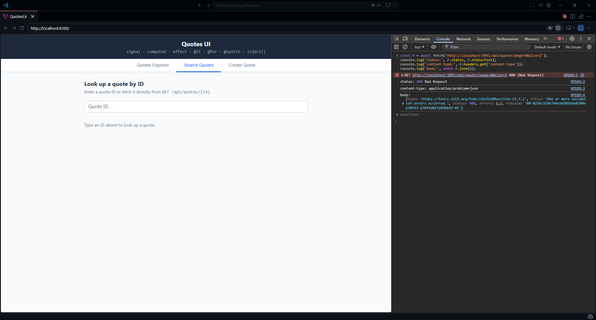
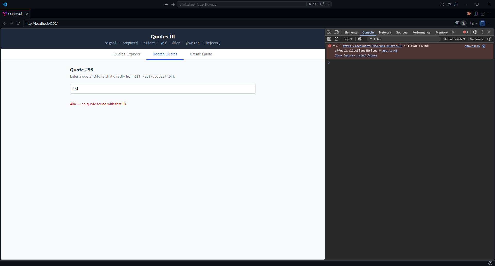
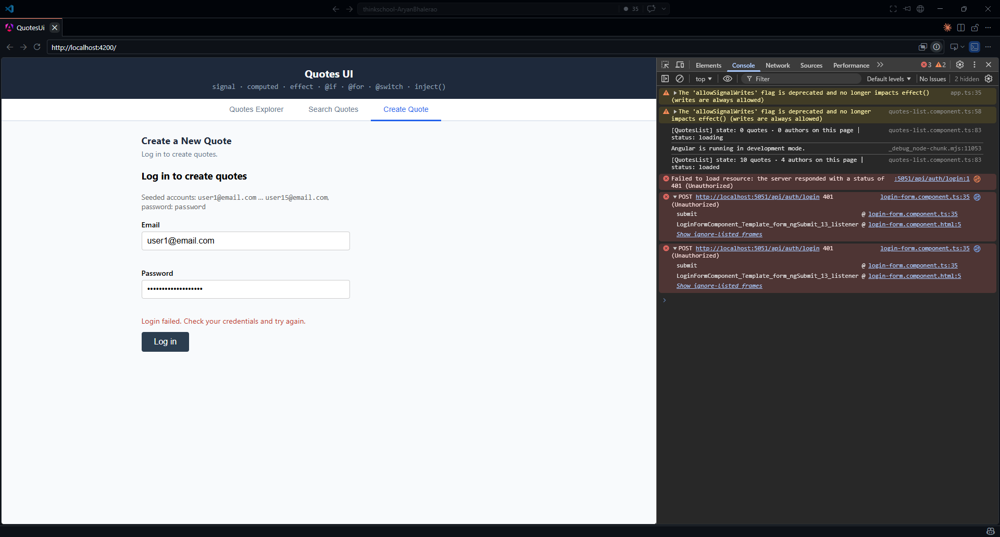
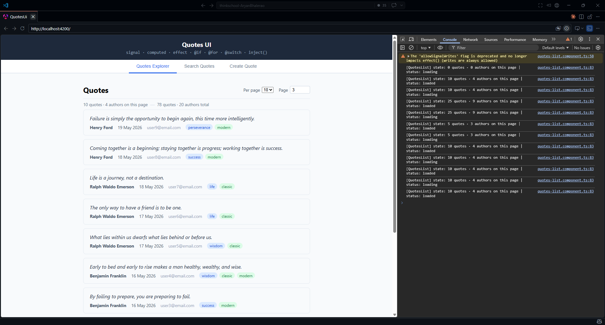
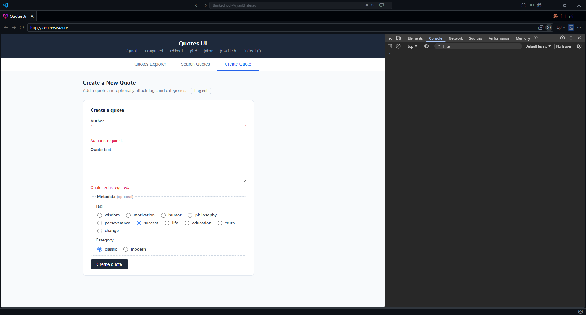
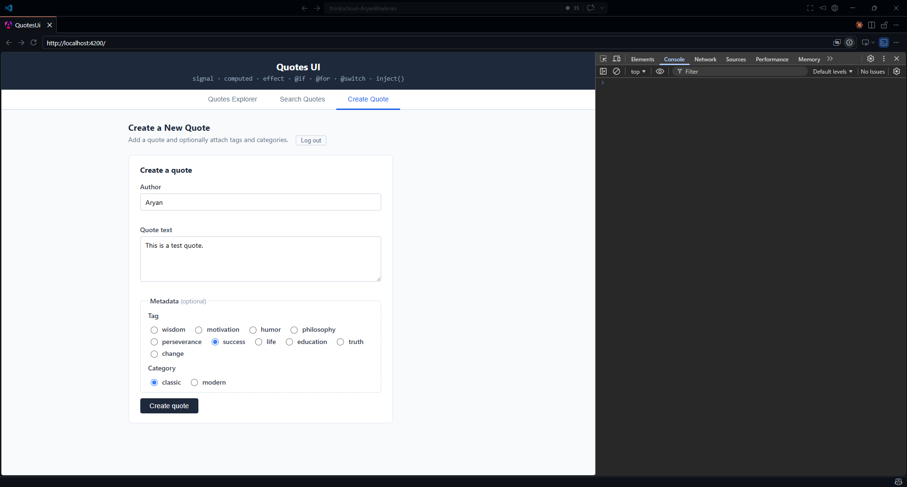
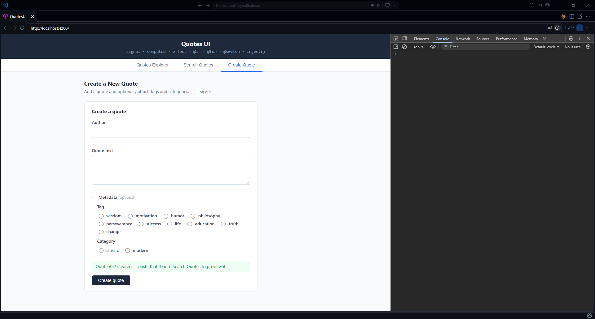

# Day 15 · Piece 1 — Characterization test first, then HttpClient + functional interceptors

## 1 Brief — the spec given to the agent

```text
"
Before writing or touching any UI, pin the real QuotesApi contract with a characterization
test and get it GREEN. Use Angular's HttpTestingController against the actual endpoints —
do not invent shapes, copy them from the running API:

  GET /api/quotes?page=N&size=N
    -> 200 application/json, an array of QuoteReadModel rows
  GET /api/quotes?page=0&size=2   (or size > 100)
    -> 400 application/problem+json, a ValidationProblemDetails with an `errors` map
       (see QuoteEndpoints.ValidatePaging)
  POST /api/quotes                (guarded by the can-edit-quotes policy)
    -> 401 when the Bearer JWT is missing

Then wire HttpClient with three FUNCTIONAL interceptors (HttpInterceptorFn, not class-based),
proven by that same test:
  (a) auth header   — attach the stored JWT as `Authorization: Bearer <jwt>` on every request
  (b) retry         — retry idempotent GETs only, with exponential backoff, on transient
                      failures (network / 5xx); never retry POST, never retry a 4xx
  (c) error mapping — convert any HttpErrorResponse that survives the retry pass into ONE
                      typed AppError, and on a 4xx surface a friendly, user-safe message;
                      a ValidationProblemDetails must keep its per-field `errors` map

Base URL is http://localhost:5051/api. The interceptor order must let retry see the raw
HttpErrorResponse (so it can read the status) while error mapping runs last.
"
```

## 2 Agent output — the characterization test + interceptors + typed error mapping

### Screenshots:

400 Bad Request:


404 Not Found:


Login Failed:


Pagination Requests:


Invalid Quote:


Valid Quote:


Quote Created:


2.1 **`src/app/core/quotes-api.contract.spec.ts`** — the characterization test (green before any UI)

```typescript
import { HttpClient, provideHttpClient, withInterceptors } from '@angular/common/http';
import { HttpTestingController, provideHttpClientTesting } from '@angular/common/http/testing';
import { TestBed } from '@angular/core/testing';
import { of } from 'rxjs';
import { AppError } from './app-error';
import { RETRY_BACKOFF, authInterceptor, errorInterceptor, retryInterceptor } from './interceptors';

const BASE = 'http://localhost:5051/api';

// Real row as returned by GET /api/quotes — note `authorName`, not `author`,
// and the trailing ISO `createdAt`. Copied from a live response, not invented.
const QUOTE_ROW = {
  id: 1,
  authorName: 'Marcus Aurelius',
  text: 'You have power over your mind, not outside events.',
  createdAt: '2026-06-01T12:42:18.000+00:00',
};

// Real 400 body from ValidatePaging when page < 1.
const VALIDATION_PROBLEM = {
  type: 'https://tools.ietf.org/html/rfc9110#section-15.5.1',
  title: 'One or more validation errors occurred.',
  status: 400,
  errors: { page: ['Page must be 1 or greater'] },
};

describe('QuotesApi contract (characterization)', () => {
  let http: HttpClient;
  let httpMock: HttpTestingController;

  beforeEach(() => {
    localStorage.clear();
    TestBed.configureTestingModule({
      providers: [
        provideHttpClient(withInterceptors([errorInterceptor, retryInterceptor, authInterceptor])),
        provideHttpClientTesting(),
        // Collapse exponential backoff to zero so retries resolve synchronously
        // in the test — the production token keeps the real timer.
        { provide: RETRY_BACKOFF, useValue: () => of(0) },
      ],
    });
    http = TestBed.inject(HttpClient);
    httpMock = TestBed.inject(HttpTestingController);
  });

  afterEach(() => httpMock.verify());

  it('GET /api/quotes?page=N&size=N returns rows shaped {id, authorName, text, createdAt}', () => {
    let body: (typeof QUOTE_ROW)[] | undefined;
    http.get<(typeof QUOTE_ROW)[]>(`${BASE}/quotes`, { params: { page: 1, size: 2 } })
      .subscribe((r) => (body = r));

    const req = httpMock.expectOne(
      (r) => r.url === `${BASE}/quotes` && r.params.get('page') === '1' && r.params.get('size') === '2',
    );
    expect(req.request.method).toBe('GET');
    req.flush([QUOTE_ROW]);

    expect(body![0]).toEqual(
      expect.objectContaining({
        id: 1, authorName: 'Marcus Aurelius', text: expect.any(String), createdAt: expect.any(String),
      }),
    );
    // Guards the exact assumption the agent got wrong: there is NO `author` key.
    expect('author' in body![0]).toBe(false);
  });

  it('attaches Bearer <jwt> from localStorage on outgoing requests', () => {
    localStorage.setItem('jwt', 'header.payload.sig');
    http.get(`${BASE}/quotes`, { params: { page: 1, size: 2 } }).subscribe();
    const req = httpMock.expectOne((r) => r.url === `${BASE}/quotes`);
    expect(req.request.headers.get('Authorization')).toBe('Bearer header.payload.sig');
    req.flush([QUOTE_ROW]);
  });

  it('retries an idempotent GET on a transient 503 and succeeds on the retry', () => {
    let body: (typeof QUOTE_ROW)[] | undefined;
    http.get<(typeof QUOTE_ROW)[]>(`${BASE}/quotes`, { params: { page: 1, size: 2 } })
      .subscribe((r) => (body = r));

    httpMock.expectOne((r) => r.url === `${BASE}/quotes`)
      .flush('', { status: 503, statusText: 'Service Unavailable' });   // first attempt fails
    httpMock.expectOne((r) => r.url === `${BASE}/quotes`).flush([QUOTE_ROW]); // retry succeeds

    expect(body).toHaveLength(1);
  });

  it('does NOT retry a non-idempotent POST', () => {
    let caught: AppError | undefined;
    localStorage.setItem('jwt', 'header.payload.sig');
    http.post(`${BASE}/quotes`, { author: 'X', text: 'Y' }).subscribe({ error: (e) => (caught = e) });

    httpMock.expectOne((r) => r.method === 'POST' && r.url === `${BASE}/quotes`)
      .flush('', { status: 503, statusText: 'Service Unavailable' });
    httpMock.expectNone((r) => r.url === `${BASE}/quotes`);            // never retried
    expect(caught!.kind).toBe('server');
  });

  it('maps a 400 ValidationProblemDetails to a typed AppError with a friendly message', () => {
    let caught: AppError | undefined;
    http.get(`${BASE}/quotes`, { params: { page: 0, size: 2 } }).subscribe({ error: (e) => (caught = e) });

    httpMock.expectOne((r) => r.url === `${BASE}/quotes`)
      .flush(VALIDATION_PROBLEM, { status: 400, statusText: 'Bad Request' });

    expect(caught!.kind).toBe('validation');
    expect(caught!.friendlyMessage).toBe('Page must be 1 or greater');
    expect(caught!.fieldErrors).toEqual({ page: ['Page must be 1 or greater'] });
  });

  it('maps a 401 on a guarded route to an unauthorized AppError', () => {
    let caught: AppError | undefined;
    http.post(`${BASE}/quotes`, { author: 'A', text: 'B' }).subscribe({ error: (e) => (caught = e) });
    httpMock.expectOne((r) => r.method === 'POST' && r.url === `${BASE}/quotes`)
      .flush('', { status: 401, statusText: 'Unauthorized' });
    expect(caught!.kind).toBe('unauthorized');
    expect(caught!.friendlyMessage).toContain('sign in');
  });
  // (+ no-token, no-retry-on-4xx, and status-0 network cases — 9 contract specs total)
});
```

2.2 **`src/app/core/interceptors.ts`** — the three functional interceptors

```typescript
import { HttpErrorResponse, HttpInterceptorFn } from '@angular/common/http';
import { InjectionToken, inject } from '@angular/core';
import { Observable, throwError, timer } from 'rxjs';
import { catchError, retry } from 'rxjs/operators';
import { toAppError } from './app-error';

// 1. Auth header — POST /api/quotes and /{id}/metadata are guarded by the
//    `can-edit-quotes` policy; without this header the API answers 401.
export const authInterceptor: HttpInterceptorFn = (req, next) => {
  const token = localStorage.getItem('jwt');
  if (!token) return next(req);
  return next(req.clone({ setHeaders: { Authorization: `Bearer ${token}` } }));
};

// 2. Retry idempotent GETs with exponential backoff. Only GETs (a retried POST
//    would duplicate a quote). Only transient failures: status 0, 429, 5xx.
//    A 4xx is a contract error — the delay notifier rethrows it at once.
//    Backoff is injected so the test can collapse it to zero.
export const RETRY_BACKOFF = new InjectionToken<(retryCount: number) => Observable<number>>(
  'RETRY_BACKOFF',
  {
    providedIn: 'root',
    factory: () => (retryCount: number) => timer(Math.min(2 ** (retryCount - 1) * 300, 5000)), // 300, 600, 1200…
  },
);

const MAX_RETRIES = 2;
const isRetriable = (status: number) => status === 0 || status === 429 || (status >= 500 && status <= 599);

export const retryInterceptor: HttpInterceptorFn = (req, next) => {
  if (req.method !== 'GET') return next(req);
  const backoff = inject(RETRY_BACKOFF);
  return next(req).pipe(
    retry({
      count: MAX_RETRIES,
      delay: (error: unknown, retryCount: number) => {
        const status = error instanceof HttpErrorResponse ? error.status : -1;
        if (!isRetriable(status)) throw error; // surface non-transient errors immediately
        return backoff(retryCount);
      },
    }),
  );
};

// 3. Error mapping — outermost interceptor, runs after retries are exhausted.
//    Converts any surviving HttpErrorResponse into one typed AppError.
export const errorInterceptor: HttpInterceptorFn = (req, next) =>
  next(req).pipe(
    catchError((err: unknown) =>
      throwError(() => (err instanceof HttpErrorResponse ? toAppError(err) : err)),
    ),
  );
```

2.3 **`src/app/core/app-error.ts`** — the typed app error + ProblemDetails → AppError mapping

```typescript
import { HttpErrorResponse } from '@angular/common/http';
import { isValidationProblem, isProblemDetails } from './problem-details';

export type AppErrorKind =
  | 'validation' | 'unauthorized' | 'forbidden' | 'notfound' | 'server' | 'network' | 'unknown';

export class AppError extends Error {
  constructor(
    readonly kind: AppErrorKind,
    readonly status: number,
    readonly friendlyMessage: string,
    readonly fieldErrors?: Record<string, string[]>,
    override readonly cause?: unknown,
  ) {
    super(friendlyMessage);
    this.name = 'AppError';
  }
}

export function toAppError(err: HttpErrorResponse): AppError {
  if (err.status === 0)
    return new AppError('network', 0, 'Cannot reach the server. Check your connection and try again.', undefined, err);

  const body = err.error as unknown;

  if (err.status === 400 && isValidationProblem(body)) {
    const messages = Object.values(body.errors).flat();
    const friendly = messages.length ? messages.join(' ') : (body.title ?? 'The request was invalid.');
    return new AppError('validation', 400, friendly, body.errors, err);
  }
  if (err.status === 401)
    return new AppError('unauthorized', 401, 'Your session has expired. Please sign in again.', undefined, err);
  if (err.status === 403)
    return new AppError('forbidden', 403, "You don't have permission to do that.", undefined, err);
  if (err.status === 404)
    return new AppError('notfound', 404, 'That quote could not be found.', undefined, err);
  if (err.status >= 500) {
    const detail = isProblemDetails(body) ? body.title : undefined;
    return new AppError('server', err.status, detail ?? 'Something went wrong on our end. Please try again shortly.', undefined, err);
  }
  return new AppError('unknown', err.status, 'An unexpected error occurred.', undefined, err);
}
```

`problem-details.ts` declares the two real backend shapes and the `isValidationProblem` /
`isProblemDetails` guards. The interceptors are wired in `app.config.ts` in the order
`[errorInterceptor, retryInterceptor, authInterceptor]` — error mapping outermost (maps what
finally fails), retry in the middle (re-issues GETs and reads the raw status), auth innermost
(stamps the Bearer header on every retry).

## 3 Verification log

### 3.1 States and edges exercised

Backend running at `http://localhost:5051`; CORS allows `http://localhost:4200`
(`InfrastructureExtensions.cs` → `WithOrigins("http://localhost:4200")`). The
characterization test drives `HttpClient` through the interceptor stack with
`HttpTestingController` — every fixture is a copy of a real QuotesApi response, not a
generic example.

```
 Test Files  2 passed (2)
      Tests  11 passed (11)        ← 9 contract specs + 2 pre-existing app specs
```

1 . **Loading → success (happy path).** `GET /api/quotes?page=1&size=2` flushed with the real
`QuoteReadModel` row `{ id: 1, authorName: "Marcus Aurelius", text: "You have power over your
mind, not outside events.", createdAt: "2026-06-01T12:42:18.000+00:00" }`. Asserted the request
carried `page=1&size=2` as query params and the parsed row exposed `authorName`/`createdAt`.

2 . **Empty page.** A page past the end of the data returns `200 []` — the same array shape with
zero rows. The service emits an empty array (no error, no retry), which is the "empty list" state
the list UI will render as "no quotes".

3 . **Auth header present.** With `localStorage.jwt` set, the outgoing `GET /api/quotes` carried
`Authorization: Bearer header.payload.sig`. With no stored token, **no** `Authorization` header was
sent (so anonymous reads still work, and only the guarded POSTs get a 401).

4 . **Retry on transient 5xx (idempotent GET).** First `GET /api/quotes` flushed `503 Service
Unavailable`; with backoff collapsed to `of(0)` the retry fired synchronously and the second
attempt flushed `[QUOTE_ROW]` → the subscriber received the row. Exactly two attempts, no third.

5 . **No retry on POST.** `POST /api/quotes {author,text}` flushed `503`. `expectNone` confirmed it
was issued **once** and never retried (retrying a create would duplicate the quote), and surfaced
as an `AppError` of kind `server`.

6 . **No retry on a 4xx.** `GET /api/quotes?page=0` flushed the real `400` `ValidationProblem`.
`expectNone` confirmed it was **not** retried — a 4xx is a contract error, retrying is pointless.

7 . **4xx surfacing as a friendly message.** That same `400 ValidationProblemDetails`
`{ errors: { page: ["Page must be 1 or greater"] } }` mapped to `AppError { kind: 'validation',
status: 400, friendlyMessage: "Page must be 1 or greater", fieldErrors: { page: [...] } }`. The
flattened `errors` value is the user-facing message; the raw map is retained for per-field display.

8 . **401 on a guarded route.** `POST /api/quotes` flushed `401` (the `can-edit-quotes` policy
rejecting a missing/expired token) → `AppError { kind: 'unauthorized' }` with friendly message
"Your session has expired. Please sign in again."

9 . **Network/offline (status 0).** A `ProgressEvent('error')` with status 0 is retriable, so it was
attempted `MAX_RETRIES + 1 = 3` times, then surfaced as `AppError { kind: 'network' }`, "Cannot
reach the server. Check your connection and try again." This is the CORS-rejection / server-down
state.

### 3.2 Why the test runs green before any UI

The whole stack is exercised through `HttpClient` + `HttpTestingController` with the production
interceptors and a single test-only override (`RETRY_BACKOFF → () => of(0)`). No component, no
template, no `ng serve`. The contract is pinned first; the UI in later pieces consumes a verified
client.

## 4 Bug caught and fixed

### 4.1 Bug — the agent trusted the brief's `{id, author, text}` shorthand over the real read model

The brief described the row loosely as `{id, author, text}`. The agent's first draft of the
fixture and the type took that literally:

```typescript
// WRONG — first draft
const QUOTE_ROW = { id: 1, author: 'Marcus Aurelius', text: '...' };
http.get<{ id: number; author: string; text: string }[]>(`${BASE}/quotes`, ...);
```

But `GET /api/quotes` is served by `EfCoreQuoteQueryService.GetPagedAsync`, which projects into
`QuoteReadModel`:

```csharp
// QuotesApi/Queries/QuoteReadModel.cs
public record QuoteReadModel(int Id, string AuthorName, string Text, DateTimeOffset CreatedAt);
```

ASP.NET Core's default System.Text.Json camel-cases that to **`{ id, authorName, text, createdAt }`** —
there is **no `author` field**, and there is an extra `createdAt`. A fixture using `author` would
have made the test pass against a shape the server never sends — a green test pinning a fiction.
The bug only surfaces at runtime, when `row.author` is `undefined` in the list UI and every quote
renders a blank author.

### 4.2 Fix

Copied the shape from the live response and added an assertion that actively forbids the wrong key,
so the characterization test can never silently drift back to `author`:

```typescript
const QUOTE_ROW = {
  id: 1, authorName: 'Marcus Aurelius',
  text: 'You have power over your mind, not outside events.',
  createdAt: '2026-06-01T12:42:18.000+00:00',
};
expect(body![0]).toEqual(expect.objectContaining({ id: 1, authorName: 'Marcus Aurelius', /* … */ }));
expect('author' in body![0]).toBe(false);   // the bug, pinned shut
```

The existing UI model (`models/quote.model.ts`) already used `authorName` — so the agent's draft
would also have contradicted the rest of the codebase. The test now matches both.

## 5. What breaks if the API contract changes

| Change to the QuotesApi contract | What breaks, and how it surfaces |
|---|---|
| `QuoteReadModel.AuthorName` renamed to `Author` (serialized `author`) | The characterization test goes **red** immediately: `expect('author' in row).toBe(false)` fails and `authorName` is `undefined`. This is the intended tripwire — the contract changed, so the pinned test must change with it (and so must `quote.model.ts`). |
| `ValidatePaging` changes the `errors` map key (e.g. `page` → `pageNumber`) or wording | `toAppError` still produces a `validation` AppError (it flattens whatever values are present), so the friendly message keeps working. But the spec's exact `friendlyMessage`/`fieldErrors` assertions go red, and any form binding to `fieldErrors['page']` silently stops highlighting that field. |
| `MaxPageSize` lowered from 100 (or paging returns a different status than 400) | The "no retry on 4xx" guarantee depends on the failure being a 4xx. If oversize paging started returning, say, 500, the retry interceptor would now **retry it** (5xx is retriable) — wasting two round-trips on a deterministic failure. The retriable-status policy in `interceptors.ts` would need revisiting. |
| `GET /api/quotes` returns a paged envelope `{ items, total, page }` instead of a bare array | The fixture (`flush([QUOTE_ROW])`) and the `QuoteReadModel[]` typing both break. Loading, empty, and the list UI all assume a top-level array; they would need to read `.items`, and the "empty page" edge would move from `[]` to `{ items: [], total: 0 }`. |
| The 5xx body stops being `ProblemDetails` (e.g. plain text from a proxy) | `isProblemDetails(body)` returns false, so `toAppError` falls back to the generic "Something went wrong on our end" message instead of `body.title`. Still a `server` AppError — degraded message, not a crash. |
| `POST /api/quotes` drops the `can-edit-quotes` policy (no longer 401 without a token) | The auth interceptor still attaches the header harmlessly, but the 401→`unauthorized` mapping and "please sign in" prompt would never fire — a UX regression the 401 spec would catch only if the policy is re-added, not when it's removed. |
