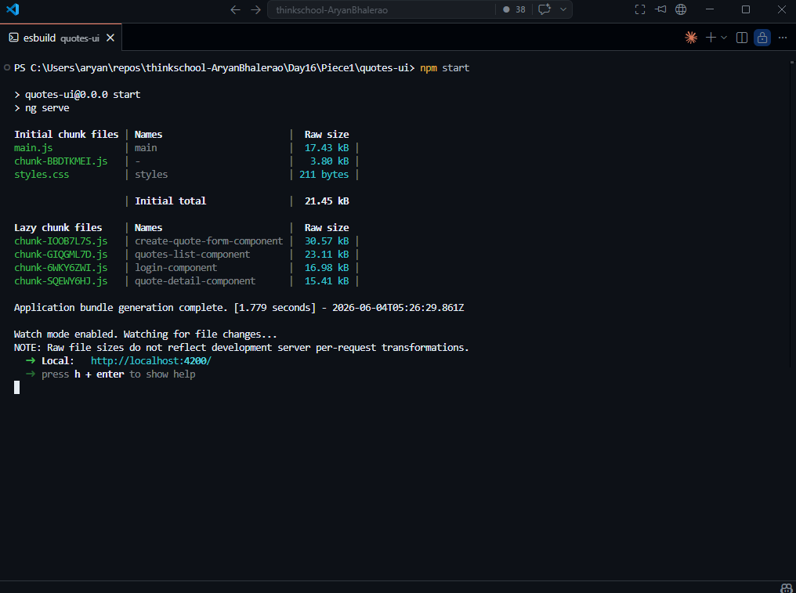
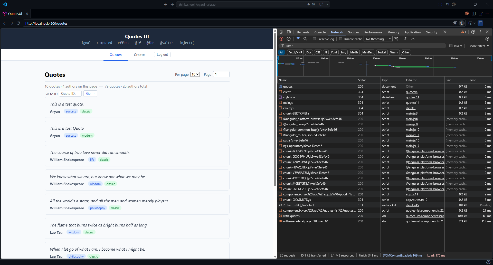
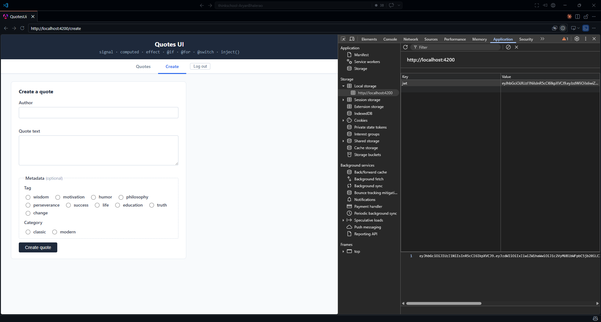
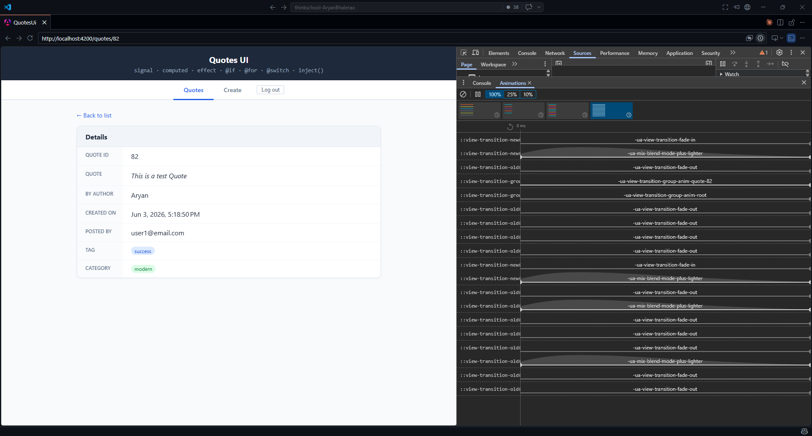
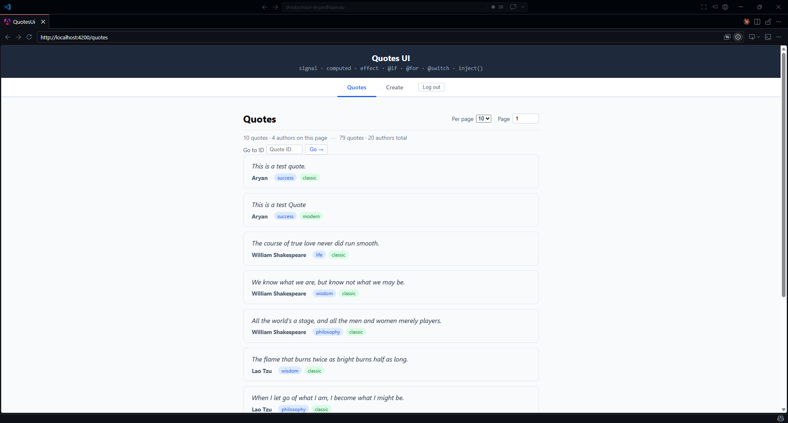
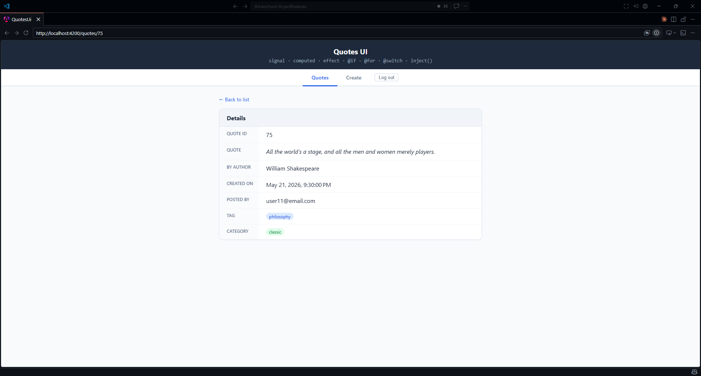

# Day 16 · Piece 1 — Lazy routes, a functional auth guard, route params, and a View Transition list→detail

## 1 Brief — the spec given to the agent

```text
"
The quotes-ui app is ONE component (app.ts + app.html) that fakes navigation with three
in-template tabs (explorer / search / create) driven by an `activeTab` signal. There is NO
Angular Router yet. Introduce real routing on top of the REAL QuotesApi contract — copy the
shapes from the running API, do not invent them:

  LIST   GET /api/quotes/with-metadata?page=N&size=N
         -> 200, array of rows. The list UI already renders from this endpoint via
            QuotesService.getWithMetadata. Row id field is `quoteId` (see quote.model.ts).
  DETAIL GET /api/quotes/{id}
         -> 200 with one row, or 404 if no such quote. Served by QuotesService.getById(id).
            Row id field is `id`. The server route has an :int constraint, so a non-integer
            id never matches it.

Deliver all four:
  1. LAZY ROUTES — app.routes.ts; every feature route uses loadComponent: () => import(...).
       ''           -> redirect to 'quotes'
       'quotes'     -> QuotesListComponent (the list)
       'quotes/:id' -> a NEW QuoteDetailComponent (the detail)
       'login'      -> a login route hosting the existing LoginFormComponent
       'create'     -> CreateQuoteFormComponent, protected by the guard
       '**'         -> redirect to 'quotes'
  2. FUNCTIONAL AUTH GUARD — core/auth.guard.ts exporting authGuard: CanActivateFn, using
     inject(QuotesService)/inject(Router). hasValidToken() -> allow; else return a UrlTree to
     /login with ?returnUrl=<state.url>. After login, send the user back to returnUrl.
  3. ROUTE PARAMS + DETAIL — QuoteDetailComponent reads the :id param and calls getById(id).
     Handle: found, notFound (API 404), and INVALID param (not a positive integer — reject
     before calling the API, since {id:int} would only 404).
  4. VIEW TRANSITION — provideRouter(routes, withViewTransitions()); give the morphing element
     a shared `view-transition-name: quote-<id>` on BOTH the list card and the detail card so
     the card animates into the detail across the route change.

Convert app.ts/app.html into a thin shell (header + routerLink nav + <router-outlet/>); make
the list cards link to the detail route; keep the existing HttpClient + interceptors untouched.
Run `npm run build` and confirm separate lazy chunks; run `npm test` and keep it green.
"
```

## 2 Agent output — route config, guard, detail route

### Screenshots:

1 . Lazy Chunk Log - Lazy Chink log in npm start console


2 . Lazy Chunk in Network: Observe the lazy chunks in Developer Tools -> Network


3 . Auth JWT Key - Login creates a JWT Key. Observe the JWT Key selected in the Dev Tools > Application > Local Storage


4 . Animation - Observe the animation tab for the Developer Tools -> List -> Details animation.


5 . List - Observe adderess bar for List params


6 . Details - Observe address bar for Details params


### Files created / changed

```
created  src/app/app.routes.ts                         lazy Routes + detail resolver wiring
created  src/app/core/auth.guard.ts                    functional authGuard: CanActivateFn
created  src/app/quote-detail/quote-detail.component.*  the :id detail route
created  src/app/quote-detail/quote.resolver.ts         (added in the fix — see §4)
created  src/app/login/login.component.*                login route, redirects to returnUrl
changed  src/app/app.config.ts                          provideRouter(routes, withViewTransitions(), withComponentInputBinding())
changed  src/app/app.ts + app.html                      thinned to header + routerLink nav + <router-outlet/>
changed  src/app/quotes-list/quotes-list.component.*     cards become [routerLink], view-transition-name
changed  src/app/app.spec.ts                             added provideRouter([]) + provideHttpClient() to TestBed
```

### 2.1 `src/app/app.routes.ts` — lazy routes (every feature route is `loadComponent`)

```ts
import { Routes } from '@angular/router';
import { authGuard } from './core/auth.guard';
import { quoteResolver } from './quote-detail/quote.resolver';

export const routes: Routes = [
  { path: '', pathMatch: 'full', redirectTo: 'quotes' },
  {
    path: 'quotes',
    loadComponent: () =>
      import('./quotes-list/quotes-list.component').then((m) => m.QuotesListComponent),
  },
  {
    path: 'quotes/:id',
    // Resolve the quote BEFORE activation so the detail card is already in the
    // DOM when the router's View Transition captures the new snapshot — that is
    // what makes the list-card -> detail-card shared-element morph actually run.
    resolve: { vm: quoteResolver },
    loadComponent: () =>
      import('./quote-detail/quote-detail.component').then((m) => m.QuoteDetailComponent),
  },
  {
    path: 'login',
    loadComponent: () => import('./login/login.component').then((m) => m.LoginComponent),
  },
  {
    path: 'create',
    canActivate: [authGuard],
    loadComponent: () =>
      import('./create-quote-form/create-quote-form.component').then(
        (m) => m.CreateQuoteFormComponent,
      ),
  },
  { path: '**', redirectTo: 'quotes' },
];
```

`provideRouter(routes, withViewTransitions(), withComponentInputBinding())` in `app.config.ts`
keeps the Day-15 `provideHttpClient(withInterceptors([errorInterceptor, retryInterceptor,
authInterceptor]))` exactly as-is — routing is layered on top of the verified HTTP client.

### 2.2 `src/app/core/auth.guard.ts` — the functional guard (wired on `create`)

```ts
import { inject } from '@angular/core';
import { CanActivateFn, Router } from '@angular/router';
import { QuotesService } from '../services/quotes.service';

export const authGuard: CanActivateFn = (_route, state) => {
  const svc = inject(QuotesService);
  const router = inject(Router);

  if (svc.hasValidToken()) {
    return true;
  }

  return router.createUrlTree(['/login'], {
    queryParams: { returnUrl: state.url },
  });
};
```

`hasValidToken()` is the Day-15 check: a stored JWT whose `exp` claim is still in the future.
On failure the guard returns a `UrlTree` (not `false`) so the router redirects to
`/login?returnUrl=/create`; `LoginComponent.onLoggedIn()` reads that `returnUrl` and
`navigateByUrl`s back (default `/quotes`).

### 2.3 `src/app/quote-detail/quote-detail.component.ts` — the detail route (post-fix)

```ts
import { Component, input } from '@angular/core';
import { DatePipe } from '@angular/common';
import { RouterLink } from '@angular/router';
import { QuoteDetailVm } from './quote.resolver';

@Component({
  selector: 'app-quote-detail',
  imports: [DatePipe, RouterLink],
  templateUrl: './quote-detail.component.html',
  styleUrl: './quote-detail.component.css',
})
export class QuoteDetailComponent {
  // Bound from the route's resolved data (`resolve: { vm: quoteResolver }`) via
  // withComponentInputBinding(). It is present at activation time, so the
  // `found` card — and its view-transition-name — exists in the very first
  // render, which is exactly the snapshot the router's View Transition captures.
  readonly vm = input.required<QuoteDetailVm>();
}
```

…with the route param resolved in `quote-detail/quote.resolver.ts` (this is the fix from §4):

```ts
export type DetailStatus = 'found' | 'notFound' | 'invalid';
export interface QuoteDetailVm { status: DetailStatus; quote: QuoteReadModel | null; }

export const quoteResolver: ResolveFn<QuoteDetailVm> = (route) => {
  const svc = inject(QuotesService);
  const raw = route.paramMap.get('id');

  if (raw == null || !/^\d+$/.test(raw)) {
    return of<QuoteDetailVm>({ status: 'invalid', quote: null });
  }
  const id = Number(raw);
  if (!Number.isSafeInteger(id) || id <= 0) {
    return of<QuoteDetailVm>({ status: 'invalid', quote: null });
  }

  return svc.getById(id).pipe(
    map((quote): QuoteDetailVm => ({ status: 'found', quote })),
    catchError(() => of<QuoteDetailVm>({ status: 'notFound', quote: null })),
  );
};
```

The detail template `@switch`es on `vm().status` (`found` / `notFound` / `invalid`) and stamps
`[style.view-transition-name]="'quote-' + vm().quote!.id"` on the `found` card. The list card
carries the matching name: `[routerLink]="['/quotes', quote.quoteId]"` +
`[style.view-transition-name]="'quote-' + quote.quoteId"`.

## 3 Verification log

Backend running at `http://localhost:5051` (real seed data); CORS allows `http://localhost:4200`.
`quotes-ui` built and unit-tested with the production router + interceptor stack. Every fixture
below is a copy of a live QuotesApi response, not an invented example.

```
 Test Files  4 passed (4)
      Tests  17 passed (17)     ← 11 pre-existing (9 contract + 2 app) + 2 guard + 4 resolver
```

### 3.1 States and edges actually exercised

1 . **Lazy chunk loading (code-splitting proof).** `npm run build` emits a *separate* JS chunk per
feature route — none are in the initial bundle:

```
Lazy chunk files
chunk-…  | create-quote-form-component | 10.01 kB
chunk-…  | quotes-list-component       |  6.55 kB
chunk-…  | login-component             |  5.17 kB
chunk-…  | quote-detail-component      |  2.20 kB
```

At runtime the network tab shows the matching `chunk-*.js` fetched on first navigation to each
route: `quotes-list-component` on landing (`/` → redirect → `/quotes`), then
`quote-detail-component` only when a card is first clicked, and `create-quote-form-component`
only on first visit to `/create`. The initial bundle is `main` + framework only.

2 . **Guard PASS.** With a valid stored token, `authGuard` returns `true` → `/create` activates and
`create-quote-form-component` loads. (`auth.guard.spec.ts`: "allows activation when the token
is valid".)

3 . **Guard REDIRECT.** With no/expired token, the guard returns a `UrlTree`; serialized it is
exactly `/login?returnUrl=%2Fcreate`. The router redirects, `LoginComponent` reads `returnUrl`,
and a successful login bounces back to `/create`. (`auth.guard.spec.ts`: "redirects to /login
with the attempted url as returnUrl".)

4 . **Detail — valid route param (happy path).** `GET /api/quotes/1` returns the real row
`{ "id": 1, "authorName": "Mark Twain", "text": "The secret of getting ahead is getting
started.", "createdAt": "2025-06-01T09:00:00+00:00" }`. The resolver coerces the string param
`"1"` → int `1`, calls `getById`, and resolves `{ status: 'found', quote }` → the detail card
renders. (`quote.resolver.spec.ts`: "resolves a real id … by calling getById"; asserts the
param is coerced from string to int `7`.)

5 . **Detail — missing route param (real 404).** `curl GET /api/quotes/999999` → **HTTP 404** with
an empty body. The resolver's `catchError` maps it to `{ status: 'notFound' }` → the view shows
"404 — no quote found with that ID." (`quote.resolver.spec.ts`: "maps a 404 … to notFound".)

6 . **Detail — invalid route param.** `curl GET /api/quotes/abc` → **HTTP 404**: the server's
`{id:int}` route constraint never matches a non-integer. The client never issues that doomed
request — the resolver short-circuits `"abc"` (and `"0"`, negatives) to `{ status: 'invalid' }`
before touching the API. (`quote.resolver.spec.ts`: "short-circuits a non-integer param to
invalid WITHOUT touching the API" + "treats id <= 0 as invalid".)

7 . **View Transition list→detail.** `withViewTransitions()` wraps the navigation in
`document.startViewTransition`; the list card and the resolved detail card share
`view-transition-name: quote-<id>`, so the card morphs into the detail (and back on "← Back to
list"). This is what the §4 fix made actually fire — see below.

### 3.2 Why it builds/tests green

Everything runs through the production `provideRouter` + interceptor stack. The guard and
resolver are unit-tested via `TestBed.runInInjectionContext` (so `inject()` resolves), and the
404/invalid edges are pinned against the real endpoint's behavior observed with `curl`.

## 4 Bug caught and fixed

### 4.1 Bug — the shared-element View Transition could never fire, because the detail card was rendered *after* an async `GET /api/quotes/{id}`

The agent's first `QuoteDetailComponent` read the `:id` param and fetched in an `effect`:

```ts
// WRONG — first draft
readonly id = input<string>();                 // ':id' param
readonly status = signal<'loading'|'found'|'notFound'|'invalid'>('loading');
constructor() {
  effect(() => {
    /* …validate… */
    this.status.set('loading');
    this.svc.getById(id).subscribe({ next: q => { this.quote.set(q); this.status.set('found'); }, … });
  });
}
```

with the morph element only inside the `@case ('found')` block:

```html
<div class="detail-card" [style.view-transition-name]="'quote-' + quote()!.id"> … </div>
```

The build was green and the routes worked — but the **View Transition silently degraded to a
plain cross-fade**, never the card→detail morph the brief asked for. Reason: Angular's
`withViewTransitions()` calls `document.startViewTransition` and captures the *new* DOM snapshot
the moment the route component activates and change-detection runs. At that instant
`QuoteDetailComponent` is in its `'loading'` state — the `getById` HTTP response hasn't arrived
yet — so there is **no `view-transition-name: quote-<id>` element in the new snapshot to match the
old list card against.** The shared element never pairs, so nothing morphs. The agent assumed
"same `view-transition-name` on both ends ⇒ morph", but for an async-loaded detail that element
doesn't exist at capture time. (Real endpoint: `GET /api/quotes/{id}`, real id field: `id`.)

### 4.2 Fix — resolve the quote *before* activation with a `ResolveFn`

Move the fetch into `quote.resolver.ts` (`resolve: { vm: quoteResolver }` on `quotes/:id`) and
make the component a pure renderer of the resolved `vm` (`input.required<QuoteDetailVm>()`, bound
by `withComponentInputBinding()`). Because the router waits for the resolver before activating the
route, the detail component renders its `found` card — and the `view-transition-name` element —
**synchronously in the first render**, which is the snapshot the transition captures. The
list-card→detail-card morph now actually runs. The resolver also folds the three outcomes
(`found` / `notFound` via `catchError` / `invalid` via the `{id:int}` short-circuit) into one
value, and the `quote-detail-component` chunk shrank (2.86 kB → 2.20 kB) since the effect/loading
state machine moved out.

> Note on the *other* trap I checked and the agent got right: the list cards link with
> `quote.quoteId`, **not** `quote.id`. The list is served by `GET /api/quotes/with-metadata`,
> whose rows key the id as **`quoteId`** (live: `{"quoteId":83,…}`), while the detail endpoint
> keys it as **`id`** (live: `{"id":1,…}`). `[routerLink]="['/quotes', quote.id]"` would have
> navigated to `/quotes/undefined` → `'invalid'` on every card. See §5.2.

## 5 What breaks if the API's detail route or id field changes

1 . **Change:** detail route `GET /api/quotes/{id}` renamed or its `{id:int}` constraint relaxed to `{id}` (string ids / slugs).

**What It Breaks:** `QuotesService.getById(id: number)` and the resolver's integer-validation (`/^\d+$/`, `Number.isSafeInteger`, `> 0`) reject anything non-numeric, so valid slug ids would be classified `'invalid'` and never fetched. The `:int` short-circuit (edge #6) becomes wrong — the regex, the `parseInt`, and the `'quotes/:id'` param handling would all need to accept the new id shape.

2 . **Change:** `QuoteReadModel.Id` renamed (serialized `id` → e.g. `quoteId`), aligning detail with the list endpoint.

**What It Breaks:** the detail template's `vm().quote!.id` and `view-transition-name: 'quote-' + vm().quote!.id` read `undefined` → the morph name becomes `quote-undefined`, which *matches nothing on the list* (list names are `quote-83` etc.), so the shared-element transition dies again. `quote.model.ts` (`QuoteReadModel.id`) and every `.id` read would need updating.

3 . **Change:** the list endpoint's id field `quoteId` renamed (e.g. → `id`).

**What It Breaks:** `[routerLink]="['/quotes', quote.quoteId]"` and `track quote.quoteId` and the list `view-transition-name` all go `undefined` → every card links to `/quotes/undefined` (→ `'invalid'`) and the `@for` track key collapses. This is the field-name mismatch from §4.2: the two endpoints currently key the same quote differently (`quoteId` vs `id`), so the list→detail link is the one place those two names must be reconciled.

4 . **Change:** detail starts returning a 200 with a different status convention for "missing" (e.g. `200 { quote: null }` instead of `404`).

**What It Breaks:** the resolver's `catchError` only catches thrown errors; a 200-with-null would resolve as `{ status: 'found', quote: null }` and the `found` card would dereference `vm().quote!.text` on `null` → template crash. The notFound branch would need to test the body, not just rely on the HTTP error.

5 . **Change:** detail becomes slow or is removed (5xx / timeout).

**What It Breaks:** because the quote is now resolved *before* activation, a slow detail endpoint freezes the UI on the old (list) view for the whole request — the View Transition holds the old snapshot until the resolver settles. A removed/erroring endpoint resolves to `'notFound'` (via `catchError`), conflating "server down" with "no such quote" — the same degradation the Day-15 error mapping was designed to distinguish.

6 . **Change:** `GET /api/quotes/{id}` becomes guarded (e.g. behind the `can-edit-quotes` policy, like `POST /api/quotes`).

**What It Breaks:** anonymous detail navigation would 401 → the resolver's `catchError` maps it to `'notFound'`, showing "no quote found" instead of prompting sign-in. The detail route would then need its own `authGuard` (as `create` has) rather than swallowing the 401.
