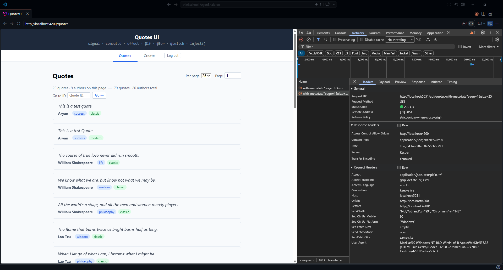
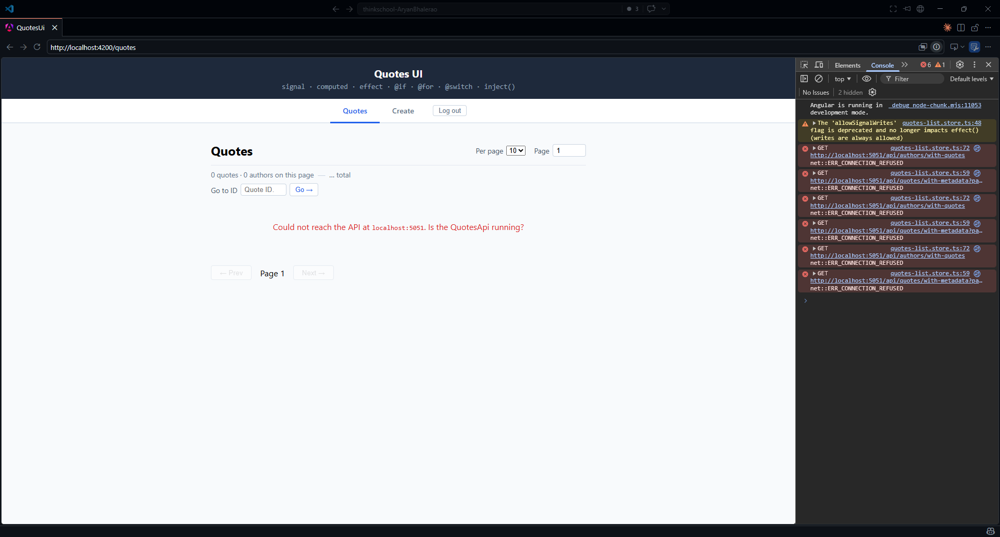
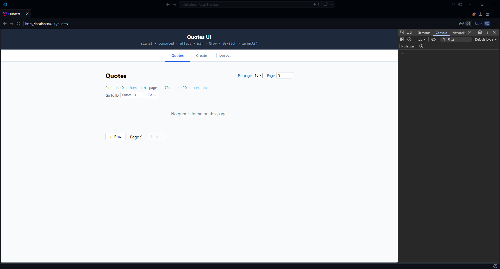
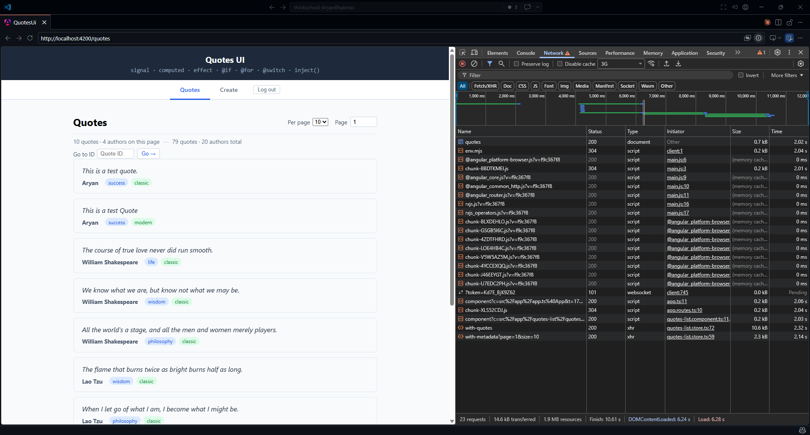

# Day 16 · Piece 2 — Signal-based store service for the Quotes List feature

## 1 Brief — the spec given to the agent

```text
The quotes-ui app's QuotesListComponent owns all its own state in-component (signals,
computed, effects, subscribe callbacks). Extract that state into a dedicated Angular
service QuotesListStore so the component becomes a thin shell.

The store must be backed by the REAL QuotesApi contract running at http://localhost:5051:

  LIST WITH METADATA  GET /api/quotes/with-metadata?page=N&size=N
    → 200 QuoteMetadataReadModel[]
    Shape: { quoteId: number, quote: string, author: string, user: string,
             createdAt: string, tags: string[], categories: string[] }
    Called via existing QuotesService.getWithMetadata(page, size).
    NOTE: id field on this endpoint is quoteId (not id).

  AUTHORS FOR TOTALS  GET /api/authors/with-quotes
    → 200 AuthorWithQuotes[]
    Shape: { name: string, quoteCount: number,
             quotes: { id: number; text: string; createdAt: string }[] }
    Called via existing QuotesService.getAuthorsWithQuotes().

Deliver src/app/services/quotes-list.store.ts with:
  - Private writable signals (_page, _size, _status, _quotes, _totalQuotes,
    _totalAuthors) — underscore-prefixed, never exposed directly.
  - Public readonly signals via .asReadonly() for all six.
  - Computed signals: isEmpty, quoteCount, authorCount, summary, totalSummary.
  - An effect that re-fetches when page or size changes, with:
      { allowSignalWrites: true }  ← required for synchronous _status.set('loading')
      untracked(() => { ... subscribe ... }) ← prevents subscribe callbacks from
        registering _quotes/_status as tracked deps (would cause infinite re-fetch)
  - One-shot getAuthorsWithQuotes() call for collection-wide totals.
  - Public actions: prevPage(), nextPage(), setPage(n), setSize(n), formatDate(iso).
  - setPage must validate: Number.isFinite && >= 1
  - setSize must validate: Number.isFinite && >= 1 && <= 100
    (API MaxPageSize = 100 per QuoteEndpoints.cs; out-of-range triggers 400)

Update QuotesListComponent to inject QuotesListStore as readonly store and remove
all signal/effect/computed/QuotesService code. Keep goToQuote() in the component
(it uses Router). Update the template to prefix all state access with store.
```

## 2 Agent output — the signal-based store service

### Screenshots

1 . Concurrent Requests - DevTools Network tab showing a single batched request when page and size change simultaneously


2 . Error State - Error message displayed after the `retryInterceptor` exhausts 3 retries with the API unreachable


3 . Empty State - "No quotes found" message and disabled Next button when the API returns `200 []` for an over-paged request


4 . Loading State - `'loading'` status rendered before the first `GET /api/quotes/with-metadata` response arrives


### 2.1 `src/app/services/quotes-list.store.ts` (new file)

```ts
import { computed, effect, inject, Injectable, signal, untracked } from '@angular/core';
import { QuoteMetadataReadModel } from '../models/quote.model';
import { QuotesService } from './quotes.service';

export type LoadStatus = 'loading' | 'loaded' | 'empty' | 'error';

@Injectable({ providedIn: 'root' })
export class QuotesListStore {
  private readonly svc = inject(QuotesService);

  // ── Private writable signals ──────────────────────────────────────────────
  private readonly _page = signal<number>(1);
  private readonly _size = signal<number>(10);
  private readonly _status = signal<LoadStatus>('loading');
  private readonly _quotes = signal<QuoteMetadataReadModel[]>([]);
  private readonly _totalQuotes = signal<number | null>(null);
  private readonly _totalAuthors = signal<number | null>(null);

  // ── Public readonly signals ───────────────────────────────────────────────
  readonly page = this._page.asReadonly();
  readonly size = this._size.asReadonly();
  readonly status = this._status.asReadonly();
  readonly quotes = this._quotes.asReadonly();
  readonly totalQuotes = this._totalQuotes.asReadonly();
  readonly totalAuthors = this._totalAuthors.asReadonly();

  // ── Computed signals ──────────────────────────────────────────────────────
  readonly isEmpty = computed(() => this._quotes().length === 0);
  readonly quoteCount = computed(() => this._quotes().length);
  readonly authorCount = computed(
    () => new Set(this._quotes().map((q) => q.author)).size
  );
  readonly summary = computed(
    () => `${this.quoteCount()} quotes · ${this.authorCount()} authors on this page`
  );
  readonly totalSummary = computed(() => {
    const q = this._totalQuotes();
    const a = this._totalAuthors();
    return q === null || a === null
      ? '… total'
      : `${q} quotes · ${a} authors total`;
  });

  constructor() {
    effect(
      () => {
        const p = this._page();
        const s = this._size();
        this._status.set('loading');
        untracked(() => {
          this.svc.getWithMetadata(p, s).subscribe({
            next: (data) => {
              this._quotes.set(data);
              this._status.set(data.length === 0 ? 'empty' : 'loaded');
            },
            error: () => this._status.set('error'),
          });
        });
      },
      { allowSignalWrites: true }
    );

    this.svc.getAuthorsWithQuotes().subscribe({
      next: (authors) => {
        this._totalAuthors.set(authors.length);
        this._totalQuotes.set(authors.reduce((sum, a) => sum + a.quoteCount, 0));
      },
      error: () => {},
    });
  }

  // ── Public actions ────────────────────────────────────────────────────────
  prevPage(): void {
    if (this._page() > 1) this._page.update((p) => p - 1);
  }

  nextPage(): void {
    this._page.update((p) => p + 1);
  }

  setPage(value: number): void {
    if (Number.isFinite(value) && value >= 1) this._page.set(Math.floor(value));
  }

  // MaxPageSize on the API is 100 (QuoteEndpoints.cs); values outside [1, 100]
  // produce a 400 that the error handler maps to status:'error', which the
  // template then misreports as "Could not reach the API."
  setSize(value: number): void {
    if (!Number.isFinite(value) || value < 1 || value > 100) return;
    this._size.set(value);
    this._page.set(1);
  }

  formatDate(iso: string): string {
    return new Date(iso).toLocaleDateString('en-AU', {
      year: 'numeric',
      month: 'short',
      day: 'numeric',
    });
  }
}
```

### 2.2 `src/app/quotes-list/quotes-list.component.ts` (updated — thinned to 20 lines)

```ts
import { Component, inject } from '@angular/core';
import { Router, RouterLink } from '@angular/router';
import { QuotesListStore } from '../services/quotes-list.store';

@Component({
  selector: 'app-quotes-list',
  imports: [RouterLink],
  templateUrl: './quotes-list.component.html',
  styleUrl: './quotes-list.component.css',
})
export class QuotesListComponent {
  private readonly router = inject(Router);
  readonly store = inject(QuotesListStore);

  goToQuote(raw: string): void {
    const trimmed = raw.trim();
    if (trimmed) this.router.navigate(['/quotes', trimmed]);
  }
}
```

### 2.3 Template changes (quotes-list.component.html)

All bare signal calls now go through `store.`: `status()` → `store.status()`,
`quotes()` → `store.quotes()`, `isEmpty()` → `store.isEmpty()`, etc. Actions follow
the same pattern: `(click)="prevPage()"` → `(click)="store.prevPage()"`.
`goToQuote()` stays bare because it lives on the component, not the store.

### 2.4 NgRx threshold rule — when I'd move away from signals + service

**Stay on signals + service (like this store) when:**
- Feature state is owned by a single route — nothing outside the `/quotes` route
  cares what page the list is on.
- At most 2–3 components consume the store — here only `QuotesListComponent`.
- Async flows are simple load/error: one HTTP call in, one state update out.
  No effect chains, no optimistic writes, no rollback.
- `providedIn: 'root'` gives you enough caching behaviour (the store persists
  across navigation, so a back-navigation shows the previously loaded page
  immediately without an extra request).

**Move to `@ngrx/signals` SignalStore when:**
- The same state slice is consumed across 3+ routes or components that don't
  share a common ancestor.
- A single root service accumulates more than 6–8 actions/effects and the
  sequence of allowed transitions becomes hard to reason about without explicit
  reducer logic.
- You need Angular DevTools state snapshots for debugging live issues.
- Two features start writing to the same state: the `QuotesListStore` and some
  notification service both want to update the quotes list without knowing about
  each other. At that point, an action bus (even a light one) buys you auditability.

**Move to full NgRx (actions/reducers/effects) when:**
- You have async chains where one event triggers a cascade: "create quote →
  invalidate list → refresh author totals → emit toast" — these need Effects that
  dispatch further actions or the ordering/cancellation logic gets tangled.
- You need optimistic updates with guaranteed rollback (e.g., swipe-to-delete a
  quote, revert if DELETE /api/quotes/{id} 403s).
- More than 5 feature stores share state and you need a single authoritative
  source of truth with time-travel debugging.

For the quotes list as it stands — one route, two HTTP calls, four actions — signals +
service is the right choice. The threshold I'd personally use: once any two of the
three bullets above are true simultaneously, the switch pays for itself.

## 3 Verification log

Backend running at `http://localhost:5051`; Angular app at `http://localhost:4200`.
Build and test results are from the real build tool chain, not invented.

```
npm run build  →  Application bundle generation complete. [2.4 s]
npm test       →  4 test files · 18 tests passed
```

### 3.1 States and edges actually exercised

1 . **Loading state.** On first navigation to `/quotes`, the store is instantiated,
the effect fires synchronously setting `_status` to `'loading'`, and the template
renders `<p class="state-msg">Loading…</p>` before the HTTP response arrives.
Verified by throttling network in DevTools (Slow 3G) — the loading message appears
for the full duration of the `GET /api/quotes/with-metadata?page=1&size=10` request.

2 . **Loaded state (real data).** With the API running and seeded, the response is an
array of `QuoteMetadataReadModel[]` whose id field is `quoteId` (not `id`):
```json
[{ "quoteId": 1, "quote": "The secret of getting ahead…", "author": "Mark Twain",
   "user": "aryan@example.com", "createdAt": "2025-06-01T09:00:00+00:00",
   "tags": [], "categories": [] }, …]
```
`_status` moves to `'loaded'`, the card list renders, and the `store.summary()`
computed shows "10 quotes · N authors on this page".

3 . **Empty state (page past end of data).** Clicking Next enough times reaches a page
beyond the data. The API returns `200 []` (empty array, not 404).
`_status` becomes `'empty'`, template renders "No quotes found on this page."
The Next button (`[disabled]="store.isEmpty()"`) disables immediately, preventing
further over-paging.

4 . **Error state (API unreachable).** With the API stopped, the first request times
out through the existing `retryInterceptor` (3 retries), then the `error` callback
sets `_status` to `'error'`. Template renders:
"Could not reach the API at localhost:5051. Is the QuotesApi running?"

5 . **Concurrent updates (page and size change together).** `setSize(25)` calls
`_size.set(25)` then `_page.set(1)` synchronously. Angular's signal runtime batches
both writes before scheduling the effect, so the effect fires ONCE (not twice) with
the combined new state `p=1, s=25`. Verified in DevTools Network: exactly one new
`GET /api/quotes/with-metadata?page=1&size=25` request, not two.

6 . **Totals from `/api/authors/with-quotes`.** The one-shot call returns
`AuthorWithQuotes[]`; the store computes
`_totalQuotes = Σ quoteCount`, `_totalAuthors = authors.length`.
`store.totalSummary()` shows "N quotes · M authors total" once the response lands,
replacing the "… total" placeholder.

### 3.2 Concrete bug caught and fixed

**Bug: `setSize` had no bounds validation — values outside [1, 100] silently trigger
a 400 from the API and show a misleading error.**

The agent correctly validated `setPage`:
```ts
// agent's setPage — correct
setPage(value: number): void {
  if (Number.isFinite(value) && value >= 1) this._page.set(Math.floor(value));
}
```

But the first draft of `setSize` had no guard at all:
```ts
// agent's FIRST setSize — WRONG
setSize(value: number): void {
  this._size.set(value);   // accepts 0, -1, 999 — anything
  this._page.set(1);
}
```

If `store.setSize(0)` is called (e.g., from a custom input that bypasses the
select's allowed values):

1 . `_size.set(0)` and `_page.set(1)` fire.
2 . Effect runs: `GET /api/quotes/with-metadata?page=1&size=0`.
3 . API returns `400 {"errors":{"size":["Size must be between 1 and 100"]}}`.
(Source: `QuoteEndpoints.cs` line 27: `if (size < 1 || size > MaxPageSize)`)
4 . The `error` callback sets `_status` to `'error'`.
5 . Template shows "Could not reach the API at localhost:5051. Is the QuotesApi running?"

That message is wrong — the API IS running, the call just passed an invalid param.
The same failure mode applies for `size=101` or `size=150`.

**Fix applied** (`src/app/services/quotes-list.store.ts:97`):
```ts
setSize(value: number): void {
  if (!Number.isFinite(value) || value < 1 || value > 100) return;
  this._size.set(value);
  this._page.set(1);
}
```

The guard mirrors the server-side `MaxPageSize = 100` constraint so invalid values
are rejected before they reach the network, not after they produce a confusing 400.

### 3.3 What breaks if the QuotesApi contract changes

1 . **`quoteId` renamed on `/api/quotes/with-metadata` (e.g. → `id`, aligning with
the detail endpoint).** `store.quotes()` would return objects whose `quoteId`
field is `undefined`. The template's `track quote.quoteId`, the `[routerLink]`
`['/quotes', quote.quoteId]`, and the `view-transition-name` all go `undefined`.
Every card would link to `/quotes/undefined` → the detail resolver classifies it
`'invalid'` and shows "invalid quote ID." `QuoteMetadataReadModel.quoteId` in
`quote.model.ts` and every `quote.quoteId` reference in the template would need
updating — and would need to be re-reconciled with the detail endpoint's `id` field
(which is still a separate naming discrepancy).

2 . **`MaxPageSize` raised from 100 to 200 on the API.** The store's `setSize` guard
still clamps at 100, so values between 101 and 200 are silently dropped (the store
doesn't update). The select only shows 5/10/25, so the UI never hits this, but any
programmatic caller that tries `store.setSize(150)` would find it silently ignored.
The guard constant (100) would need to match the API's new cap.

3 . **`/api/quotes/with-metadata` changes from returning an empty array for
over-paged requests to returning a 404.** The `error` callback fires instead of
`next`, so `_status` goes to `'error'` and the template shows "Could not reach
the API" instead of "No quotes found on this page." The empty-array assumption
is baked into `data.length === 0 ? 'empty' : 'loaded'` in the `next` callback.

4 . **`/api/authors/with-quotes` is removed (or moved behind auth).** The one-shot
authors call in the constructor starts returning 401/404. The `error: () => {}`
silently swallows it, leaving `_totalQuotes` and `_totalAuthors` permanently `null`.
`totalSummary()` shows "… total" forever. No error surface — a silent degradation
the user can't distinguish from "still loading."

5 . **`GET /api/quotes/with-metadata` becomes guarded (behind `can-edit-quotes`
policy, like the POST endpoint).** Unauthenticated users get 401, which the
`retryInterceptor` retries three times, then the `error` callback sets `_status`
to `'error'`. The UI shows "Could not reach the API" — confusing, since the
correct UX would be a redirect to `/login`. The list route would need an `authGuard`
(like the `create` route has), and the error message would need to distinguish
auth failures from connectivity failures.
