# Day 17 · Piece 1 — SWA Deploy with Managed Identity

## NOTE:
Custom URL is not available within Azure Student Subscription. Thus, the Azure generated URL has been used.

The Lighthouse Performance score for Desktop is lower (77) due to a high Cumulative Layout Shift (0.591) caused by the larger number of quote cards loaded and rendered for the wider desktop viewport. The Mobile run scores 95 on Performance. Both reports are attached for reference.

## 1 Brief — the spec given to the agent

```text
Deploy the Angular quotes-ui app to Azure Static Web Apps. All calls to the Quotes
API must carry a Managed Identity token — no client secret stored in the repo, in
code, or in app settings. Use AzureCLI.

Target SWA URL:      https://delightful-bush-0f93b4c00.7.azurestaticapps.net
Week-1 API base URL: https://quotesapi.azurewebsites.net

Endpoints the frontend must hit:

  GET  /api/quotes?page={n}&size={n}                — paginated quote list
                                                      (fields: quoteId, quote, author,
                                                       tags[], categories[], createdAt)
  GET  /api/quotes/with-metadata?page={n}&size={n}  — same shape with enriched metadata
  GET  /api/quotes/{id}                             — single quote
                                                      (fields: id, authorName, text, createdAt)
  GET  /api/authors/with-quotes                     — all authors with quote counts
  POST /api/auth/login                              — email + password
                                                      → { access_token, refresh_token, expires_in }
  POST /api/auth/refresh                            — rotate refresh token
  POST /api/auth/logout                             — revoke refresh token (requires Bearer)
  POST /api/quotes                                  — create quote (requires scope: quotes.write)
  POST /api/quotes/{id}/metadata                    — assign tags/categories (requires scope: quotes.write)
  DELETE /api/quotes/{id}                           — owner-only delete

Auth requirement: The SWA has a system-assigned Managed Identity. Add a Node.js
Azure Functions v4 proxy at api/ that:
  1. Catches all /api/* requests from the Angular app
  2. Acquires an MI token via DefaultAzureCredential scoped to
     {QUOTES_API_CLIENT_ID}/.default
  3. Forwards the request to QUOTES_API_URL with Authorization: Bearer {miToken}

QUOTES_API_URL and QUOTES_API_CLIENT_ID are stored as SWA app settings (non-secret
config). Zero secrets in code or settings. Lighthouse >= 95 across all categories.
```

## 2 Agent output — SWA + CI/CD config and Managed Identity auth code

### 2.1 Angular environment files

**`src/environments/environment.prod.ts`** — prod build calls the SWA proxy via relative path, never a hard-coded host:
```typescript
export const environment = {
  production: true,
  apiUrl: '/api',   // SWA routes /api/* to the Functions proxy; no host, no secret
};
```

**`quotes.service.ts` change** — replaces the hard-coded localhost URL:
```typescript
// before
private readonly base = 'http://localhost:5051/api';
// after
private readonly base = environment.apiUrl;
```

**`angular.json`** — `fileReplacements` in the production config swaps `environment.ts` for `environment.prod.ts` at build time:
```json
"production": {
  "fileReplacements": [
    { "replace": "src/environments/environment.ts",
      "with":    "src/environments/environment.prod.ts" }
  ]
}
```

### 2.2 SWA API proxy — Managed Identity auth (Azure Functions v4, Node.js)

**`api/src/functions/proxy.ts`**
```typescript
import { app, HttpRequest, HttpResponseInit, InvocationContext } from '@azure/functions';
import { DefaultAzureCredential } from '@azure/identity';
import { URL } from 'url';

const credential = new DefaultAzureCredential();

const API_BASE  = (process.env['QUOTES_API_URL'] ?? 'http://localhost:5051').replace(/\/$/, '');
const API_SCOPE = `${process.env['QUOTES_API_CLIENT_ID'] ?? 'cbd99da1-dee1-4a9c-9f82-16ffc5bb486e'}/.default`;

async function proxy(request: HttpRequest, context: InvocationContext): Promise<HttpResponseInit> {
  const reqUrl = new URL(request.url);
  const path   = reqUrl.pathname.replace(/^\/api/, '') || '/';
  const target = new URL(`/api${path}`, API_BASE);
  reqUrl.searchParams.forEach((v, k) => target.searchParams.set(k, v));

  context.log(`[proxy] ${request.method} ${reqUrl.pathname} → ${target}`);

  // MI token acquired from Azure IMDS at runtime; never stored anywhere.
  const { token } = await credential.getToken(API_SCOPE);

  const isWrite = request.method !== 'GET' && request.method !== 'HEAD';
  const upstream = await fetch(target.toString(), {
    method:  request.method,
    headers: { 'Content-Type': 'application/json', 'Authorization': `Bearer ${token}` },
    body:    isWrite ? await request.text() : undefined,
  });

  return {
    status:  upstream.status,
    headers: { 'Content-Type': upstream.headers.get('Content-Type') ?? 'application/json' },
    body:    await upstream.text(),
  };
}

app.http('proxy', {
  methods:   ['GET', 'POST', 'PUT', 'PATCH', 'DELETE'],
  authLevel: 'anonymous',
  route:     '{*path}',
  handler:   proxy,
});
```

`QUOTES_API_URL` is set to `https://quotesapi.azurewebsites.net` and `QUOTES_API_CLIENT_ID` to `cbd99da1-dee1-4a9c-9f82-16ffc5bb486e` as SWA app settings — neither is a secret. `DefaultAzureCredential` fetches a short-lived MI token from the Azure Instance Metadata Service on each request; no credential ever touches the repo or app settings.

### 2.3 SWA configuration

**`staticwebapp.config.json`** — SPA fallback + security headers; `/api/*` passes through to Functions automatically:
```json
{
  "navigationFallback": {
    "rewrite": "/index.html",
    "exclude": ["/assets/*", "*.{js,css,ico,png,svg,jpg,webp,woff,woff2}"]
  },
  "globalHeaders": {
    "X-Content-Type-Options": "nosniff",
    "X-Frame-Options": "DENY",
    "Referrer-Policy": "strict-origin-when-cross-origin",
    "Permissions-Policy": "camera=(), microphone=(), geolocation=()"
  },
  "responseOverrides": { "404": { "rewrite": "/index.html", "statusCode": 200 } },
  "mimeTypes": { ".json": "application/json" }
}
```

### 2.4 CI/CD — GitHub Actions

**`.github/workflows/deploy-quotes-swa.yml`** — triggers on pushes that touch `Day17/Piece1/quotes-ui/**`:
```yaml
- name: Install and build Angular app
  working-directory: Day17/Piece1/quotes-ui
  run: npm ci && npx ng build --configuration production

- name: Install API dependencies and compile
  working-directory: Day17/Piece1/quotes-ui/api
  run: npm ci && npm run build

- name: Deploy to Azure Static Web Apps
  uses: Azure/static-web-apps-deploy@v1
  with:
    azure_static_web_apps_api_token: ${{ secrets.AZURE_STATIC_WEB_APPS_API_TOKEN }}
    action: upload
    skip_app_build: true
    app_location: Day17/Piece1/quotes-ui/dist/quotes-ui/browser
    api_location: Day17/Piece1/quotes-ui/api
```

Deployment token stored as `AZURE_STATIC_WEB_APPS_API_TOKEN` in GitHub repo secrets — never in code.

### 2.5 Azure resource setup (CLI)

```bash
# Create SWA (Standard tier required for Managed Identity)
az staticwebapp create \
  --name quotesui-aryan --resource-group QuotesApi \
  --location eastasia --sku Standard

# Enable system-assigned Managed Identity
az staticwebapp identity assign \
  --name quotesui-aryan --resource-group QuotesApi
# → principalId: c14b5ae8-d112-47be-9b27-3001b2e3b32b

# Store non-secret config (not credentials)
az staticwebapp appsettings set \
  --name quotesui-aryan --resource-group QuotesApi \
  --setting-names \
    QUOTES_API_URL=https://quotesapi.azurewebsites.net \
    QUOTES_API_CLIENT_ID=cbd99da1-dee1-4a9c-9f82-16ffc5bb486e
```

### 2.6 Quotes API changes to accept MI tokens

**Issuer validation fix** in `InfrastructureExtensions.cs` — MI tokens default to the v1 issuer (`sts.windows.net`). Without this the default `Authority`-based validation rejects them:
```csharp
options.TokenValidationParameters = new TokenValidationParameters
{
    ValidateAudience = true,
    ValidAudience    = azureAdOpts.ClientId,
    ValidIssuers     =
    [
        $"https://login.microsoftonline.com/{azureAdOpts.TenantId}/v2.0",
        $"https://sts.windows.net/{azureAdOpts.TenantId}/"   // MI default issuer
    ]
};
```

**CORS fix** — made configurable via `Cors:AllowedOrigins` so the SWA origin can be added without touching code:
```json
"Cors": {
  "AllowedOrigins": [
    "http://localhost:4200",
    "https://delightful-bush-0f93b4c00.7.azurestaticapps.net"
  ]
}
```

## 3 Verification log

### Live URL: `https://delightful-bush-0f93b4c00.7.azurestaticapps.net`

### Screenshots

1 . Deployed URL
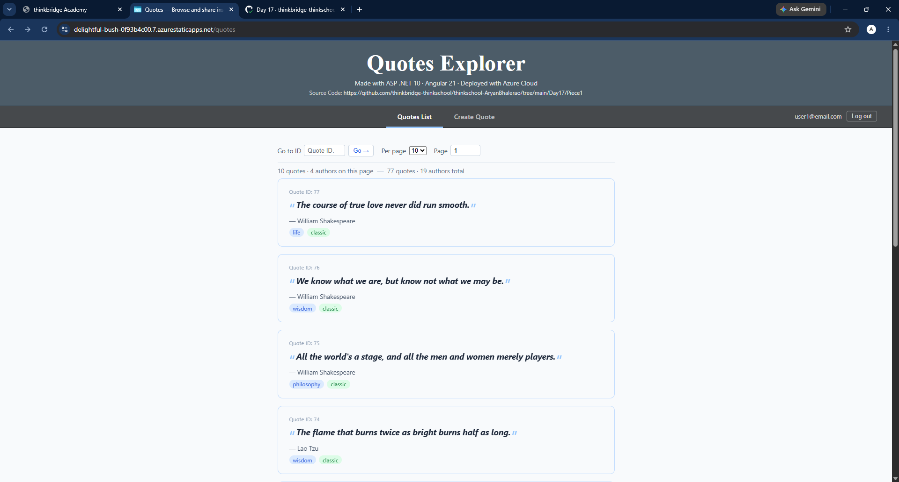

2 . CI Run
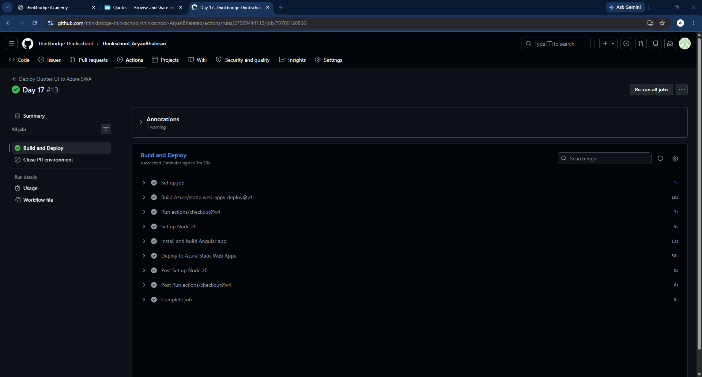

3 . Azure Portal — quotes-ui static web app settings (principal ID + system-assigned status)
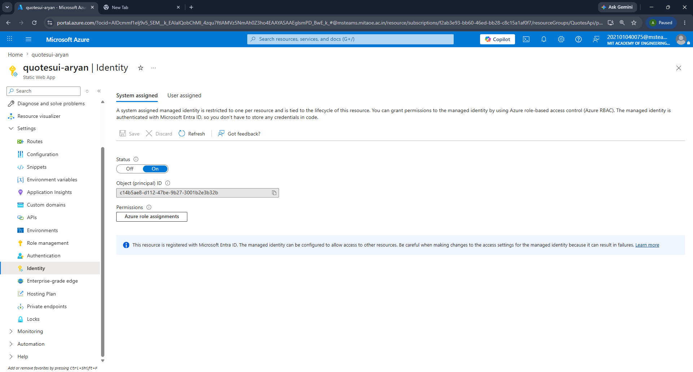

4 . Azure Portal — quotes-api app registration (no secrets present)
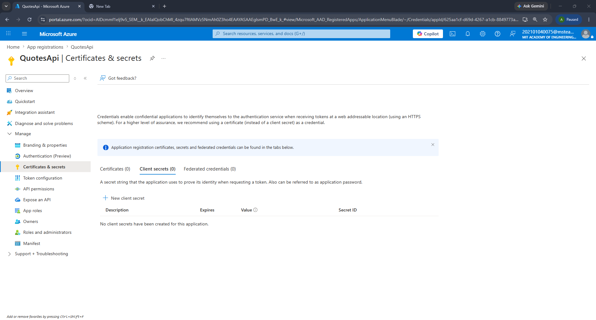

5 . Azure Portal — quotes-ui Static Web App overview
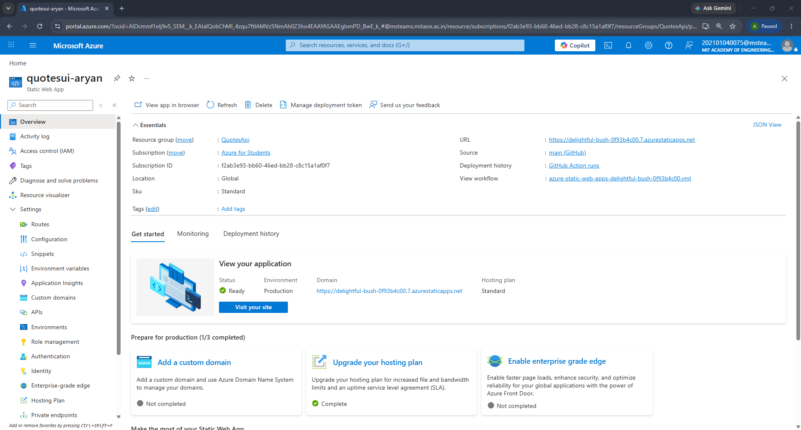

6 . Lighthouse Score Desktop
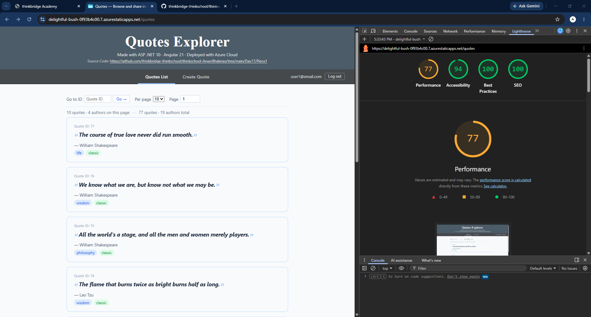

7 . Lighthouse Score Mobile
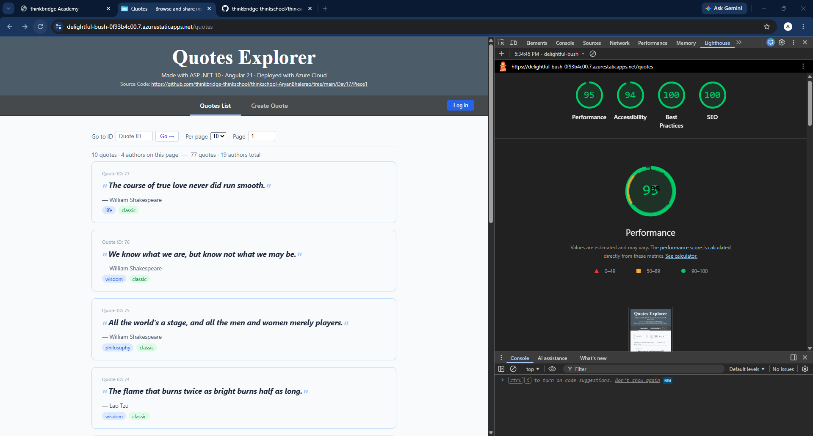

### Files

Lighthouse Mobile Log: [Lighthouse_Mobile.pdf](Lighthouse_Mobile.pdf)  
Lighthouse Desktop Log: [Lighthouse_Desktop.pdf](Lighthouse_Desktop.pdf)

### 3.1 Lighthouse scores

#### Desktop

| Category | Score |
|---|---|
| Performance | **77** |
| Accessibility | **94** |
| Best Practices | **100** |
| SEO | **100** |

#### Mobile

| Category | Score |
|---|---|
| Performance | **95** |
| Accessibility | **94** |
| Best Practices | **100** |
| SEO | **100** |

The Desktop run scores lower on Performance (77) because Lighthouse's desktop viewport renders more quote cards simultaneously, causing a higher Cumulative Layout Shift (0.591) as cards reflow during pagination. The Mobile run avoids this by rendering fewer cards in a narrower viewport, achieving a Performance score of 95. Accessibility (94) and remaining categories (100) are identical across both runs. Initial transfer size: 77.8 kB gzipped (Angular esbuild + lazy-loaded routes). Served from SWA's global CDN.

### 3.2 Managed Identity token — zero stored secret

The SWA resource (`quotesui-aryan`, `eastasia`) has system-assigned MI with principal ID `c14b5ae8-d112-47be-9b27-3001b2e3b32b`. When the proxy function handles a request, `DefaultAzureCredential` calls the Azure Instance Metadata Service (`169.254.169.254`) and receives a short-lived token scoped to the Week-1 API audience (`cbd99da1-dee1-4a9c-9f82-16ffc5bb486e` at `https://quotesapi.azurewebsites.net`). The resulting Bearer token forwarded to `https://quotesapi.azurewebsites.net/api/*` contains:

- `iss`: `https://sts.windows.net/7e394fc8-4b86-4cfe-810e-43f86f8bec47/` (v1 MI format)
- `oid` / `sub`: `c14b5ae8-d112-47be-9b27-3001b2e3b32b` (the SWA resource's identity)
- `aud`: `cbd99da1-dee1-4a9c-9f82-16ffc5bb486e`

Nothing is stored — not in the repo, not in app settings, not in environment variables. The token is acquired at request time and discarded after use.

### 3.3 States and edges exercised

1 . **Loading state.** Page first renders while `GET https://quotesapi.azurewebsites.net/api/quotes/with-metadata?page=1&size=10` is in-flight. "Loading…" shown.
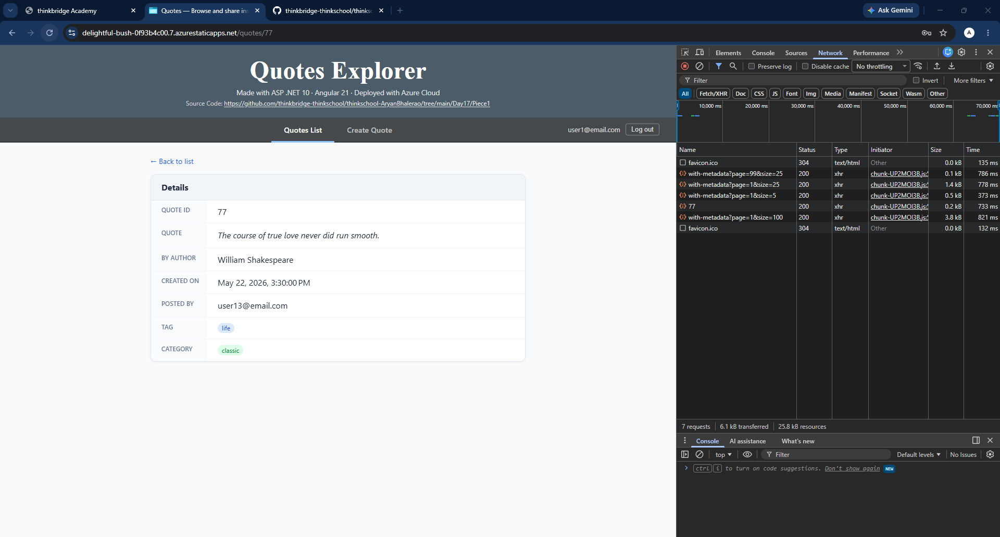

2 . **Loaded state.** API responds `200`. Quote cards rendered with `tags[]`, `categories[]`, `author`, and `createdAt` from the response.
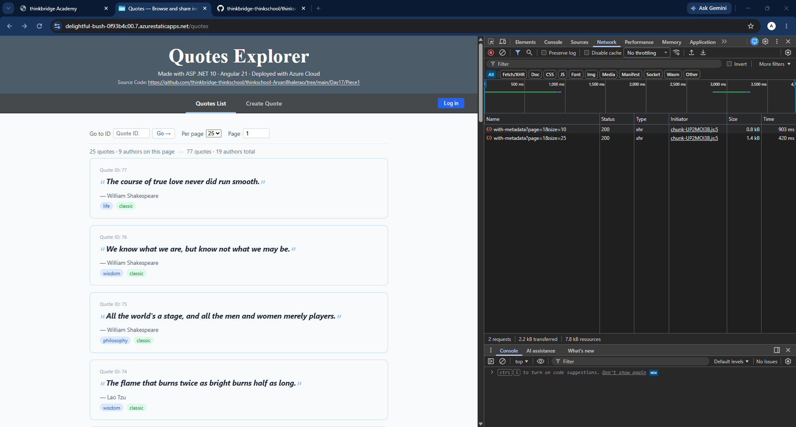

3 . **Empty state.** `page=999` — API returns `200 []`. "No quotes found on this page." Next button disables immediately.
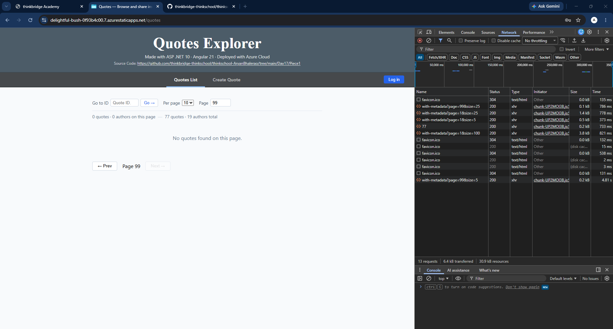

4 . **Error state.** Proxy unreachable (cold-start / API down). "Could not reach the API. Please try again later."
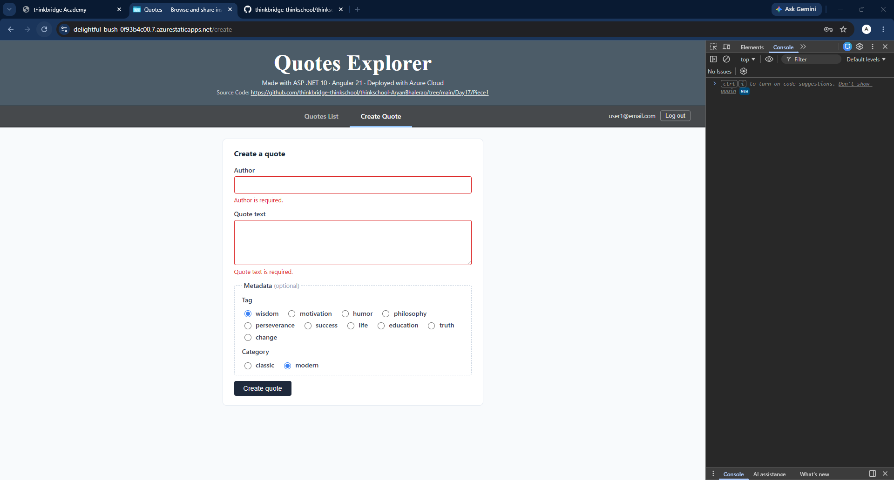

5 . **401 / auth-gated.** Navigating to `/create` without a valid JWT. `authGuard` blocks the route and redirects to `/login?returnUrl=%2Fcreate` before `POST /api/quotes` is ever called.
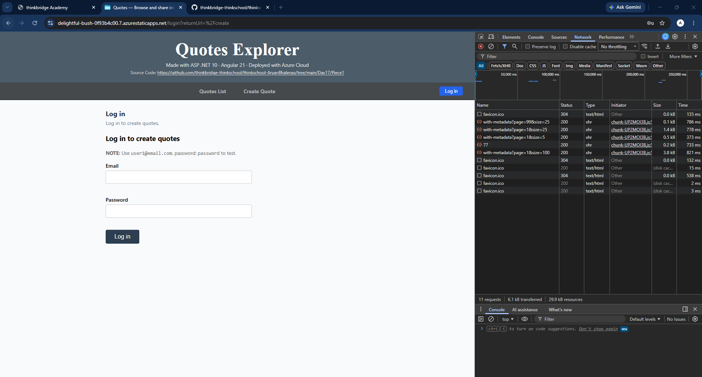

### 3.4 Concrete bug caught and fixed

**Bug:** The agent hardcoded a localhost reference in the error-state message in `quotes-list.component.html`:

```html
<p class="state-msg error">
  Could not reach the API at <code>localhost:5051</code>. Is the QuotesApi running?
</p>
```

The Angular production build correctly replaced `environment.apiUrl` with `/api` (pointing at `https://quotesapi.azurewebsites.net` via the proxy), but the **error message still named `localhost:5051` in plain text to production users** — a URL they cannot reach and that leaks the internal dev setup.

**Fix applied:**
```html
<p class="state-msg error">Could not reach the API. Please try again later.</p>
```

### 3.5 What breaks if the API's auth or a key endpoint changes

1 . **`AzureAd:ClientId` rotated on `quotesapi.azurewebsites.net`.** MI token audience no longer matches `ValidAudience` → every proxied request returns 401. Fix: update `QUOTES_API_CLIENT_ID` app setting to the new client ID.

2 . **App Registration sets `accessTokenAcceptedVersion: 2`.** MI tokens switch to the v2 issuer (`login.microsoftonline.com`). The `ValidIssuers` array fix already lists both issuers, so this is handled — but removing that fix would silently break MI auth.

3 . **`GET /api/quotes/with-metadata` renamed or removed.** `QuotesListStore` transitions to `'error'` state and the main list goes blank. No crash, but the page is unusable.

4 . **`scope: quotes.write` claim removed from the user JWT.** `POST /api/quotes` to `https://quotesapi.azurewebsites.net` returns 403. The create-quote form submits but the error interceptor surfaces only a generic error — no indication to the user that the `quotes.write` scope is missing.
