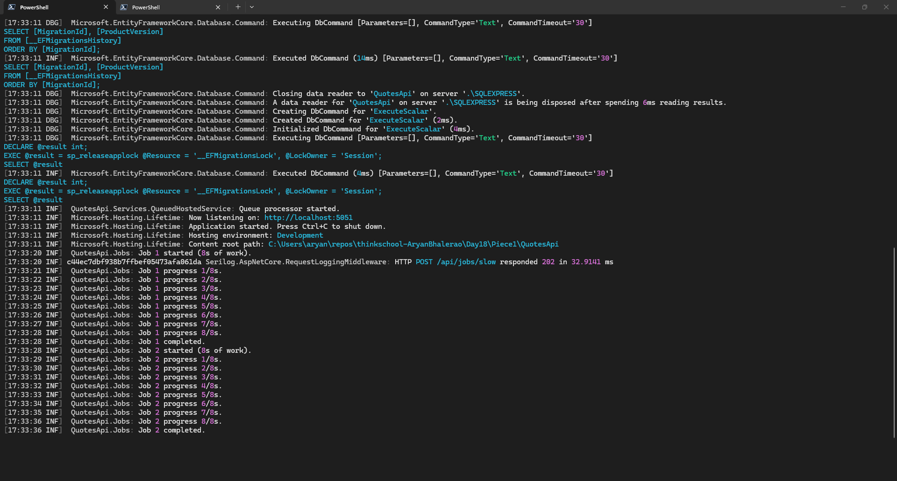
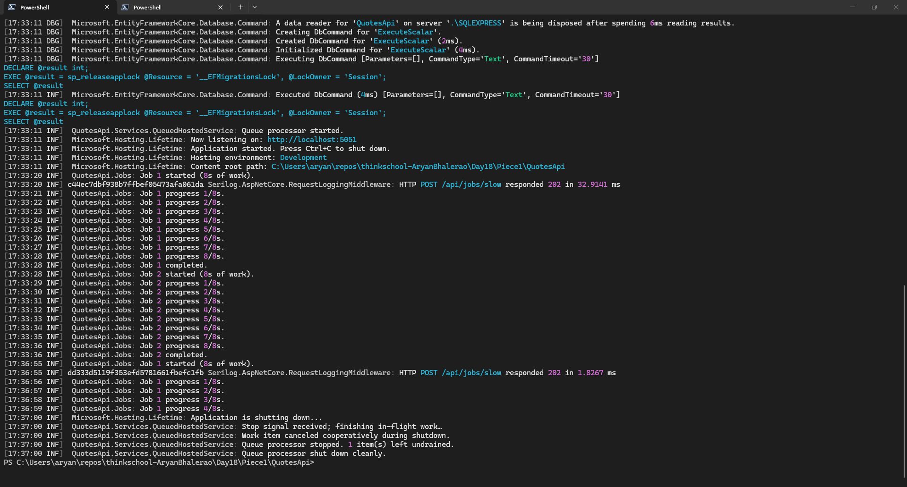

# Day 18 · Piece 1 — Moving slow work off the request thread with a `BackgroundService` queue

## 1 Background Service Queue
A request thread should answer the caller and let go. When an endpoint does slow side work inline — indexing, sending mail, calling a third party — the caller waits for work it does not care about, and the thread is held hostage under load. The fix is a **producer/consumer queue**: the endpoint *enqueues* a work item and returns `202 Accepted` immediately; a long-running `BackgroundService` *drains* the queue on its own thread.

### Pieces added

| File | Role |
|------|------|
| [`Services/IBackgroundTaskQueue.cs`](QuotesApi/Services/IBackgroundTaskQueue.cs) | Producer/consumer contract |
| [`Services/BackgroundTaskQueue.cs`](QuotesApi/Services/BackgroundTaskQueue.cs) | Bounded queue backed by `System.Threading.Channels` |
| [`Services/QueuedHostedService.cs`](QuotesApi/Services/QueuedHostedService.cs) | The `BackgroundService` that drains the queue |
| [`Endpoints/JobEndpoints.cs`](QuotesApi/Endpoints/JobEndpoints.cs) | `POST /api/jobs/slow` — anonymous demo producer |
| [`Endpoints/QuoteEndpoints.cs`](QuotesApi/Endpoints/QuoteEndpoints.cs) | Real use: quote creation enqueues post-processing |

**The `BackgroundService`** ([`QueuedHostedService.cs`](QuotesApi/Services/QueuedHostedService.cs)) — drains the queue one item at a time:

```csharp
public sealed class QueuedHostedService : BackgroundService
{
    private readonly IBackgroundTaskQueue _queue;
    private readonly ILogger<QueuedHostedService> _logger;

    public QueuedHostedService(IBackgroundTaskQueue queue, ILogger<QueuedHostedService> logger)
    {
        _queue = queue;
        _logger = logger;
    }

    protected override async Task ExecuteAsync(CancellationToken stoppingToken)
    {
        _logger.LogInformation("Queue processor started.");

        while (!stoppingToken.IsCancellationRequested)
        {
            Func<CancellationToken, ValueTask> workItem;
            try
            {
                workItem = await _queue.DequeueAsync(stoppingToken);
            }
            catch (OperationCanceledException)
            {
                // Shutdown requested while idle-waiting for work — leave the loop.
                break;
            }

            try
            {
                await workItem(stoppingToken);
            }
            catch (OperationCanceledException) when (stoppingToken.IsCancellationRequested)
            {
                _logger.LogInformation("Work item canceled cooperatively during shutdown.");
            }
            catch (Exception ex)
            {
                // One faulty job must not tear down the processor — log and continue.
                _logger.LogError(ex, "Background work item threw.");
            }
        }

        _logger.LogInformation(
            "Queue processor stopped. {Remaining} item(s) left undrained.", _queue.Count);
    }

    public override async Task StopAsync(CancellationToken cancellationToken)
    {
        _logger.LogInformation("Stop signal received; finishing in-flight work…");
        await base.StopAsync(cancellationToken);
        _logger.LogInformation("Queue processor shut down cleanly.");
    }
}
```

**The queue** ([`BackgroundTaskQueue.cs`](QuotesApi/Services/BackgroundTaskQueue.cs)) is a **bounded** channel, so a burst of requests applies back-pressure instead of growing memory without limit:

```csharp
public sealed class BackgroundTaskQueue : IBackgroundTaskQueue
{
    private readonly Channel<Func<CancellationToken, ValueTask>> _queue;

    public BackgroundTaskQueue(int capacity = 100)
    {
        var options = new BoundedChannelOptions(capacity)
        {
            FullMode = BoundedChannelFullMode.Wait,   // producer awaits when full
            SingleReader = true,                       // only QueuedHostedService drains it
        };
        _queue = Channel.CreateBounded<Func<CancellationToken, ValueTask>>(options);
    }

    public int Count => _queue.Reader.Count;

    public async ValueTask QueueAsync(Func<CancellationToken, ValueTask> workItem)
    {
        ArgumentNullException.ThrowIfNull(workItem);
        await _queue.Writer.WriteAsync(workItem);
    }

    public async ValueTask<Func<CancellationToken, ValueTask>> DequeueAsync(CancellationToken cancellationToken)
        => await _queue.Reader.ReadAsync(cancellationToken);
}
```

**Registration** ([`InfrastructureExtensions.cs`](QuotesApi/Extensions/InfrastructureExtensions.cs)) — one singleton queue shared by the producers and the single consumer:

```csharp
services.AddSingleton<IBackgroundTaskQueue>(_ => new BackgroundTaskQueue(capacity: 100));
services.AddHostedService<QueuedHostedService>();
```

### `BackgroundService` vs `IHostedService` vs Hangfire

| | `IHostedService` | `BackgroundService` | Hangfire |
|---|---|---|---|
| What it is | Raw start/stop contract (`StartAsync`/`StopAsync`) | Abstract base over `IHostedService` exposing one `ExecuteAsync(stoppingToken)` loop | A library: persistent job store + dashboard + workers |
| You write | Both lifecycle methods and your own loop + thread management | Just the `ExecuteAsync` loop; base wires the token | A one-line `BackgroundJob.Enqueue` / `RecurringJob.AddOrUpdate` |
| State on restart | In-memory — **lost** when the process dies | In-memory — **lost** when the process dies | **Survives** — jobs persisted to SQL/Redis, retried after a crash |
| Scheduling | DIY (`PeriodicTimer`, `Task.Delay`) | DIY (`PeriodicTimer`, `Task.Delay`) | First-class cron + delayed jobs, automatic retries |
| Across instances | Each instance runs its own loop (no coordination) | Same | Distributed: shared store, one worker pool, no double-run |
| Cost | Free, in-box | Free, in-box | External dependency + a backing store to operate |

`BackgroundService` is just `IHostedService` with the boilerplate removed — use it for **in-process,
fire-and-forget** work whose loss on restart is acceptable. Reach for Hangfire when jobs must
**outlive the process**.

**One line — when Hangfire over a hosted service?** Use Hangfire when a job must **survive a
restart/crash, be scheduled (cron/delayed), retry automatically, and not double-run across
multiple instances** — a hosted service's in-memory queue gives you none of those for free.

## 2 Graceful Shutdown

The host supplies `ExecuteAsync` with a `stoppingToken`, which it cancels the moment the app
begins shutting down (Ctrl+C, SIGTERM, `IHostApplicationLifetime.StopApplication`). That single
token does double duty:

1 . it unblocks `DequeueAsync` so the loop stops waiting for new work, and
2 . it is handed to each work item so in-flight work can wind down at a safe point
   (its next `await`) instead of being hard-killed.

On Ctrl+C the in-flight `Task.Delay(…, stoppingToken)` throws `OperationCanceledException`, which
the loop catches as *cooperative cancellation* and logs — the job is wound down, not aborted
mid-write. The host's `StopAsync` then waits (up to `ShutdownTimeout`, 30 s by default) for
`ExecuteAsync` to return; that wait is what makes shutdown **clean** — the process exits on its
own with no forced termination.

## 3 Output

Run the dotnet server on terminal 1 and send the curl request on the another terminal - terminal 2.

Terminal 2 Curl Request:
```text
PS C:\Users\aryan> curl -X POST "http://localhost:5051/api/jobs/slow?count=2&seconds=8"
{"enqueued":2,"secondsEach":8}
```


### 3.1 Background service terminal output and screenshot

Terminal 1 Log:
```text
[17:33:20 INF] c44ec7dbf938b7ffbef05473afa061da Serilog.AspNetCore.RequestLoggingMiddleware: HTTP POST /api/jobs/slow responded 202 in 32.9141 ms
[17:33:21 INF]  QuotesApi.Jobs: Job 1 progress 1/8s.
[17:33:22 INF]  QuotesApi.Jobs: Job 1 progress 2/8s.
[17:33:23 INF]  QuotesApi.Jobs: Job 1 progress 3/8s.
[17:33:24 INF]  QuotesApi.Jobs: Job 1 progress 4/8s.
[17:33:25 INF]  QuotesApi.Jobs: Job 1 progress 5/8s.
[17:33:26 INF]  QuotesApi.Jobs: Job 1 progress 6/8s.
[17:33:27 INF]  QuotesApi.Jobs: Job 1 progress 7/8s.
[17:33:28 INF]  QuotesApi.Jobs: Job 1 progress 8/8s.
[17:33:28 INF]  QuotesApi.Jobs: Job 1 completed.
[17:33:28 INF]  QuotesApi.Jobs: Job 2 started (8s of work).
[17:33:29 INF]  QuotesApi.Jobs: Job 2 progress 1/8s.
[17:33:30 INF]  QuotesApi.Jobs: Job 2 progress 2/8s.
[17:33:31 INF]  QuotesApi.Jobs: Job 2 progress 3/8s.
[17:33:32 INF]  QuotesApi.Jobs: Job 2 progress 4/8s.
[17:33:33 INF]  QuotesApi.Jobs: Job 2 progress 5/8s.
[17:33:34 INF]  QuotesApi.Jobs: Job 2 progress 6/8s.
[17:33:35 INF]  QuotesApi.Jobs: Job 2 progress 7/8s.
[17:33:36 INF]  QuotesApi.Jobs: Job 2 progress 8/8s.
[17:33:36 INF]  QuotesApi.Jobs: Job 2 completed.
```

Screenshot:


Observe that the `POST` returned `202` at `17:33:20` in just 32.9 ms, yet the two 8-second jobs did not finish until `17:33:36` — the caller never waited for the work, which proves it ran off the request thread. Job 2 only starts the moment Job1 completes (`17:33:28`), so a single background worker is draining the queue one item at a time rather than tying up request threads.

### 3.2 Graceful Shutdown terminal output and screenshot

```text
[17:36:55 INF] dd333d5119f353efd5781661fbefc1fb Serilog.AspNetCore.RequestLoggingMiddleware: HTTP POST /api/jobs/slow responded 202 in 1.8267 ms
[17:36:56 INF]  QuotesApi.Jobs: Job 1 progress 1/8s.
[17:36:57 INF]  QuotesApi.Jobs: Job 1 progress 2/8s.
[17:36:58 INF]  QuotesApi.Jobs: Job 1 progress 3/8s.
[17:36:59 INF]  QuotesApi.Jobs: Job 1 progress 4/8s.
[17:37:00 INF]  Microsoft.Hosting.Lifetime: Application is shutting down...
[17:37:00 INF]  QuotesApi.Services.QueuedHostedService: Stop signal received; finishing in-flight work…
[17:37:00 INF]  QuotesApi.Services.QueuedHostedService: Work item canceled cooperatively during shutdown.
[17:37:00 INF]  QuotesApi.Services.QueuedHostedService: Queue processor stopped. 1 item(s) left undrained.
[17:37:00 INF]  QuotesApi.Services.QueuedHostedService: Queue processor shut down cleanly.
```

Screenshot:


Observe that Ctrl+C at `17:37:00` cancels the `stoppingToken` while Job 1 is still mid-flight (`progress 4/8s`), so instead of being hard-killed it throws at its next `await` and is logged as *canceled cooperatively*. Job 2 was still queued and never started, which is why the log honestly reports `1 item(s) left undrained` the limitation of an in-memory queue that Hangfire's durable store would solve. Finally `shut down cleanly` prints and the prompt returns, showing the process
exited on its own with no forced termination.
