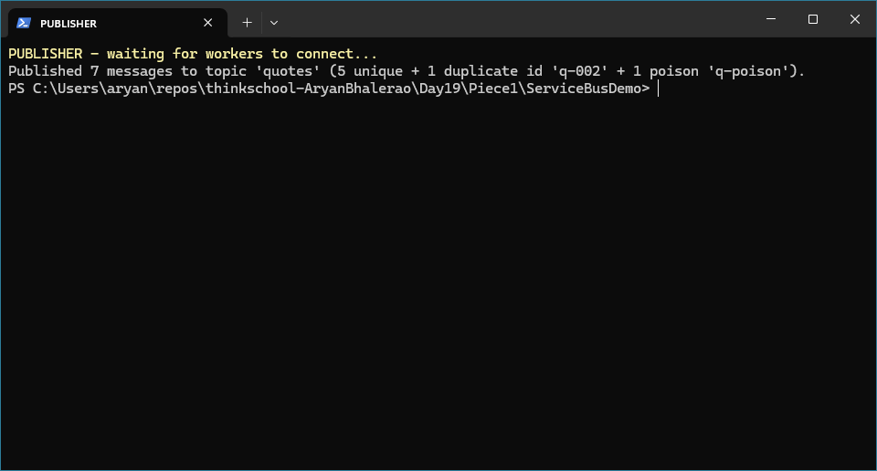
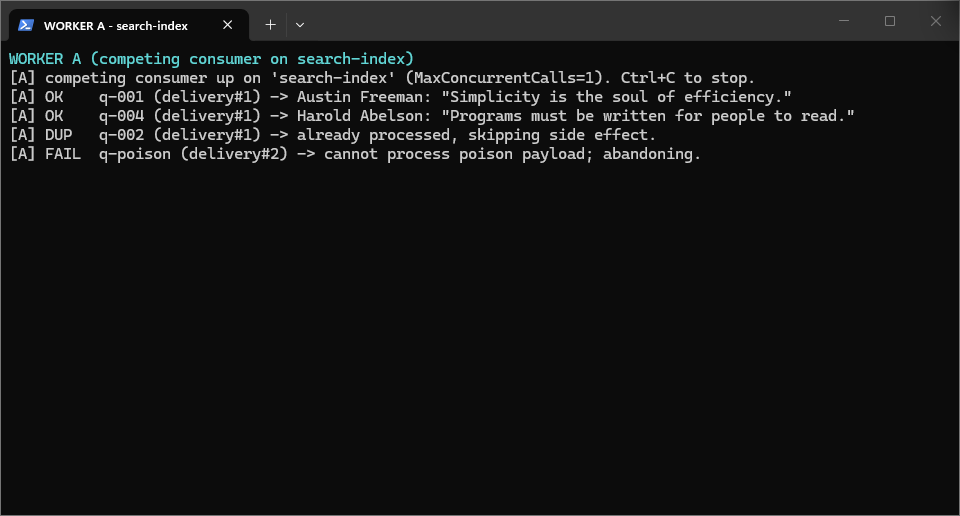
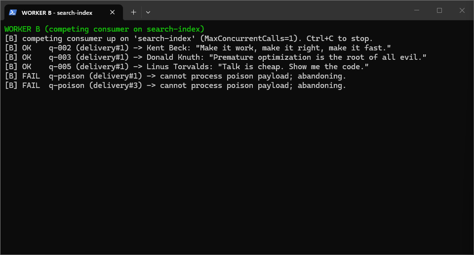
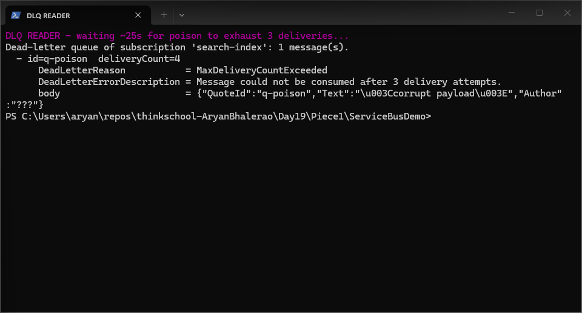
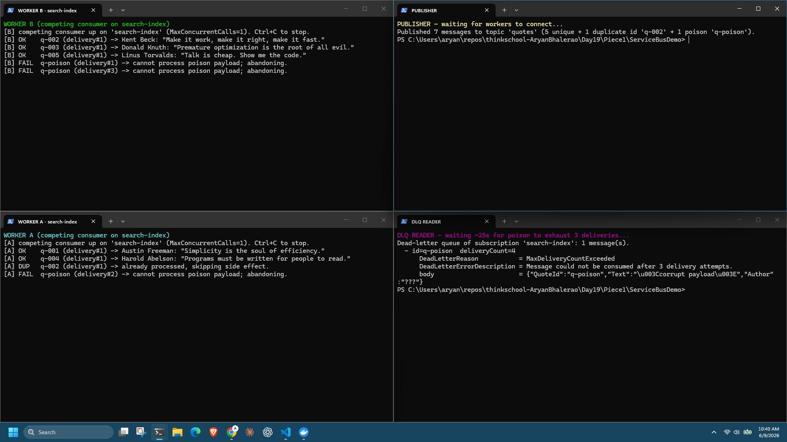

# Day 19 · Piece 1 — Service Bus: competing consumers, idempotency, and the dead-letter queue

A **topic** fans every message out to each **subscription** (pub/sub); within one subscription, multiple workers **compete** so each message is handled by exactly one of them. This runs locally on Microsoft's official **Azure Service Bus emulator** in Docker — a real broker with peek-lock, delivery-count tracking, and dead-letter queues. Topic `quotes` has two subscriptions, `audit` and `search-index`, each with `MaxDeliveryCount=3`. Full code lives in [`ServiceBusDemo/`](ServiceBusDemo/); the topology is declared in [config/servicebus-config.json](ServiceBusDemo/config/servicebus-config.json) and the broker comes up via [docker-compose.yml](ServiceBusDemo/docker-compose.yml).

## Setup

Bring the broker up once; it loads the topic + two subscriptions from the config on boot. Everything else (publish, workers, DLQ read) talks to it over AMQP on `localhost:5672`.

```powershell
cd ServiceBusDemo
docker compose up -d        # Azure Service Bus emulator + its SQL Edge backend
# ... run the demo (Proof, below) ...
docker compose down         # tear down when finished
```

---

## 1. Publisher

The publisher sends to the **topic**, not a subscription, so the broker copies each message to both subscriptions. The business key `QuoteId` is copied onto `MessageId`, which becomes the idempotency key the consumer dedupes on. The batch is seeded with one **duplicate id** (`q-002` twice) and one **poison** message (tagged so the handler always throws) to exercise both dedupe and the DLQ.

ServiceBusDemo/Publisher.cs
```csharp
await using var sender = client.CreateSender("quotes");

foreach (var q in quotes)                       // 5 unique quotes
    messages.Add(NewMessage(q.id, new QuoteCreated(q.id, q.text, q.author)));

// DUPLICATE id — broker won't drop it, so the consumer must dedupe.
messages.Add(NewMessage("q-002", new QuoteCreated("q-002", "Make it work...", "Kent Beck")));

// POISON — flagged so the handler throws on every delivery → ends up in the DLQ.
var poison = NewMessage("q-poison", new QuoteCreated("q-poison", "<corrupt payload>", "???"));
poison.ApplicationProperties["poison"] = true;
messages.Add(poison);

await sender.SendMessagesAsync(messages);        // fans out to BOTH subscriptions

private static ServiceBusMessage NewMessage(string id, QuoteCreated q) =>
    new(JsonSerializer.Serialize(q)) { MessageId = id, ContentType = "application/json" };
//                                     ^^^^^^^^^^^ the idempotency key
```

## 2. Consumer

Each worker binds to one subscription via a `ServiceBusProcessor` in peek-lock mode. Run two instances against the same subscription and they **compete** — peek-lock guarantees each message goes to exactly one. `AutoCompleteMessages = false` means *we* settle each message: `Complete` on success, `Abandon` on failure so the broker redelivers it. After `MaxDeliveryCount` (3) abandons, the broker dead-letters the message on its own.

ServiceBusDemo/Worker.cs
```csharp
var processor = client.CreateProcessor("quotes", _subscription, new ServiceBusProcessorOptions
{
    ReceiveMode          = ServiceBusReceiveMode.PeekLock,
    AutoCompleteMessages = false,          // we settle each message ourselves
    MaxConcurrentCalls   = _concurrency,
});
processor.ProcessMessageAsync += OnMessageAsync;
await processor.StartProcessingAsync(ct);
```

ServiceBusDemo/Worker.cs
```csharp
private async Task OnMessageAsync(ProcessMessageEventArgs args)
{
    var msg = args.Message;
    var id  = msg.MessageId;

    if (_store.IsProcessed(_subscription, id))                 // idempotency gate
    {
        Console.WriteLine($"[{_workerId}] DUP   {id} -> skipping side effect.");
        await args.CompleteMessageAsync(msg);
        return;
    }
    try
    {
        var quote = JsonSerializer.Deserialize<QuoteCreated>(msg.Body.ToString())!;
        if (msg.ApplicationProperties.TryGetValue("poison", out var p) && p is true)
            throw new InvalidOperationException("cannot process poison payload");

        Console.WriteLine($"[{_workerId}] OK    {id} (delivery#{msg.DeliveryCount}) -> {quote.Author}");
        _store.MarkProcessed(_subscription, id, _workerId);    // record AFTER success
        await args.CompleteMessageAsync(msg);
    }
    catch (Exception ex)
    {
        Console.WriteLine($"[{_workerId}] FAIL  {id} (delivery#{msg.DeliveryCount}) -> {ex.Message}; abandoning.");
        await args.AbandonMessageAsync(msg);                   // → redeliver → eventually DLQ
    }
}
```

## 3. Idempotency key handling — [`ServiceBusDemo/IdempotencyStore.cs`](ServiceBusDemo/IdempotencyStore.cs)

Service Bus is **at-least-once**: redeliveries and re-sends happen, so the handler must be safe to run twice. It guards the side effect on a dedupe record keyed by the message id, recorded **after** the work succeeds and before `Complete` — so a crash mid-way replays the work (at-least-once) rather than dropping it. The key is `(subscription, MessageId)`, not the id alone: a topic delivers the same id to every subscription, and each is an independent consumer group that must process its own copy.

ServiceBusDemo/IdempotencyStore.cs
```csharp
CREATE TABLE IF NOT EXISTS processed_messages (
    scope        TEXT NOT NULL,      -- the subscription (consumer group)
    message_id   TEXT NOT NULL,      -- ServiceBusMessage.MessageId
    processed_at TEXT NOT NULL,
    worker       TEXT NOT NULL,
    PRIMARY KEY (scope, message_id)
);

public bool IsProcessed(string scope, string messageId)        // SELECT 1 WHERE scope=? AND message_id=?

public void MarkProcessed(string scope, string messageId, string worker)
    => /* INSERT OR IGNORE — two competing workers racing on the same (scope,id)
          can't both insert; the second is a no-op, never an error. */
```

The store is SQLite on a shared file (WAL + `busy_timeout`) so two competing worker **processes** share one dedupe table — the local stand-in for a `UNIQUE`-constrained row in Postgres/SQL Server.

## 4. Proof — poison message landed in the DLQ

Two competing consumers (`A`, `B`) drain the `search-index` subscription: the five good quotes split across them, the re-sent `q-002` is deduped on A (`DUP`), and the poison fails on every delivery, hopping between workers (B#1 → A#2 → B#3). After 3 failed deliveries the broker dead-letters `q-poison` on its own — `deliveryCount=4`, reason `MaxDeliveryCountExceeded` — leaving the queue clear while the bad message is quarantined for triage.

### Output

Bring the broker up, start both workers *before* publishing, publish one batch, then read the DLQ once the poison has exhausted its 3 deliveries — five terminals in all.

**Terminal 1 — Docker** · bring up the emulator + its SQL backend
```powershell
cd ServiceBusDemo
docker compose up -d
```

**Terminal 2 — Worker A** · competing consumer on `search-index`
```powershell
dotnet run -- worker search-index 1 A
[A] OK    q-001 (delivery#1) -> Austin Freeman
[A] OK    q-004 (delivery#1) -> Harold Abelson
[A] DUP   q-002 -> already processed, skipping.
[A] FAIL  q-poison (delivery#2) -> abandoning.
```

**Terminal 3 — Worker B** · competing consumer on `search-index`
```powershell
dotnet run -- worker search-index 1 B
[B] OK    q-002 (delivery#1) -> Kent Beck
[B] OK    q-003 (delivery#1) -> Donald Knuth
[B] OK    q-005 (delivery#1) -> Linus Torvalds
[B] FAIL  q-poison (delivery#1) -> abandoning.
[B] FAIL  q-poison (delivery#3) -> abandoning.
```

**Terminal 4 — Publisher** · sends one batch of 7 to the topic
```powershell
dotnet run -- publish
```

**Terminal 5 — DLQ Reader** · reads the dead-letter queue after the poison fails 3×
```powershell
dotnet run -- dlq search-index
Dead-letter queue of subscription 'search-index': 1 message(s).
  - id=q-poison  deliveryCount=4
      DeadLetterReason           = MaxDeliveryCountExceeded
      DeadLetterErrorDescription = Message could not be consumed after 3 delivery attempts.
      body                       = {"QuoteId":"q-poison","Text":"<corrupt payload>","Author":"???"}
```

### Output Screenshots

**Publisher**



**Worker A**



**Worker B**



**DLQ Reader**



**All Terminals**



## What did I learn?
It is important to ensure that messages get delievered and senders be aware about recievers recieving them. Idempotency sents a message multiple times for redundancy. DLQ ensures that poison messages do not make the sender keep retrying forever. Poison messages are messages which will fail every single time. Usually they are bugs or an impossible request.

## What can break this?
Consider that a reciever has recieved a message and started processing it, while it recieves another instance of the same message from a idempotency based service. Marking the work done and completing it has to be perfectly atomic. Sometimes when it is not, it may lead to double execution.