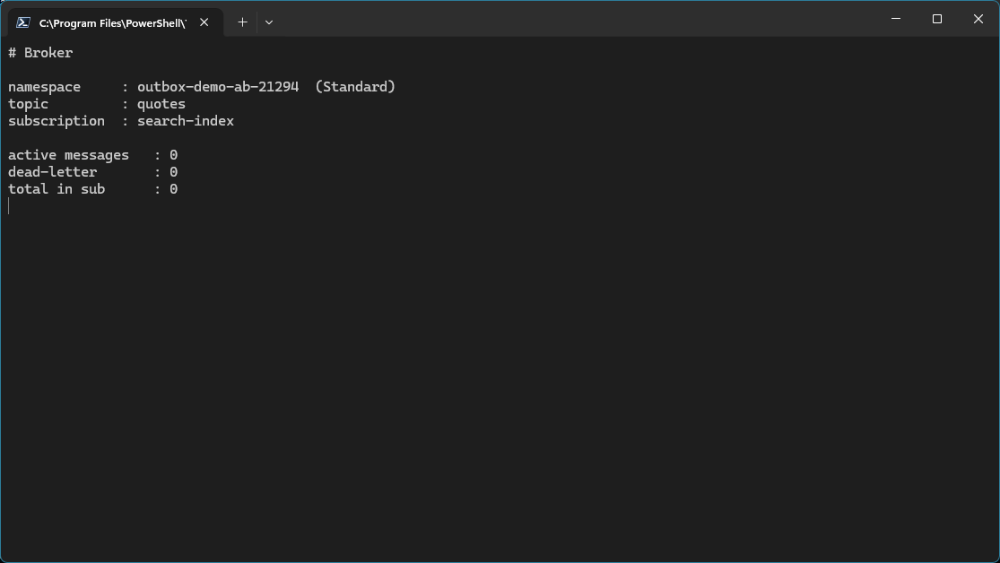
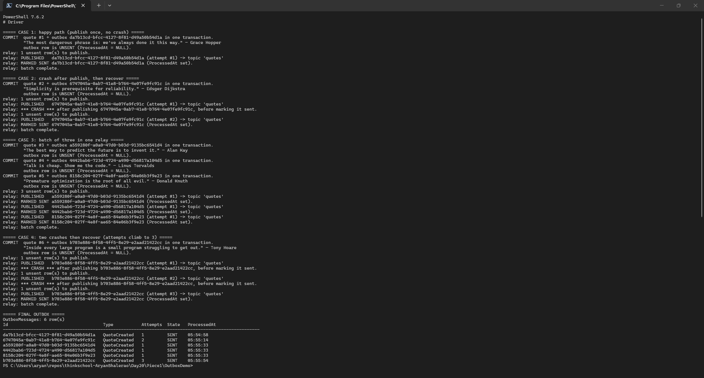
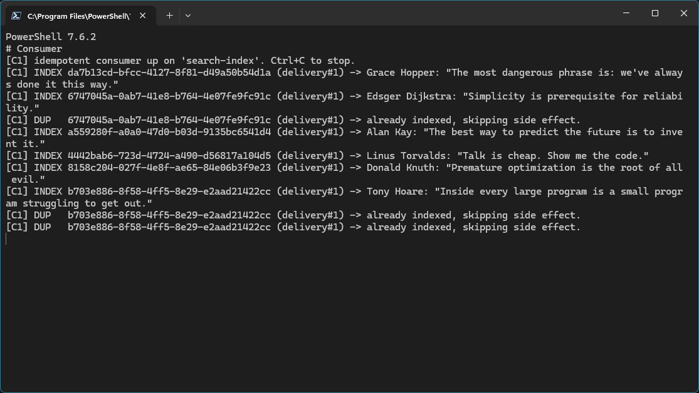
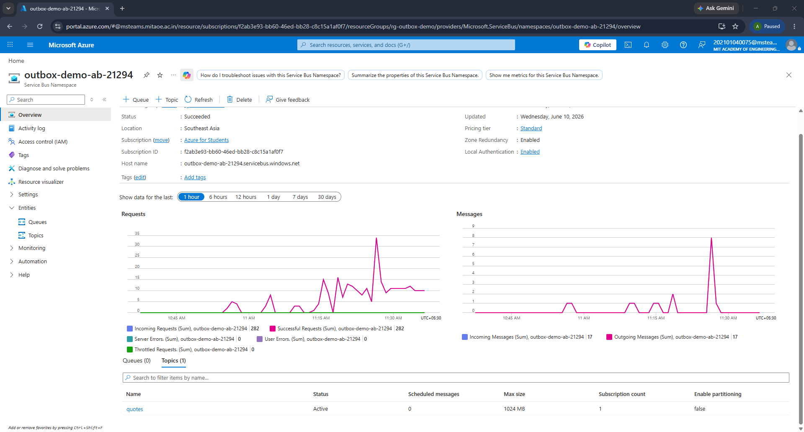
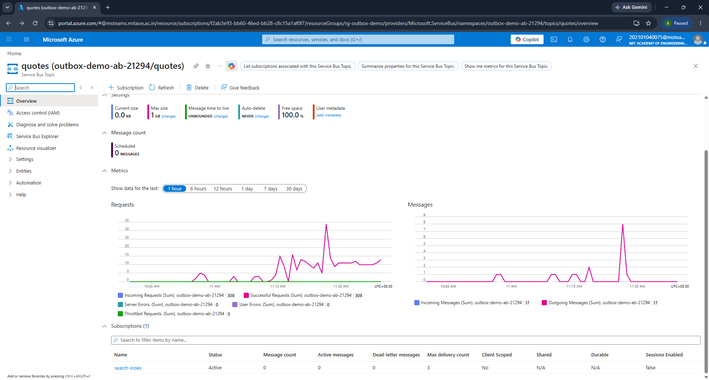
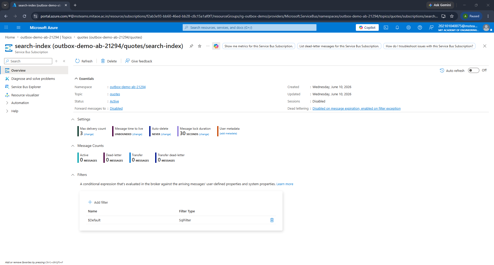

# Day 20 · Piece 1 — The transactional outbox: a DB write and a queue publish that cannot diverge

**Dual writes** — save the quote, then publish an event — are two systems with no shared transaction, so a crash between them commits the quote but sends no event and the DB and queue **diverge**. The **transactional outbox** fixes this by writing the event as a row in the *same transaction* as the domain change; a **relay** publishes pending rows later (at-least-once) and an **idempotent consumer** absorbs the duplicate a retry causes. DB is EF Core over **SQLite**, broker is **Azure Service Bus** — the same code hits the local emulator or a real **Standard** namespace by one env var. The proof below ran on Azure for Students; code in [`OutboxDemo/`](OutboxDemo/).

## 1. The outbox — one transaction, and what makes it run on Azure

The quote and its event are inserted on the same `DbContext` and committed by a single `tx.CommitAsync()`. A crash before the commit rolls back **both** — no orphan quote, no orphan event.

OutboxDemo/Producer.cs
```csharp
await using var db = Db.Open();
await using var tx = await db.Database.BeginTransactionAsync();

// 1) the domain change
var quote = new Quote { Author = author, Text = text, CreatedAt = DateTimeOffset.UtcNow };
db.Quotes.Add(quote);
await db.SaveChangesAsync();          // assigns quote.Id (still inside the tx)

// 2) the outbox row describing that change — same DbContext, same tx
var evt = new QuoteCreated(quote.Id.ToString(), quote.Text, quote.Author);
db.OutboxMessages.Add(new OutboxMessage
{
    Id = Guid.NewGuid(),               // becomes the broker MessageId == idempotency key
    Type = nameof(QuoteCreated),
    Payload = JsonSerializer.Serialize(evt),
    OccurredAt = DateTimeOffset.UtcNow,
    ProcessedAt = null,                // unsent
});
await db.SaveChangesAsync();

// 3) commit BOTH rows atomically
await tx.CommitAsync();
```

Moving to the cloud changes no logic — only **where the connection string comes from**: an env var when set, the emulator dev string otherwise.

OutboxDemo/Program.cs
```csharp
string ConnString =
    Environment.GetEnvironmentVariable("SERVICEBUS_CONNECTION_STRING") is { Length: > 0 } envConn
        ? envConn
        : EmulatorConnString;   // "Endpoint=sb://localhost;...;UseDevelopmentEmulator=true;"
```

Provisioning needs the **Standard** tier — topics/subscriptions don't exist on Basic. The topic and subscription mirror [config/servicebus-config.json](OutboxDemo/config/servicebus-config.json).

```powershell
az servicebus namespace create -g rg-outbox-demo -n <namespace> --location southeastasia --sku Standard
az servicebus topic create -g rg-outbox-demo --namespace-name <namespace> -n quotes
az servicebus topic subscription create -g rg-outbox-demo --namespace-name <namespace> `
    --topic-name quotes -n search-index --max-delivery-count 3 --lock-duration PT30S

$env:SERVICEBUS_CONNECTION_STRING = az servicebus namespace authorization-rule keys list `
    -g rg-outbox-demo --namespace-name <namespace> -n RootManageSharedAccessKey `
    --query primaryConnectionString -o tsv
```

Azure for Students restricts regions (`southeastasia` is allowed). Keep the connection string in the env var, and `az group delete -n rg-outbox-demo --yes` when done to stop the charge.

## 2. The outbox table — [`OutboxDemo/OutboxMessage.cs`](OutboxDemo/OutboxMessage.cs)

One row per pending event, in the *same* database as the domain table. `ProcessedAt` is the single source of truth for "published?" — `NULL` until the relay has **both** published and committed the stamp.

OutboxDemo/OutboxMessage.cs
```csharp
public class OutboxMessage
{
    public Guid Id { get; set; }                      // == broker MessageId == idempotency key
    public string Type { get; set; } = "";            // event name, e.g. "QuoteCreated"
    public string Payload { get; set; } = "";         // JSON body of the event
    public DateTimeOffset OccurredAt { get; set; }     // when the domain change committed
    public DateTimeOffset? ProcessedAt { get; set; }  // NULL = not yet published+committed
    public int Attempts { get; set; }                 // how many times the relay tried
}
```

Both tables share one `DbContext` ([`OutboxDbContext.cs`](OutboxDemo/OutboxDbContext.cs)) — that co-location is what lets one transaction cover both. `ProcessedAt` is indexed for the relay's hot query: unpublished rows, oldest first.

## 3. The relay — publish, THEN mark sent — [`OutboxDemo/OutboxRelay.cs`](OutboxDemo/OutboxRelay.cs)

A separate step: it polls unsent rows, publishes each, and only then stamps `ProcessedAt`. The ordering `publish → mark sent` is the entire guarantee:

* Crash **before** publish → row still unsent → retried next run. No loss.
* Crash **after** publish, before the mark commits → row still unsent → published **again** next run. At-least-once; the duplicate is the consumer's job. No loss.
* Crash **after** the mark commits → row is sent, never re-published. Done.

The forbidden ordering is the reverse — mark sent, then publish — because a crash in its window marks a message sent that never reached the broker: silent, permanent loss.

OutboxDemo/OutboxRelay.cs
```csharp
foreach (var m in pending)              // unsent rows, oldest first
{
    m.Attempts++; await db.SaveChangesAsync();  // count the attempt before trying

    // ---- 1. PUBLISH ----  MessageId = the outbox Id, STABLE across re-publishes,
    //                       so the crash-copy and the retry-copy share an id.
    var msg = new ServiceBusMessage(m.Payload) { MessageId = m.Id.ToString(), Subject = m.Type };
    await sender.SendMessageAsync(msg);

    // ---- 2. CRASH WINDOW ----  message is on the broker; the DB doesn't know yet.
    if (_crashAfterPublish) Environment.Exit(70);   // the mark below never runs

    // ---- 3. MARK SENT and commit ----
    m.ProcessedAt = DateTimeOffset.UtcNow;
    await db.SaveChangesAsync();
}
```

## 4. The crash scenario — why no message is lost or duplicated

`relay --crash` publishes, then `Environment.Exit(70)` *before* `ProcessedAt` commits — the window where the broker has the message but the DB doesn't yet know. **No loss (at-least-once):** the mark never committed, so the row stays `UNSENT` and the next run re-publishes (`attempt #2`, `#3`…) until it commits. **No duplication (idempotent consumer):** every copy carries the same `MessageId` (the stable outbox `Id`), so the consumer `INDEX`es the first and skips each re-publish as a `DUP`.

OutboxDemo/Consumer.cs
```csharp
var id = msg.MessageId;
if (_store.IsProcessed(_subscription, id))            // idempotency gate
{
    Console.WriteLine($"[{_id}] DUP   {id} -> already indexed, skipping side effect.");
    await args.CompleteMessageAsync(msg);
    return;
}
var quote = JsonSerializer.Deserialize<QuoteCreated>(msg.Body.ToString())!;
Console.WriteLine($"[{_id}] INDEX {id} -> {quote.Author}: \"{quote.Text}\"");  // the once-only effect
_store.MarkProcessed(_subscription, id, _id);          // record AFTER success
await args.CompleteMessageAsync(msg);
```

The dedupe store ([`IdempotencyStore.cs`](OutboxDemo/IdempotencyStore.cs)) is a SQLite table keyed `PRIMARY KEY (scope, message_id)` with `INSERT OR IGNORE`. At-least-once relay + dedupe consumer = effectively-once, with the stable `MessageId` as the hinge.

## 5. Output

### Setup

Local: `docker compose up -d` for the emulator. Azure: set `SERVICEBUS_CONNECTION_STRING` (§1), no Docker. The proof ran on Azure across three windows, four cases back-to-back.

| Case | What it exercises | Consumer sees | Final outbox |
|------|-------------------|---------------|--------------|
| 1 | Happy path — publish once, no crash | `INDEX` ×1 | `SENT`, attempts 1 |
| 2 | Crash after publish, then recover | `INDEX` then `DUP` | `SENT`, attempts 2 |
| 3 | Batch — three quotes, one relay | `INDEX` ×3 | three `SENT`, attempts 1 |
| 4 | Two crashes, then recover | `INDEX` then `DUP` ×2 | `SENT`, attempts 3 |

**Broker** · live view of the Standard namespace; `active` blips to 1 per publish, drains to 0 as the consumer keeps up
```
namespace     : outbox-demo-ab-21294  (Standard)
topic         : quotes
subscription  : search-index

active messages   : 0
dead-letter       : 0
total in sub      : 0
```

**Consumer** · indexes each of the six distinct events once, discards every re-published duplicate
```
[C1] idempotent consumer up on 'search-index'. Ctrl+C to stop.
[C1] INDEX da7b13cd-bfcc-4127-8f81-d49a50b54d1a (delivery#1) -> Grace Hopper: "The most dangerous phrase is: we've always done it this way."
[C1] INDEX 6747045a-0ab7-41e8-b764-4e07fe9fc91c (delivery#1) -> Edsger Dijkstra: "Simplicity is prerequisite for reliability."
[C1] DUP   6747045a-0ab7-41e8-b764-4e07fe9fc91c (delivery#1) -> already indexed, skipping side effect.
[C1] INDEX a559280f-a0a0-47d0-b03d-9135bc6541d4 (delivery#1) -> Alan Kay: "The best way to predict the future is to invent it."
[C1] INDEX 4442bab6-723d-4724-a490-d56817a104d5 (delivery#1) -> Linus Torvalds: "Talk is cheap. Show me the code."
[C1] INDEX 8158c204-027f-4e8f-ae65-84e06b3f9e23 (delivery#1) -> Donald Knuth: "Premature optimization is the root of all evil."
[C1] INDEX b703e886-8f58-4ff5-8e29-e2aad21422cc (delivery#1) -> Tony Hoare: "Inside every large program is a small program struggling to get out."
[C1] DUP   b703e886-8f58-4ff5-8e29-e2aad21422cc (delivery#1) -> already indexed, skipping side effect.
[C1] DUP   b703e886-8f58-4ff5-8e29-e2aad21422cc (delivery#1) -> already indexed, skipping side effect.
```

**Driver** · the four cases — every `relay --crash` leaves the row `UNSENT`; every following `relay` re-publishes with a higher `attempt #` and finally `MARKED SENT`
```
===== CASE 1: happy path (publish once, no crash) =====
COMMIT  quote #1 + outbox da7b13cd-bfcc-4127-8f81-d49a50b54d1a in one transaction.
        "The most dangerous phrase is: we've always done it this way." — Grace Hopper
relay: PUBLISHED   da7b13cd-bfcc-4127-8f81-d49a50b54d1a (attempt #1) -> topic 'quotes'
relay: MARKED SENT da7b13cd-bfcc-4127-8f81-d49a50b54d1a (ProcessedAt set).

===== CASE 2: crash after publish, then recover =====
COMMIT  quote #2 + outbox 6747045a-0ab7-41e8-b764-4e07fe9fc91c in one transaction.
        "Simplicity is prerequisite for reliability." — Edsger Dijkstra
relay: PUBLISHED   6747045a-0ab7-41e8-b764-4e07fe9fc91c (attempt #1) -> topic 'quotes'
relay: *** CRASH *** after publishing 6747045a-0ab7-41e8-b764-4e07fe9fc91c, before marking it sent.
relay: PUBLISHED   6747045a-0ab7-41e8-b764-4e07fe9fc91c (attempt #2) -> topic 'quotes'
relay: MARKED SENT 6747045a-0ab7-41e8-b764-4e07fe9fc91c (ProcessedAt set).

===== CASE 3: batch of three in one relay =====
COMMIT  quote #3 + outbox a559280f-a0a0-47d0-b03d-9135bc6541d4 in one transaction.  ("...invent it." — Alan Kay)
COMMIT  quote #4 + outbox 4442bab6-723d-4724-a490-d56817a104d5 in one transaction.  ("...Show me the code." — Linus Torvalds)
COMMIT  quote #5 + outbox 8158c204-027f-4e8f-ae65-84e06b3f9e23 in one transaction.  ("Premature optimization..." — Donald Knuth)
relay: 3 unsent row(s) to publish.
relay: PUBLISHED + MARKED SENT  a559280f / 4442bab6 / 8158c204  (attempt #1 each)

===== CASE 4: two crashes then recover (attempts climb to 3) =====
COMMIT  quote #6 + outbox b703e886-8f58-4ff5-8e29-e2aad21422cc in one transaction.
        "Inside every large program..." — Tony Hoare
relay: PUBLISHED   b703e886-8f58-4ff5-8e29-e2aad21422cc (attempt #1) -> topic 'quotes'
relay: *** CRASH *** before marking it sent.
relay: PUBLISHED   b703e886-8f58-4ff5-8e29-e2aad21422cc (attempt #2) -> topic 'quotes'
relay: *** CRASH *** before marking it sent.
relay: PUBLISHED   b703e886-8f58-4ff5-8e29-e2aad21422cc (attempt #3) -> topic 'quotes'
relay: MARKED SENT b703e886-8f58-4ff5-8e29-e2aad21422cc (ProcessedAt set).

===== FINAL OUTBOX =====
Id                                     Type           Attempts  State   ProcessedAt
----------------------------------------------------------------------------------------------------
da7b13cd-bfcc-4127-8f81-d49a50b54d1a   QuoteCreated   1         SENT    05:54:58
6747045a-0ab7-41e8-b764-4e07fe9fc91c   QuoteCreated   2         SENT    05:55:14
a559280f-a0a0-47d0-b03d-9135bc6541d4   QuoteCreated   1         SENT    05:55:33
4442bab6-723d-4724-a490-d56817a104d5   QuoteCreated   1         SENT    05:55:33
8158c204-027f-4e8f-ae65-84e06b3f9e23   QuoteCreated   1         SENT    05:55:33
b703e886-8f58-4ff5-8e29-e2aad21422cc   QuoteCreated   3         SENT    05:55:54
```

The final outbox is the whole argument: six events, all `SENT`, attempt counts (1, 2, 1, 1, 1, 3) showing how many publishes each needed. Every event indexed once, every duplicate discarded.

### Output Screenshots

**Broker**



**Driver**



**Consumer**



**Azure Portal — namespace (Standard tier)**



**Azure Portal — topic `quotes` subscriptions**



**Azure Portal — subscription `search-index` (MaxDeliveryCount 3, LockDuration 30s)**



## What did I learn?
Database commits and Services queues are separate systems which are not atomic. If the program crashes in between, there can be mismatch between the two systems on wether the process was fully completed or not. Thus, a transactional outbox and relay is used to avoid this. 

Transactional outbox stores two rows in the same databases. One which holds the message and the other holds a note on processing. Either both rows are stored or none. These values are stored by the consumer with no communication with the service. The relay is a mail carrier service which picks up these notes and notifies the broker when need arises.

## What can break this?
If the consumer crashes right before updating the note on completion it may lead to duplicate runs. 