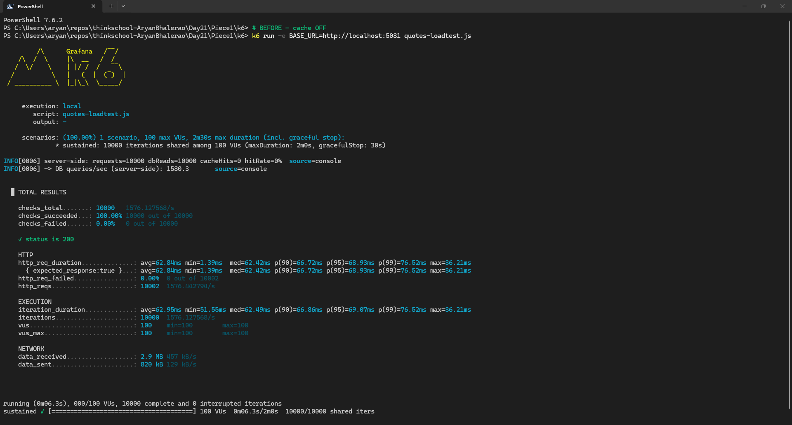
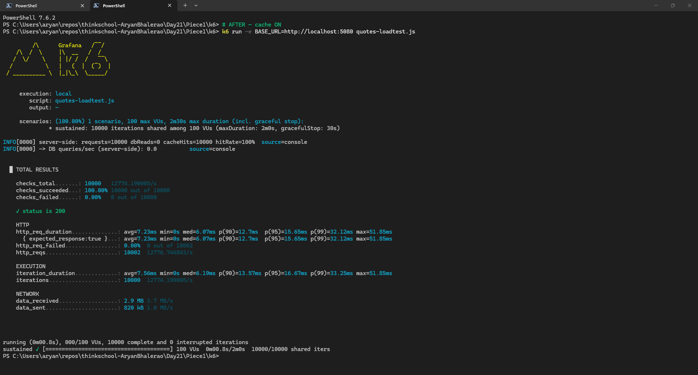
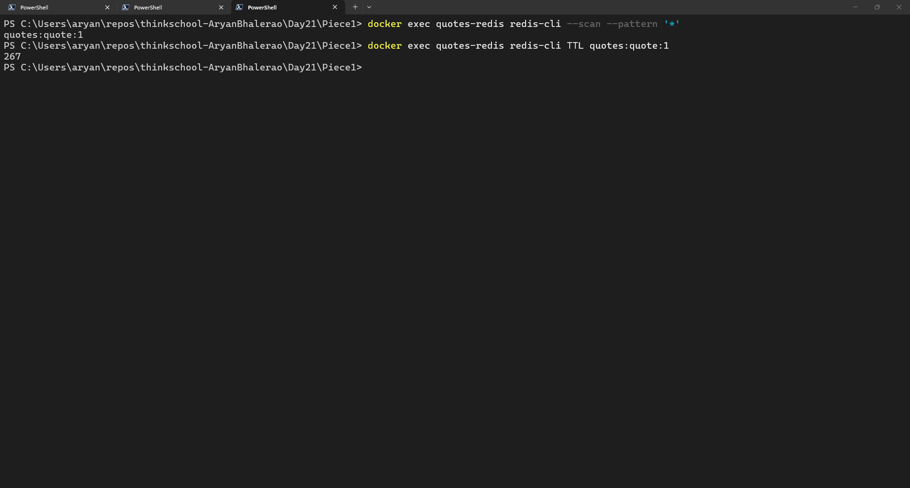
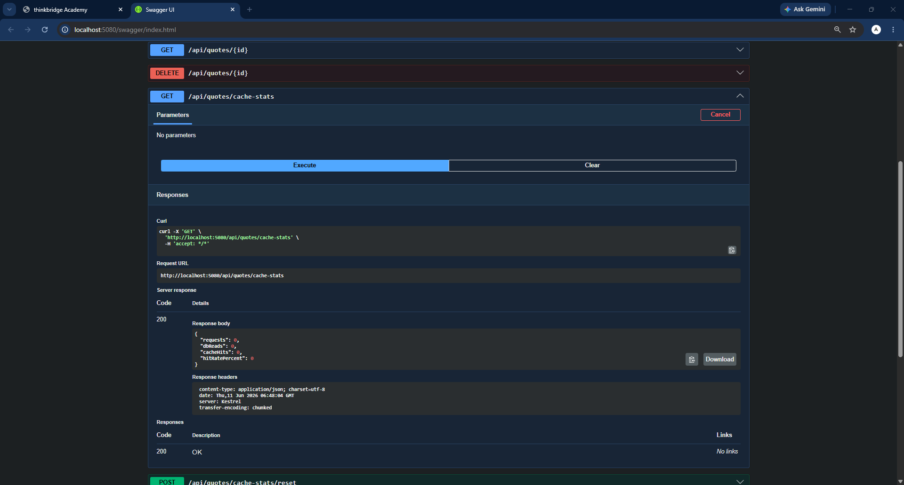
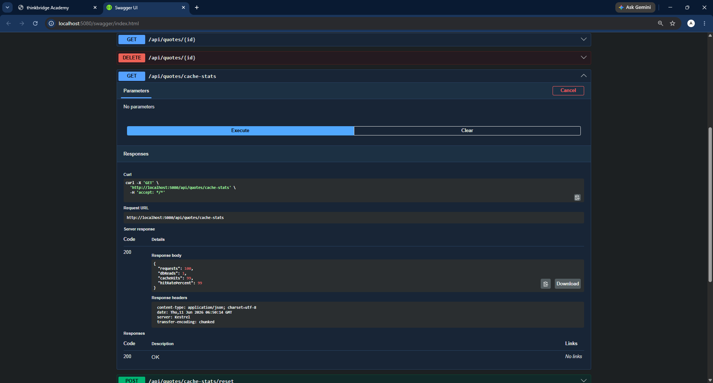

# Day 21 · Piece 1: HybridCache on a hot read, with stampede protection

This piece puts a two-tier cache (in-memory L1 plus Redis L2) in front of the hot read GET /api/quotes/{id}. It also adds stampede protection, so a cold key does not fan out into many identical DB hits. Stack: .NET 10 Minimal API, SQL Server Express, Redis 7 (Docker), Microsoft.Extensions.Caching.Hybrid with the StackExchangeRedis package, load-tested with k6. Code in [QuotesApi/](QuotesApi/).

## 1. Cache wiring

Cache wiring means putting the cache between the endpoint and the database without changing either one. AddHybridCache registers the in-memory L1, and the Redis distributed cache already registered in DI is picked up automatically as L2. The real EF read service sits behind a caching decorator, so the endpoint only sees IQuoteQueryService and never knows the cache exists. All settings (on/off flag, Redis connection, the two TTLs, simulated DB latency) live in one options class, so the cache can be turned off with a single config flag.

**Registration** [QuotesApi/Extensions/InfrastructureExtensions.cs](QuotesApi/Extensions/InfrastructureExtensions.cs)

```csharp
// Cached hot read
services.Configure<QuoteCacheOptions>(configuration.GetSection("QuoteCache"));
var cacheOpts = configuration.GetSection("QuoteCache").Get<QuoteCacheOptions>()
    ?? new QuoteCacheOptions();

services.AddSingleton<ReadStats>();

// L2: Redis-backed distributed cache
services.AddStackExchangeRedisCache(o =>
{
    o.Configuration = cacheOpts.RedisConnection;
    o.InstanceName = "quotes:";
});
services.AddHybridCache();

// EF service + caching decorator
services.AddScoped<EfCoreQuoteQueryService>();
services.AddScoped<IQuoteQueryService, CachedQuoteQueryService>();
```

**Options** [QuotesApi/Options/QuoteCacheOptions.cs](QuotesApi/Options/QuoteCacheOptions.cs)

```csharp
// Bound from "QuoteCache" config section
public sealed class QuoteCacheOptions
{
    public bool Enabled { get; set; }

    public string RedisConnection { get; set; } = "localhost:6379";

    public int L2ExpirationSeconds { get; set; } = 300;

    public int L1ExpirationSeconds { get; set; } = 60;

    public int SimulatedDbLatencyMs { get; set; }
}
```

**Config** [QuotesApi/appsettings.json](QuotesApi/appsettings.json)

```json
"QuoteCache": {
  "Enabled": false,
  "RedisConnection": "localhost:6379",
  "L2ExpirationSeconds": 300,
  "L1ExpirationSeconds": 60,
  "SimulatedDbLatencyMs": 0
}
```

**The caching decorator** [QuotesApi/Queries/CachedQuoteQueryService.cs](QuotesApi/Queries/CachedQuoteQueryService.cs)

```csharp
public sealed class CachedQuoteQueryService : IQuoteQueryService
{
    private readonly EfCoreQuoteQueryService _inner;
    private readonly HybridCache _cache;
    private readonly ReadStats _stats;
    private readonly QuoteCacheOptions _options;
    private readonly HybridCacheEntryOptions _entryOptions;

    public CachedQuoteQueryService(
        EfCoreQuoteQueryService inner,
        HybridCache cache,
        ReadStats stats,
        IOptions<QuoteCacheOptions> options)
    {
        _inner = inner;
        _cache = cache;
        _stats = stats;
        _options = options.Value;
        _entryOptions = new HybridCacheEntryOptions
        {
            Expiration = TimeSpan.FromSeconds(_options.L2ExpirationSeconds),
            LocalCacheExpiration = TimeSpan.FromSeconds(_options.L1ExpirationSeconds)
        };
    }

    // Paged list left uncached
    public Task<List<QuoteReadModel>> GetPagedAsync(int page, int size, CancellationToken ct)
        => _inner.GetPagedAsync(page, size, ct);

    public async Task<QuoteReadModel?> GetByIdAsync(int id, CancellationToken ct)
    {
        _stats.RecordRequest();

        if (!_options.Enabled)
            return await LoadFromDbAsync(id, ct);

        return await _cache.GetOrCreateAsync(
            $"quote:{id}",
            (id, this),
            static (state, token) => state.Item2.LoadFromDbAsync(state.id, token),
            _entryOptions,
            tags: ["quotes"],
            cancellationToken: ct);
    }

    // Expensive DB read
    private async ValueTask<QuoteReadModel?> LoadFromDbAsync(int id, CancellationToken ct)
    {
        _stats.RecordDbRead();
        if (_options.SimulatedDbLatencyMs > 0)
            await Task.Delay(_options.SimulatedDbLatencyMs, ct);
        return await _inner.GetByIdAsync(id, ct);
    }
}
```

**Counters + diagnostics endpoint** [QuotesApi/Services/ReadStats.cs](QuotesApi/Services/ReadStats.cs) · [QuotesApi/Endpoints/QuoteEndpoints.cs](QuotesApi/Endpoints/QuoteEndpoints.cs)

```csharp
// Cache effectiveness counters
public sealed class ReadStats
{
    private long _requests;
    private long _dbReads;

    public void RecordRequest() => Interlocked.Increment(ref _requests);
    public void RecordDbRead() => Interlocked.Increment(ref _dbReads);
    // ...

    public object Snapshot()
    {
        var requests = Requests;
        var dbReads = DbReads;
        var hits = requests - dbReads;
        return new
        {
            Requests = requests,
            DbReads = dbReads,
            CacheHits = hits,
            HitRatePercent = requests == 0 ? 0 : Math.Round(100.0 * hits / requests, 2)
        };
    }
}
```

```csharp
// Cache diagnostics
group.MapGet("/cache-stats", (ReadStats stats) => Results.Ok(stats.Snapshot()));
group.MapPost("/cache-stats/reset", (ReadStats stats) =>
{
    stats.Reset();
    return Results.NoContent();
});
```

## 2. Load-test before/after (DB queries/sec, p99)

Two instances of the same build run side by side: :5081 with the cache off (before) and :5080 with the cache on (after), both with a 50 ms simulated DB latency. k6 fires 10 000 requests for the same quote id with 100 VUs and measures latency percentiles (p95, p99) and requests per second. The cache-stats endpoint counts requests, DB reads and cache hits on the server side, which gives the DB queries per second and the hit rate.

**Setup and run**

```powershell
# Redis L2
docker run -d --name quotes-redis -p 6379:6379 redis:7-alpine

# Two instances of the same build (50 ms simulated DB latency on both)
#   :5081  QuoteCache__Enabled=false   (before)
#   :5080  QuoteCache__Enabled=true    (after)

# Load test each
k6 run -e BASE_URL=http://localhost:5081 k6/quotes-loadtest.js   # before
k6 run -e BASE_URL=http://localhost:5080 k6/quotes-loadtest.js   # after
```

**k6 Output**

Before:
```
http_req_duration..: avg=62.84ms med=62.42ms p(95)=68.93ms p(99)=76.52ms max=86.21ms
http_reqs..........: 10002  1576.44/s
```

After:
```
http_req_duration..: avg=7.23ms  med=6.07ms  p(95)=15.65ms p(99)=32.12ms max=51.85ms
http_reqs..........: 10002  12776.74/s
```

**GET cache-stats Output**
Before:
```
{
  "requests": 10000,
  "dbReads": 10000,
  "cacheHits": 0,
  "hitRatePercent": 0
}
```

After:
```
{
  "requests": 10000,
  "dbReads": 0,
  "cacheHits": 10000,
  "hitRatePercent": 100
}
```

**k6 results, before vs after** (10 000 req @ 100 VUs)

| Metric | Before (cache off) | After (cache on) | Improvement |
|---|---|---|---|
| avg latency | 62.84 ms | 7.23 ms | **−88 %** |
| p95 latency | 68.93 ms | 15.65 ms | **−77 %** |
| **p99 latency** | **76.52 ms** | **32.12 ms** | **−58 %** |
| Throughput | 1 576 req/s | 12 777 req/s | **+711 %** |
| **DB queries/sec** | **1 580** | **0** | **−100 %** |

**Cache stats, before vs after** (server-side GET /api/quotes/cache-stats)

| cache-stats | requests | dbReads | cacheHits | hitRate |
|---|---|---|---|---|
| Before (cache off) | 10 000 | 10 000 | 0 | 0 % |
| After (cache on) | 10 000 | **0** | **10 000** | **100 %** |

With the cache off, every request pays the 50 ms round trip and the database takes the whole load at about 1 580 queries per second. With the cache on, the warm key is served from memory with Redis as backup. The database drops to 0 queries per second, p99 falls from about 77 ms to about 32 ms, and throughput goes up about 8 times.

## 3. Stampede protection working under concurrency

A cache stampede happens when a hot key is cold (just expired or never loaded) and many requests miss at the same moment. Each miss runs the expensive load on its own, so one missing key turns into N identical DB queries at the worst possible time.

GetOrCreateAsync on HybridCache protects against this out of the box. Concurrent calls for the same key are coalesced: the first caller runs the factory (LoadFromDbAsync) and every other caller waits for that one result instead of starting its own load. No manual lock or SemaphoreSlim is needed. The 50 ms simulated latency keeps the cold misses overlapping, and the RecordDbRead counter inside the factory counts how many times the database was really hit.

[QuotesApi/Queries/CachedQuoteQueryService.cs](QuotesApi/Queries/CachedQuoteQueryService.cs)

```csharp
return await _cache.GetOrCreateAsync(
    $"quote:{id}",
    (id, this),
    static (state, token) => state.Item2.LoadFromDbAsync(state.id, token),
    _entryOptions,
    tags: ["quotes"],
    cancellationToken: ct);

// Expensive DB read
private async ValueTask<QuoteReadModel?> LoadFromDbAsync(int id, CancellationToken ct)
{
    _stats.RecordDbRead();
    if (_options.SimulatedDbLatencyMs > 0)
        await Task.Delay(_options.SimulatedDbLatencyMs, ct);
    return await _inner.GetByIdAsync(id, ct);
}
```

**Proof:** fire 100 simultaneous requests for the same id against a cold cache. Without coalescing all 100 would miss and hit the DB. With GetOrCreateAsync only the first one runs the factory and the other 99 wait for it. cache-stats confirms it: 1 DB read, 99 cache hits.

| cache-stats | requests | dbReads | cacheHits | hitRate |
|---|---|---|---|---|
| Before (cold cache) | 0 | 0 | 0 | 0 % |
| After (100 concurrent reads) | 100 | **1** | **99** | **99 %** |

The entry also lands in Redis with a live TTL, which proves the L2 tier is real and not just in-process memory:

```
$ docker exec quotes-redis redis-cli --scan --pattern '*'
quotes:quote:1
$ docker exec quotes-redis redis-cli TTL quotes:quote:1
267                     # of the configured 300s L2 expiration
```

## 4. Full Output

**Setup**

```powershell
# Redis L2
docker run -d --name quotes-redis -p 6379:6379 redis:7-alpine

# Two instances of the same build (50 ms simulated DB latency on both)
#   :5081  QuoteCache__Enabled=false   (before)
#   :5080  QuoteCache__Enabled=true    (after)

# Load test each
k6 run -e BASE_URL=http://localhost:5081 k6/quotes-loadtest.js   # before
k6 run -e BASE_URL=http://localhost:5080 k6/quotes-loadtest.js   # after
```

**k6 BEFORE (cache off, :5081)**

```
PS C:\Users\aryan\repos\thinkschool-AryanBhalerao\Day21\Piece1\k6> # BEFORE — cache OFF
PS C:\Users\aryan\repos\thinkschool-AryanBhalerao\Day21\Piece1\k6> k6 run -e BASE_URL=http://localhost:5081 quotes-loadtest.js

         /\      Grafana   /‾‾/
    /\  /  \     |\  __   /  /
   /  \/    \    | |/ /  /   ‾‾\
  /          \   |   (  |  (‾)  |
 / __________ \  |_|\_\  \_____/


     execution: local
        script: quotes-loadtest.js
        output: -

     scenarios: (100.00%) 1 scenario, 100 max VUs, 2m30s max duration (incl. graceful stop):
              * sustained: 10000 iterations shared among 100 VUs (maxDuration: 2m0s, gracefulStop: 30s)

INFO[0006] server-side: requests=10000 dbReads=10000 cacheHits=0 hitRate=0%  source=console
INFO[0006] -> DB queries/sec (server-side): 1580.3       source=console


  █ TOTAL RESULTS

    checks_total.......: 10000   1576.127568/s
    checks_succeeded...: 100.00% 10000 out of 10000
    checks_failed......: 0.00%   0 out of 10000

    ✓ status is 200

    HTTP
    http_req_duration..............: avg=62.84ms min=1.39ms  med=62.42ms p(90)=66.72ms p(95)=68.93ms p(99)=76.52ms max=86.21ms
      { expected_response:true }...: avg=62.84ms min=1.39ms  med=62.42ms p(90)=66.72ms p(95)=68.93ms p(99)=76.52ms max=86.21ms
    http_req_failed................: 0.00%  0 out of 10002
    http_reqs......................: 10002  1576.442794/s

    EXECUTION
    iteration_duration.............: avg=62.95ms min=51.55ms med=62.49ms p(90)=66.86ms p(95)=69.07ms p(99)=76.52ms max=86.21ms
    iterations.....................: 10000  1576.127568/s
    vus............................: 100    min=100        max=100
    vus_max........................: 100    min=100        max=100

    NETWORK
    data_received..................: 2.9 MB 457 kB/s
    data_sent......................: 820 kB 129 kB/s


running (0m06.3s), 000/100 VUs, 10000 complete and 0 interrupted iterations
sustained ✓ [======================================] 100 VUs  0m06.3s/2m0s  10000/10000 shared iters
```

**k6 AFTER (cache on, :5080)**

```
PS C:\Users\aryan\repos\thinkschool-AryanBhalerao\Day21\Piece1\k6> # AFTER — cache ON
PS C:\Users\aryan\repos\thinkschool-AryanBhalerao\Day21\Piece1\k6> k6 run -e BASE_URL=http://localhost:5080 quotes-loadtest.js

         /\      Grafana   /‾‾/
    /\  /  \     |\  __   /  /
   /  \/    \    | |/ /  /   ‾‾\
  /          \   |   (  |  (‾)  |
 / __________ \  |_|\_\  \_____/


     execution: local
        script: quotes-loadtest.js
        output: -

     scenarios: (100.00%) 1 scenario, 100 max VUs, 2m30s max duration (incl. graceful stop):
              * sustained: 10000 iterations shared among 100 VUs (maxDuration: 2m0s, gracefulStop: 30s)

INFO[0000] server-side: requests=10000 dbReads=0 cacheHits=10000 hitRate=100%  source=console
INFO[0000] -> DB queries/sec (server-side): 0.0          source=console


  █ TOTAL RESULTS

    checks_total.......: 10000   12774.190005/s
    checks_succeeded...: 100.00% 10000 out of 10000
    checks_failed......: 0.00%   0 out of 10000

    ✓ status is 200

    HTTP
    http_req_duration..............: avg=7.23ms min=0s med=6.07ms p(90)=12.7ms  p(95)=15.65ms p(99)=32.12ms max=51.85ms
      { expected_response:true }...: avg=7.23ms min=0s med=6.07ms p(90)=12.7ms  p(95)=15.65ms p(99)=32.12ms max=51.85ms
    http_req_failed................: 0.00%  0 out of 10002
    http_reqs......................: 10002  12776.744843/s

    EXECUTION
    iteration_duration.............: avg=7.56ms min=0s med=6.19ms p(90)=13.57ms p(95)=16.67ms p(99)=33.25ms max=51.85ms
    iterations.....................: 10000  12774.190005/s

    NETWORK
    data_received..................: 2.9 MB 3.7 MB/s
    data_sent......................: 820 kB 1.0 MB/s


running (0m00.8s), 000/100 VUs, 10000 complete and 0 interrupted iterations
sustained ✓ [======================================] 100 VUs  0m00.8s/2m0s  10000/10000 shared iters
```

**Redis (L2)**

```
PS C:\Users\aryan\repos\thinkschool-AryanBhalerao\Day21\Piece1> docker exec quotes-redis redis-cli --scan --pattern '*'
quotes:quote:1
PS C:\Users\aryan\repos\thinkschool-AryanBhalerao\Day21\Piece1> docker exec quotes-redis redis-cli TTL quotes:quote:1
267
```

Before
Request:
```
curl -X 'GET' \
  'http://localhost:5081/api/quotes/cache-stats' \
  -H 'accept: */*'
```

Response:
```
{
  "requests": 10000,
  "dbReads": 10000,
  "cacheHits": 0,
  "hitRatePercent": 0
}
```

After

Request:
```
curl -X 'GET' \
  'http://localhost:5080/api/quotes/cache-stats' \
  -H 'accept: */*'
```

Response:
```
{
  "requests": 10000,
  "dbReads": 0,
  "cacheHits": 10000,
  "hitRatePercent": 100
}
```

## 5. Output Screenshots

**k6 before (cache off, :5081)**



**k6 after (cache on, :5080)**



**Redis L2: key quotes:quote:1 with live TTL**



**cache-stats before (cold cache, all counters 0)**



**cache-stats after 100 concurrent reads (1 DB read, 99 % hit rate)**

