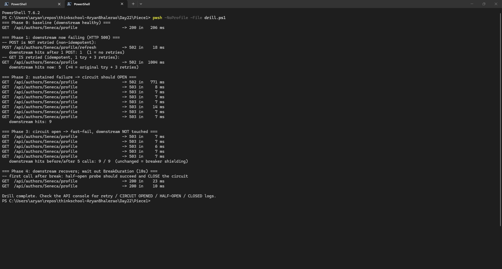
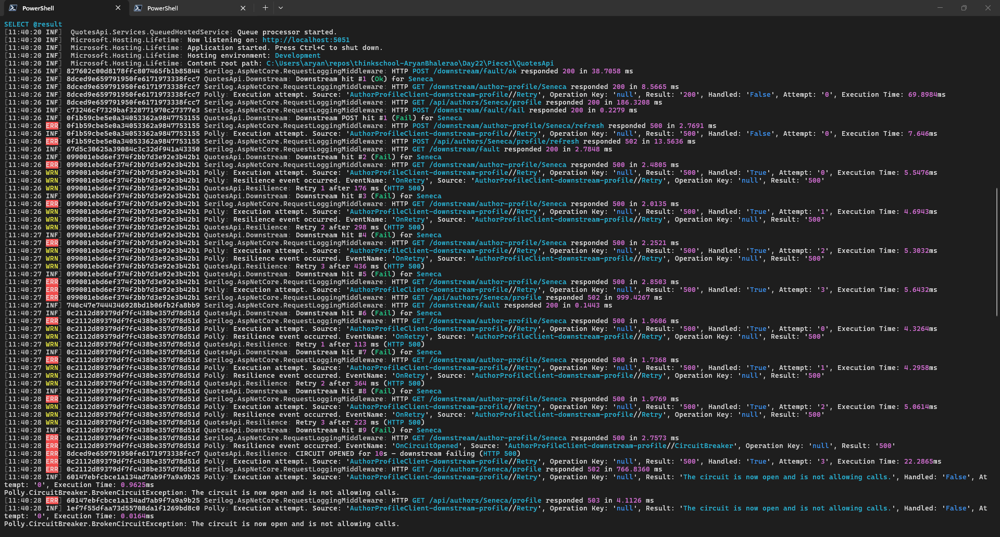
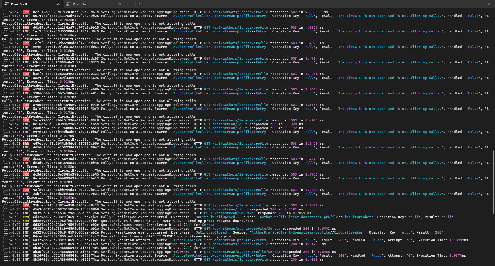

# Day 22 · Piece 1: Resilient outbound calls with Polly — retry, circuit breaker, timeout, bulkhead

This piece wraps an outbound dependency — an external author profile service — in a resilience pipeline made of retry with backoff for safe-to-repeat reads, a circuit breaker, per-attempt and total timeouts, and a bulkhead that caps concurrency. The dependency is simulated by endpoints in the same app behind a runtime fault switch for healthy, failing, and slow behaviour, so the failure drill can flip it on and off without external tooling. The stack is a .NET 10 minimal API with the Microsoft HTTP resilience library built on Polly, and Serilog for logging. Code lives in [QuotesApi/](QuotesApi/) and the drill script in [drill.ps1](drill.ps1).

## 1. The resilience pipeline

The pipeline lives entirely in the client handler chain, so the typed client and the endpoints stay free of resilience code. Strategies run outermost-first in the order they are added.

**Strategy order**

```
request -> bulkhead -> total timeout -> retry -> circuit breaker -> attempt timeout -> network
```

The bulkhead is outermost so excess load is shed before it consumes any retry or timeout budget. The total timeout caps the whole operation, retries included. Retry sits outside the breaker, so a request that trips the breaker mid-retry fails fast instead of hammering it again — a broken-circuit rejection is not a transient outcome, so it is never retried. The attempt timeout is innermost so each try gets its own budget, and a hung call surfaces as a timeout that both the retry and the breaker can count.

**Pipeline registration** — [ResilienceExtensions.cs](QuotesApi/Extensions/ResilienceExtensions.cs)

```csharp
services.AddHttpClient<AuthorProfileClient>((sp, http) =>
    {
        var opts = sp.GetRequiredService<IOptions<DownstreamResilienceOptions>>().Value;
        http.BaseAddress = new Uri(opts.BaseAddress);
    })
    .AddResilienceHandler("downstream-profile", (builder, context) =>
    {
        var opts = context.ServiceProvider
            .GetRequiredService<IOptions<DownstreamResilienceOptions>>().Value;
        var logger = context.ServiceProvider
            .GetRequiredService<ILoggerFactory>().CreateLogger("QuotesApi.Resilience");

        // 1. Bulkhead
        builder.AddConcurrencyLimiter(
            permitLimit: opts.BulkheadPermitLimit,
            queueLimit: opts.BulkheadQueueLimit);

        // 2. Total timeout
        builder.AddTimeout(TimeSpan.FromSeconds(opts.TotalTimeoutSeconds));

        // 3. Retry
        var retry = new HttpRetryStrategyOptions
        {
            MaxRetryAttempts = opts.MaxRetryAttempts,
            BackoffType = DelayBackoffType.Exponential,
            UseJitter = true,
            Delay = TimeSpan.FromMilliseconds(opts.RetryBaseDelayMs),
            OnRetry = args =>
            {
                logger.LogWarning("Retry {Attempt} after {Delay} ms ({Reason})",
                    args.AttemptNumber + 1,
                    (int)args.RetryDelay.TotalMilliseconds,
                    args.Outcome.Exception?.GetType().Name
                        ?? $"HTTP {(int?)args.Outcome.Result?.StatusCode}");
                return default;
            }
        };
        // Narrow the transient predicate to GETs only
        var transient = retry.ShouldHandle;
        retry.ShouldHandle = async args =>
            args.Context.GetRequestMessage()?.Method == HttpMethod.Get
            && await transient(args);
        builder.AddRetry(retry);

        // 4. Circuit breaker
        builder.AddCircuitBreaker(new HttpCircuitBreakerStrategyOptions
        {
            FailureRatio = opts.FailureRatio,                                      // 0.5
            MinimumThroughput = opts.MinimumThroughput,                            // 10
            SamplingDuration = TimeSpan.FromSeconds(opts.SamplingDurationSeconds), // 10s
            BreakDuration = TimeSpan.FromSeconds(opts.BreakDurationSeconds),       // 10s
            OnOpened = args =>
            {
                logger.LogError("CIRCUIT OPENED for {BreakSeconds}s — downstream failing ({Reason})",
                    args.BreakDuration.TotalSeconds,
                    args.Outcome.Exception?.GetType().Name
                        ?? $"HTTP {(int?)args.Outcome.Result?.StatusCode}");
                return default;
            },
            OnHalfOpened = _ =>
            {
                logger.LogWarning("CIRCUIT HALF-OPEN — sending probe request downstream");
                return default;
            },
            OnClosed = _ =>
            {
                logger.LogInformation("CIRCUIT CLOSED — downstream healthy again");
                return default;
            }
        });

        // 5. Attempt timeout
        builder.AddTimeout(TimeSpan.FromSeconds(opts.AttemptTimeoutSeconds));
    });
```

**Tunable options** — [DownstreamResilienceOptions.cs](QuotesApi/Options/DownstreamResilienceOptions.cs)

```csharp
// Bound from "DownstreamResilience" config section
public sealed class DownstreamResilienceOptions
{
    public string BaseAddress { get; set; } = "http://localhost:5051";

    // Bulkhead: concurrent in-flight calls allowed to the dependency
    public int BulkheadPermitLimit { get; set; } = 8;
    public int BulkheadQueueLimit { get; set; } = 4;

    // Whole-operation budget, covers all retry attempts together
    public int TotalTimeoutSeconds { get; set; } = 10;

    // Retry (idempotent requests only)
    public int MaxRetryAttempts { get; set; } = 3;
    public int RetryBaseDelayMs { get; set; } = 200;

    // Circuit breaker
    public double FailureRatio { get; set; } = 0.5;
    public int MinimumThroughput { get; set; } = 10;
    public int SamplingDurationSeconds { get; set; } = 10;
    public int BreakDurationSeconds { get; set; } = 10;

    // Per-attempt budget
    public int AttemptTimeoutSeconds { get; set; } = 2;
}
```

**Bound values** — [appsettings.json](QuotesApi/appsettings.json)

```json
"DownstreamResilience": {
  "BaseAddress": "http://localhost:5051",
  "BulkheadPermitLimit": 8,
  "BulkheadQueueLimit": 4,
  "TotalTimeoutSeconds": 10,
  "MaxRetryAttempts": 3,
  "RetryBaseDelayMs": 200,
  "FailureRatio": 0.5,
  "MinimumThroughput": 10,
  "SamplingDurationSeconds": 10,
  "BreakDurationSeconds": 10,
  "AttemptTimeoutSeconds": 2
}
```

## 2. The typed client and the consumer endpoint

The typed client is plain HTTP code, and all resilience lives in the handler, so the client never knows the pipeline exists. The consumer endpoint maps each pipeline rejection to a distinct status code, so callers can tell a downstream outage apart from load shedding.

**Typed client** — [AuthorProfileClient.cs](QuotesApi/Services/AuthorProfileClient.cs)

```csharp
public sealed class AuthorProfileClient
{
    private readonly HttpClient _http;

    public AuthorProfileClient(HttpClient http) => _http = http;

    public async Task<AuthorProfile?> GetProfileAsync(string name, CancellationToken ct)
    {
        var response = await _http.GetAsync($"/downstream/author-profile/{Uri.EscapeDataString(name)}", ct);
        response.EnsureSuccessStatusCode();
        return await response.Content.ReadFromJsonAsync<AuthorProfile>(ct);
    }

    public async Task<bool> RefreshProfileAsync(string name, CancellationToken ct)
    {
        var response = await _http.PostAsync($"/downstream/author-profile/{Uri.EscapeDataString(name)}/refresh", null, ct);
        return response.IsSuccessStatusCode;
    }
}
```

**Consumer endpoint with rejection mapping** — [AuthorEndpoints.cs](QuotesApi/Endpoints/AuthorEndpoints.cs)

```csharp
// Calls the external profile service through the resilience pipeline.
// Each pipeline rejection maps to a distinct status so callers can tell
// "dependency down" apart from "we are shedding load".
group.MapGet("/{name}/profile", async (string name, AuthorProfileClient client, CancellationToken ct) =>
{
    try
    {
        var profile = await client.GetProfileAsync(name, ct);
        return Results.Ok(profile);
    }
    catch (BrokenCircuitException)
    {
        // Breaker open: fail fast
        return Results.Json(new { Error = "Author profile service unavailable (circuit open)" },
            statusCode: StatusCodes.Status503ServiceUnavailable);
    }
    catch (TimeoutRejectedException)
    {
        return Results.Json(new { Error = "Author profile service timed out" },
            statusCode: StatusCodes.Status504GatewayTimeout);
    }
    catch (RateLimiterRejectedException)
    {
        // Bulkhead full
        return Results.Json(new { Error = "Too many concurrent profile lookups" },
            statusCode: StatusCodes.Status429TooManyRequests);
    }
    catch (HttpRequestException)
    {
        // Survived all retries
        return Results.Json(new { Error = "Author profile service returned an error" },
            statusCode: StatusCodes.Status502BadGateway);
    }
});
```

The downstream is simulated in the same app so the drill needs no external tooling. The endpoints record every hit and obey a runtime fault switch, and the switch itself is a tiny singleton that the drill drives over HTTP. Both files make up the fault switch, so both are shown below.

**Simulated downstream endpoints** — [DownstreamEndpoints.cs](QuotesApi/Endpoints/DownstreamEndpoints.cs)

```csharp
group.MapGet("/author-profile/{name}", async (string name, DownstreamFaultState fault, ...) =>
{
    var hit = fault.RecordHit();
    logger.LogInformation("Downstream hit #{Hit} ({Mode}) for {Author}", hit, fault.Mode, name);

    switch (fault.Mode)
    {
        case DownstreamFaultMode.Fail:
            return Results.StatusCode(StatusCodes.Status500InternalServerError);
        case DownstreamFaultMode.Slow:
            // Hang past the attempt timeout
            await Task.Delay(TimeSpan.FromSeconds(30), ct);
            break;
    }
    return Results.Ok(new { Author = name, Bio = ..., Source = "downstream-profile-service" });
});

// Fault controls for the drill: POST /downstream/fault/{ok|fail|slow}
// Hit counter (ground truth for "did the breaker cut traffic"): GET /downstream/fault
```

**Runtime fault switch** — [DownstreamFaultState.cs](QuotesApi/Services/DownstreamFaultState.cs)

```csharp
public enum DownstreamFaultMode { Ok, Fail, Slow }

// Runtime switch controlling the simulated downstream behaviour
public sealed class DownstreamFaultState
{
    private volatile DownstreamFaultMode _mode = DownstreamFaultMode.Ok;
    private long _hits;

    public DownstreamFaultMode Mode { get => _mode; set => _mode = value; }
    public long Hits => Interlocked.Read(ref _hits);
    public long RecordHit() => Interlocked.Increment(ref _hits);
    public void ResetHits() => Interlocked.Exchange(ref _hits, 0);
}
```

## 3. Proof: the circuit opens under sustained failure and recovers

The drill in [drill.ps1](drill.ps1) runs five phases against the live API: a healthy baseline, a failing write and read to show the idempotency rule, sustained failure until the breaker trips, calls during the break to show fail-fast, then recovery once the break elapses.

| Phase | What happens | Result | Latency | Downstream hits |
|---|---|---|---|---|
| 0 baseline | downstream healthy, 1 GET | 200 | ~206 ms | 1 |
| 1 fail mode, POST | non-idempotent, **not retried** | 502 | 18 ms | **+1**, no retries |
| 1 fail mode, GET | idempotent, retried 3× with backoff | 502 | ~1.0 s | **+4**, try plus 3 retries |
| 2 sustained GETs | breaker trips at ≥10 failures in window | 502 → **503** | ~771 ms → **7–14 ms** | stops at 9 |
| 3 circuit open, 5 GETs | fail fast, dependency shielded | 503 | **6–7 ms** | **9 / 9 unchanged** |
| 4 recover + wait 10 s | half-open probe succeeds, breaker closes | **200** | 23 ms | probe plus normal traffic |

What this shows:

- **Retry, idempotent only.** The failing write made exactly one downstream hit and returned 502 in 18 ms with no retry. The failing read made four downstream hits — the original try plus three retries with exponential backoff — and the backoff delays show up in its roughly 1.0 second latency.
- **Breaker opens under sustained failure.** Once the breaker had seen its minimum throughput of ten attempts inside the ten second sampling window at half or more failures, it opened at downstream hit number 9. The very next requests stopped reaching the dependency and returned 503 in single-digit milliseconds.
- **Fail-fast while open.** Five more calls during the break took 6 to 7 ms each, and the downstream hit counter stayed frozen at 9 — the failing dependency got zero traffic while it was down.
- **Half-open to recovery.** After the downstream was flipped healthy and the ten second break elapsed, the first call became the half-open probe, succeeded, and closed the circuit. Later calls return normal 200s.

## 4. Logs: breaker opening, half-opening, closing

Server-side log output during the drill comes from the resilience library's built-in telemetry plus the custom event handlers. The timeline reads exactly like the breaker state machine — Closed while retries absorb failures, then Open with fail-fast and zero downstream traffic, then Half-Open after the ten second break sends one probe, then Closed again on probe success.

**Breaker state transitions** — [server_log.log](server_log.log)

```
[11:40:27 WRN] QuotesApi.Resilience: Retry 1 after 113 ms (HTTP 500)
[11:40:27 INF] QuotesApi.Downstream: Downstream hit #7 (Fail) for Seneca
[11:40:27 WRN] QuotesApi.Resilience: Retry 2 after 364 ms (HTTP 500)
[11:40:28 INF] QuotesApi.Downstream: Downstream hit #8 (Fail) for Seneca
[11:40:28 WRN] QuotesApi.Resilience: Retry 3 after 223 ms (HTTP 500)
[11:40:28 INF] QuotesApi.Downstream: Downstream hit #9 (Fail) for Seneca

[11:40:28 ERR] Polly: Resilience event occurred. EventName: 'OnCircuitOpened',
               Source: 'AuthorProfileClient-downstream-profile//CircuitBreaker', Result: '500'
[11:40:28 ERR] QuotesApi.Resilience: CIRCUIT OPENED for 10s — downstream failing (HTTP 500)

[11:40:28 INF] Polly: Execution attempt. Source: '...//Retry',
               Result: 'The circuit is now open and is not allowing calls.', Handled: 'False', Attempt: '0'
               Polly.CircuitBreaker.BrokenCircuitException: The circuit is now open and is not allowing calls.
               ... (repeats for every call during the 10 s break — note Attempt: '0',
                    the BrokenCircuitException is NOT retried, it fails fast)

[11:40:39 WRN] Polly: Resilience event occurred. EventName: 'OnCircuitHalfOpened',
               Source: 'AuthorProfileClient-downstream-profile//CircuitBreaker'
[11:40:39 WRN] QuotesApi.Resilience: CIRCUIT HALF-OPEN — sending probe request downstream
[11:40:39 INF] QuotesApi.Downstream: Downstream hit #1 (Ok) for Seneca
[11:40:39 INF] Polly: Resilience event occurred. EventName: 'OnCircuitClosed',
               Source: 'AuthorProfileClient-downstream-profile//CircuitBreaker', Result: '200'
[11:40:39 INF] QuotesApi.Resilience: CIRCUIT CLOSED — downstream healthy again
```

The non-idempotent write proves the idempotency rule from the other side: one downstream hit and no retry events at all.

**Non-idempotent write is never retried** — [server_log.log](server_log.log)

```
[11:40:26 INF] QuotesApi.Downstream: Downstream POST hit #1 (Fail) for Seneca
[11:40:26 ERR] HTTP POST /downstream/author-profile/Seneca/refresh responded 500 in 2.7691 ms
[11:40:26 ERR] HTTP POST /api/authors/Seneca/profile/refresh responded 502 in 13.5636 ms
```

The resilience library also publishes metrics out of the box, one event stream tagged with the event name and the strategy source, readable with the standard .NET counters tool and no extra code. The drill uses the structured log events as its metrics record, and the downstream hit counter is the ground truth that the breaker actually cut traffic.

## 5. Full Output

**Setup and run**

```powershell
dotnet run --project QuotesApi --launch-profile http   # terminal 1
pwsh -NoProfile -File drill.ps1                        # terminal 2
```

**Drill transcript** — [drill_log.log](drill_log.log)

```
=== Phase 0: baseline (downstream healthy) ===
GET  /api/authors/Seneca/profile                   -> 200 in   206 ms

=== Phase 1: downstream now failing (HTTP 500) ===
-- POST is NOT retried (non-idempotent):
POST /api/authors/Seneca/profile/refresh           -> 502 in    18 ms
   downstream hits after 1 POST: 1  (1 = no retries)
-- GET IS retried (idempotent, 1 try + 3 retries):
GET  /api/authors/Seneca/profile                   -> 502 in  1004 ms
   downstream hits now: 5  (+4 = original try + 3 retries)

=== Phase 2: sustained failure -> circuit should OPEN ===
GET  /api/authors/Seneca/profile                   -> 502 in   771 ms
GET  /api/authors/Seneca/profile                   -> 503 in     8 ms
GET  /api/authors/Seneca/profile                   -> 503 in     7 ms
GET  /api/authors/Seneca/profile                   -> 503 in     7 ms
GET  /api/authors/Seneca/profile                   -> 503 in     7 ms
GET  /api/authors/Seneca/profile                   -> 503 in    14 ms
GET  /api/authors/Seneca/profile                   -> 503 in     7 ms
GET  /api/authors/Seneca/profile                   -> 503 in     7 ms
   downstream hits: 9

=== Phase 3: circuit open -> fast-fail, downstream NOT touched ===
GET  /api/authors/Seneca/profile                   -> 503 in     7 ms
GET  /api/authors/Seneca/profile                   -> 503 in     7 ms
GET  /api/authors/Seneca/profile                   -> 503 in     6 ms
GET  /api/authors/Seneca/profile                   -> 503 in     7 ms
GET  /api/authors/Seneca/profile                   -> 503 in     7 ms
   downstream hits before/after 5 calls: 9 / 9  (unchanged = breaker shielding)

=== Phase 4: downstream recovers; wait out BreakDuration (10s) ===
-- first call after break: half-open probe should succeed and CLOSE the circuit
GET  /api/authors/Seneca/profile                   -> 200 in    23 ms
GET  /api/authors/Seneca/profile                   -> 200 in    10 ms

Drill complete. Check the API console for retry / CIRCUIT OPENED / HALF-OPEN / CLOSED logs.
```

**Server console — breaker opening** — [server_log.log](server_log.log)

```
[11:40:20 INF]  QuotesApi.Services.QueuedHostedService: Queue processor started.
[11:40:20 INF]  Microsoft.Hosting.Lifetime: Now listening on: http://localhost:5051
[11:40:20 INF]  Microsoft.Hosting.Lifetime: Application started. Press Ctrl+C to shut down.
[11:40:20 INF]  Microsoft.Hosting.Lifetime: Hosting environment: Development
[11:40:26 INF] 827602… RequestLoggingMiddleware: HTTP POST /downstream/fault/ok responded 200 in 38.7058 ms
[11:40:26 INF] 8dced9… QuotesApi.Downstream: Downstream hit #1 (Ok) for Seneca
[11:40:26 INF] 8dced9… RequestLoggingMiddleware: HTTP GET /downstream/author-profile/Seneca responded 200 in 8.5665 ms
[11:40:26 INF] 8dced9… Polly: Execution attempt. Source: '…//Retry', Result: '200', Handled: 'False', Attempt: '0', Execution Time: 69.8984ms
[11:40:26 INF] 8dced9… RequestLoggingMiddleware: HTTP GET /api/authors/Seneca/profile responded 200 in 186.3208 ms
[11:40:26 INF] c73246… RequestLoggingMiddleware: HTTP POST /downstream/fault/fail responded 200 in 0.2279 ms

[11:40:26 INF] 0f1b59… QuotesApi.Downstream: Downstream POST hit #1 (Fail) for Seneca
[11:40:26 ERR] 0f1b59… RequestLoggingMiddleware: HTTP POST /downstream/author-profile/Seneca/refresh responded 500 in 2.7691 ms
[11:40:26 INF] 0f1b59… Polly: Execution attempt. Source: '…//Retry', Result: '500', Handled: 'False', Attempt: '0', Execution Time: 7.646ms
[11:40:26 ERR] 0f1b59… RequestLoggingMiddleware: HTTP POST /api/authors/Seneca/profile/refresh responded 502 in 13.5636 ms

[11:40:26 INF] 099001… QuotesApi.Downstream: Downstream hit #2 (Fail) for Seneca
[11:40:26 WRN] 099001… Polly: EventName: 'OnRetry', Result: '500'
[11:40:26 WRN] 099001… QuotesApi.Resilience: Retry 1 after 176 ms (HTTP 500)
[11:40:26 INF] 099001… QuotesApi.Downstream: Downstream hit #3 (Fail) for Seneca
[11:40:26 WRN] 099001… Polly: EventName: 'OnRetry', Result: '500'
[11:40:26 WRN] 099001… QuotesApi.Resilience: Retry 2 after 298 ms (HTTP 500)
[11:40:27 INF] 099001… QuotesApi.Downstream: Downstream hit #4 (Fail) for Seneca
[11:40:27 WRN] 099001… Polly: EventName: 'OnRetry', Result: '500'
[11:40:27 WRN] 099001… QuotesApi.Resilience: Retry 3 after 436 ms (HTTP 500)
[11:40:27 INF] 099001… QuotesApi.Downstream: Downstream hit #5 (Fail) for Seneca
[11:40:27 ERR] 099001… RequestLoggingMiddleware: HTTP GET /api/authors/Seneca/profile responded 502 in 999.4267 ms

[11:40:27 INF] 0c2112… QuotesApi.Downstream: Downstream hit #6 (Fail) for Seneca
[11:40:27 WRN] 0c2112… QuotesApi.Resilience: Retry 1 after 113 ms (HTTP 500)
[11:40:27 INF] 0c2112… QuotesApi.Downstream: Downstream hit #7 (Fail) for Seneca
[11:40:27 WRN] 0c2112… QuotesApi.Resilience: Retry 2 after 364 ms (HTTP 500)
[11:40:28 INF] 0c2112… QuotesApi.Downstream: Downstream hit #8 (Fail) for Seneca
[11:40:28 WRN] 0c2112… QuotesApi.Resilience: Retry 3 after 223 ms (HTTP 500)
[11:40:28 INF] 0c2112… QuotesApi.Downstream: Downstream hit #9 (Fail) for Seneca

[11:40:28 ERR] 0c2112… Polly: EventName: 'OnCircuitOpened', Source: '…//CircuitBreaker', Result: '500'
[11:40:28 ERR] 8dced9… QuotesApi.Resilience: CIRCUIT OPENED for 10s — downstream failing (HTTP 500)
[11:40:28 ERR] 0c2112… RequestLoggingMiddleware: HTTP GET /api/authors/Seneca/profile responded 502 in 766.8360 ms
```

**Server console — recovery** — [server_log.log](server_log.log)

```
[11:40:28 INF] 60147e… Polly: Execution attempt. Result: 'The circuit is now open and is not allowing calls.', Handled: 'False', Attempt: '0', Execution Time: 0.9625ms
               Polly.CircuitBreaker.BrokenCircuitException: The circuit is now open and is not allowing calls.
[11:40:28 ERR] 60147e… RequestLoggingMiddleware: HTTP GET /api/authors/Seneca/profile responded 503 in 4.1126 ms
[11:40:28 ERR] 1ef7f5… RequestLoggingMiddleware: HTTP GET /api/authors/Seneca/profile responded 503 in 3.4695 ms
[11:40:28 ERR] cc4c44… RequestLoggingMiddleware: HTTP GET /api/authors/Seneca/profile responded 503 in 3.4714 ms
[11:40:28 ERR] b3cf84… RequestLoggingMiddleware: HTTP GET /api/authors/Seneca/profile responded 503 in 3.4281 ms
[11:40:28 ERR] a52426… RequestLoggingMiddleware: HTTP GET /api/authors/Seneca/profile responded 503 in 2.9667 ms
[11:40:28 ERR] 5786d8… RequestLoggingMiddleware: HTTP GET /api/authors/Seneca/profile responded 503 in 3.1368 ms
[11:40:28 ERR] 5afe27… RequestLoggingMiddleware: HTTP GET /api/authors/Seneca/profile responded 503 in 3.4108 ms
[11:40:28 ERR] e47eca… RequestLoggingMiddleware: HTTP GET /api/authors/Seneca/profile responded 503 in 3.2428 ms
[11:40:28 ERR] d656c1… RequestLoggingMiddleware: HTTP GET /api/authors/Seneca/profile responded 503 in 3.4219 ms
[11:40:28 ERR] dc3d02… RequestLoggingMiddleware: HTTP GET /api/authors/Seneca/profile responded 503 in 2.9776 ms
[11:40:28 ERR] 4afe0e… RequestLoggingMiddleware: HTTP GET /api/authors/Seneca/profile responded 503 in 3.2293 ms
[11:40:28 ERR] 25bfeb… RequestLoggingMiddleware: HTTP GET /api/authors/Seneca/profile responded 503 in 3.3429 ms
[11:40:28 INF] 90378e… RequestLoggingMiddleware: HTTP POST /downstream/fault/ok responded 200 in 0.2059 ms

[11:40:39 WRN] 6d327d… Polly: EventName: 'OnCircuitHalfOpened', Source: '…//CircuitBreaker', Result: 'null'
[11:40:39 WRN] 8dced9… QuotesApi.Resilience: CIRCUIT HALF-OPEN — sending probe request downstream
[11:40:39 INF] 6d327d… QuotesApi.Downstream: Downstream hit #1 (Ok) for Seneca
[11:40:39 INF] 6d327d… RequestLoggingMiddleware: HTTP GET /downstream/author-profile/Seneca responded 200 in 1.6442 ms
[11:40:39 INF] 6d327d… Polly: EventName: 'OnCircuitClosed', Source: '…//CircuitBreaker', Result: '200'
[11:40:39 INF] 8dced9… QuotesApi.Resilience: CIRCUIT CLOSED — downstream healthy again
[11:40:39 INF] 6d327d… RequestLoggingMiddleware: HTTP GET /api/authors/Seneca/profile responded 200 in 19.1258 ms
[11:40:39 INF] 8b36f0… QuotesApi.Downstream: Downstream hit #2 (Ok) for Seneca
[11:40:39 INF] 8b36f0… RequestLoggingMiddleware: HTTP GET /api/authors/Seneca/profile responded 200 in 6.4061 ms
```

## 6. Output Screenshots

The client transcript shows the baseline, the write that is not retried against the read that is, the flip to fast-fail with the hit counter frozen, and the return to healthy after the probe.

**Drill transcript**



**Server console — breaker opening**



**Server console — recovery**


