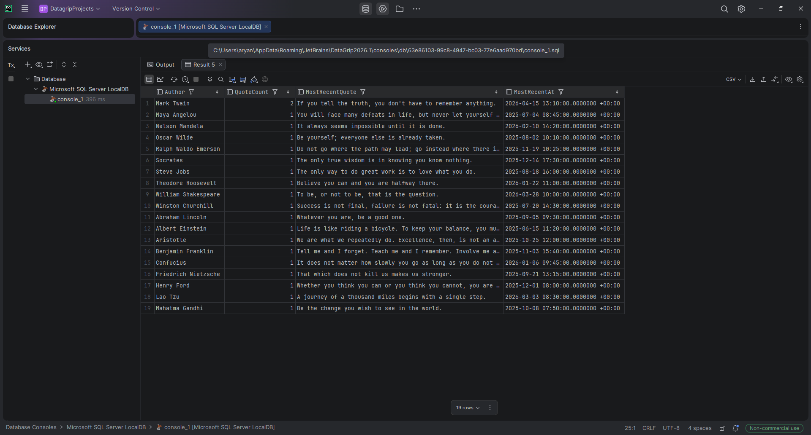

Query:

WITH AuthorStats AS (
    SELECT
        Author,
        COUNT(*)     AS QuoteCount,
        MAX(CreatedAt) AS LatestAt
    FROM [Quotes]
    GROUP BY Author
),
RankedQuotes AS (
    SELECT
        Author,
        Text,
        CreatedAt,
        ROW_NUMBER() OVER (PARTITION BY Author ORDER BY CreatedAt DESC) AS rn
    FROM [Quotes]
)
SELECT
    s.Author,
    s.QuoteCount,
    r.Text      AS MostRecentQuote,
    s.LatestAt  AS MostRecentAt
FROM AuthorStats s
JOIN RankedQuotes r ON r.Author = s.Author AND r.rn = 1
ORDER BY s.QuoteCount DESC;

Output:
#	Author	QuoteCount	MostRecentQuote	MostRecentAt
1	Mark Twain	2	If you tell the truth, you don't have to remember anything.	2026-04-15 13:10:00.0000000 +00:00
2	Maya Angelou	1	You will face many defeats in life, but never let yourself be defeated.	2025-07-04 08:45:00.0000000 +00:00
3	Nelson Mandela	1	It always seems impossible until it is done.	2026-02-10 14:20:00.0000000 +00:00
4	Oscar Wilde	1	Be yourself; everyone else is already taken.	2025-08-02 10:10:00.0000000 +00:00
5	Ralph Waldo Emerson	1	Do not go where the path may lead; go instead where there is no path and leave a trail.	2025-11-19 10:25:00.0000000 +00:00
6	Socrates	1	The only true wisdom is in knowing you know nothing.	2025-12-14 17:30:00.0000000 +00:00
7	Steve Jobs	1	The only way to do great work is to love what you do.	2025-08-18 16:00:00.0000000 +00:00
8	Theodore Roosevelt	1	Believe you can and you are halfway there.	2026-01-22 11:00:00.0000000 +00:00
9	William Shakespeare	1	To be, or not to be, that is the question.	2026-03-28 10:00:00.0000000 +00:00
10	Winston Churchill	1	Success is not final, failure is not fatal: it is the courage to continue that counts.	2025-07-20 14:30:00.0000000 +00:00

Output:
