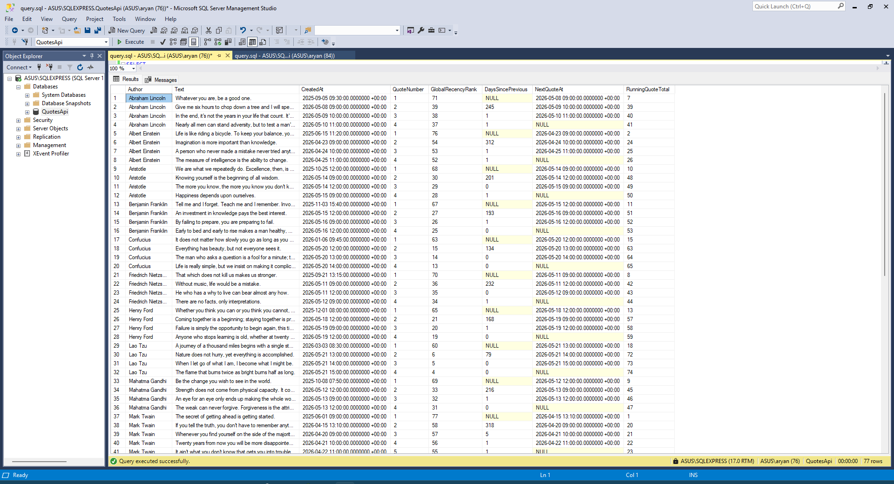

# Window Functions — Per-Author Quote Timeline

```sql
SELECT
    Author,
    Text,
    CreatedAt,

    -- Ordinal position of this quote within the author's timeline
    ROW_NUMBER() OVER (PARTITION BY Author ORDER BY CreatedAt)          AS QuoteNumber,

    -- Rank by recency across ALL quotes (ties share the same rank)
    RANK()       OVER (ORDER BY CreatedAt DESC)                         AS GlobalRecencyRank,

    -- Days since the author's previous quote (NULL for their first)
    DATEDIFF(
        day,
        LAG(CreatedAt) OVER (PARTITION BY Author ORDER BY CreatedAt),
        CreatedAt
    )                                                                    AS DaysSincePrevious,

    -- Next quote date for this author (NULL for their latest)
    LEAD(CreatedAt) OVER (PARTITION BY Author ORDER BY CreatedAt)       AS NextQuoteAt,

    -- Running total of quotes published so far, across all authors, ordered by time
    SUM(1) OVER (ORDER BY CreatedAt ROWS BETWEEN UNBOUNDED PRECEDING AND CURRENT ROW)
                                                                         AS RunningQuoteTotal

FROM [Quotes]
ORDER BY Author, CreatedAt;
```

# Output

|   | Author | Text | CreatedAt | QuoteNumber | GlobalRecencyRank | DaysSincePrevious | NextQuoteAt | RunningQuoteTotal |
|---|--------|------|-----------|-------------|-------------------|-------------------|-------------|-------------------|
| 1 | Abraham Lincoln | Whatever you are, be a good one. | 2025-09-05 09:30:00.0000000 +00:00 | 1 | 71 | | 2026-05-08 09:00:00.0000000 +00:00 | 7 |
| 2 | Abraham Lincoln | Give me six hours to chop down a tree and I will spend the first four sharpening the axe. | 2026-05-08 09:00:00.0000000 +00:00 | 2 | 39 | 245 | 2026-05-09 10:00:00.0000000 +00:00 | 39 |
| 3 | Abraham Lincoln | In the end, it's not the years in your life that count. It's the life in your years. | 2026-05-09 10:00:00.0000000 +00:00 | 3 | 38 | 1 | 2026-05-10 11:00:00.0000000 +00:00 | 40 |
| 4 | Abraham Lincoln | Nearly all men can stand adversity, but to test a man's character, give him power. | 2026-05-10 11:00:00.0000000 +00:00 | 4 | 37 | 1 | | 41 |
| 5 | Albert Einstein | Life is like riding a bicycle. To keep your balance, you must keep moving. | 2025-06-15 11:20:00.0000000 +00:00 | 1 | 76 | | 2026-04-23 09:00:00.0000000 +00:00 | 2 |
| 6 | Albert Einstein | Imagination is more important than knowledge. | 2026-04-23 09:00:00.0000000 +00:00 | 2 | 54 | 312 | 2026-04-24 10:00:00.0000000 +00:00 | 24 |
| 7 | Albert Einstein | A person who never made a mistake never tried anything new. | 2026-04-24 10:00:00.0000000 +00:00 | 3 | 53 | 1 | 2026-04-25 11:00:00.0000000 +00:00 | 25 |
| 8 | Albert Einstein | The measure of intelligence is the ability to change. | 2026-04-25 11:00:00.0000000 +00:00 | 4 | 52 | 1 | | 26 |
| 9 | Aristotle | We are what we repeatedly do. Excellence, then, is not an act, but a habit. | 2025-10-25 12:00:00.0000000 +00:00 | 1 | 68 | | 2026-05-14 09:00:00.0000000 +00:00 | 10 |
| 10 | Aristotle | Knowing yourself is the beginning of all wisdom. | 2026-05-14 09:00:00.0000000 +00:00 | 2 | 30 | 201 | 2026-05-14 12:00:00.0000000 +00:00 | 48 |

# Output Screenshot:
