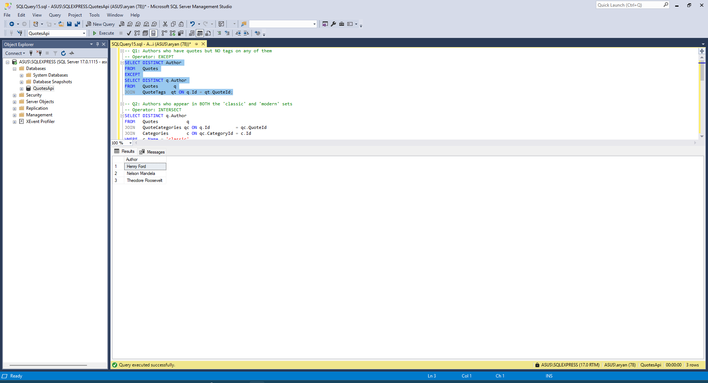
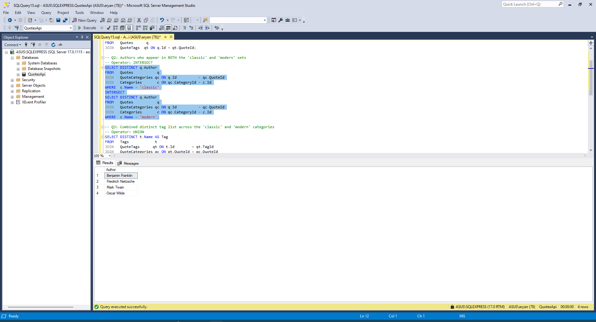
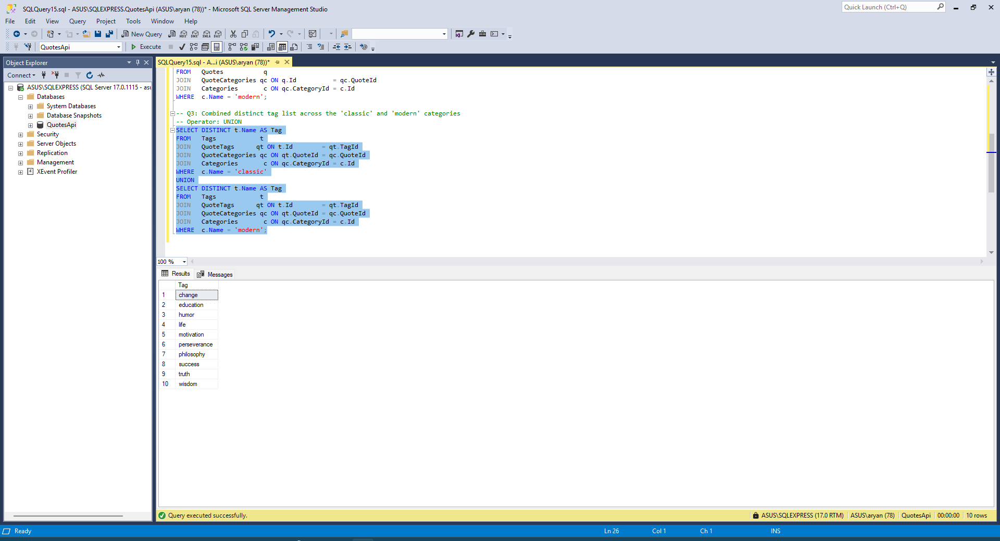

# Set Operators — Solution Notes

## Changes in Database
- Added Tables Categories, Tags, QuoteCategories, QuoteTags
- Added Tags to all quotes bar quotes of Henry Ford, Nelson Mandela and Theodore Roosevelt.
- Added Categories to all quotes. Most authors having quotes in either Classic or Modern. Only Benjamin Franklin, Friedrich Nietzsche, Mark Twain and Oscar Wilde having quotes in both.
---

## Q1 — Authors with quotes but no tags

```sql
SELECT DISTINCT Author AS "Authors with no quotes with Tags"
FROM   Quotes
EXCEPT
SELECT DISTINCT q.Author
FROM   Quotes      q
JOIN   QuoteTags  qt ON q.Id = qt.QuoteId;
```

Operator: EXCEPT. Reason: The result is the set of all quote authors minus the set of authors who have at least one tagged quote. EXCEPT performs exactly that subtraction between two result sets. A LEFT JOIN with a NULL check produces the same rows but mixes filtering logic into what is structurally a set-difference operation.

Output:
	Authors with no quotes with Tags
1	Henry Ford
2	Nelson Mandela
3	Theodore Roosevelt



---

## Q2 — Authors in both 'classic' and 'modern'

```sql
SELECT DISTINCT q.Author AS "Authors with both Classic and Modern quotes."
FROM   Quotes           q
JOIN   QuoteCategories qc ON q.Id          = qc.QuoteId
JOIN   Categories       c ON qc.CategoryId = c.Id
WHERE  c.Name = 'classic'
INTERSECT
SELECT DISTINCT q.Author
FROM   Quotes           q
JOIN   QuoteCategories qc ON q.Id          = qc.QuoteId
JOIN   Categories       c ON qc.CategoryId = c.Id
WHERE  c.Name = 'modern';
```

Operator: INTERSECT. Reason: INTERSECT returns only rows that appear in both result sets, which directly matches the condition of an author having quotes in both categories. A self-join or EXISTS subquery can produce the same output but encodes set membership as a filter rather than as a set operation. INTERSECT keeps both sides structurally parallel and is the natural operator for set intersection.



Output:
	Authors with both Classic and Modern quotes.
1	Benjamin Franklin
2	Friedrich Nietzsche
3	Mark Twain
4	Oscar Wilde

---

## Q3 — Combined distinct tag list across 'classic' and 'modern'

```sql
SELECT DISTINCT t.Name AS "Distinct Tags"
FROM   Tags            t
JOIN   QuoteTags      qt ON t.Id        = qt.TagId
JOIN   QuoteCategories qc ON qt.QuoteId = qc.QuoteId
JOIN   Categories       c ON qc.CategoryId = c.Id
WHERE  c.Name = 'classic'
UNION
SELECT DISTINCT t.Name
FROM   Tags            t
JOIN   QuoteTags      qt ON t.Id        = qt.TagId
JOIN   QuoteCategories qc ON qt.QuoteId = qc.QuoteId
JOIN   Categories       c ON qc.CategoryId = c.Id
WHERE  c.Name = 'modern';

```

Operator: UNION. Reason: UNION merges two result sets and removes duplicate rows, so tags shared between classic and modern quotes appear exactly once in the output. UNION ALL is not suitable here because it preserves duplicates, inflating the list beyond the distinct set of tags. UNION is the correct operator when the goal is a combined, deduplicated collection from multiple sets.

Output:
	Distinct Tags
1	change
2	education
3	humor
4	life
5	motivation
6	perseverance
7	philosophy
8	success
9	truth
10	wisdom


