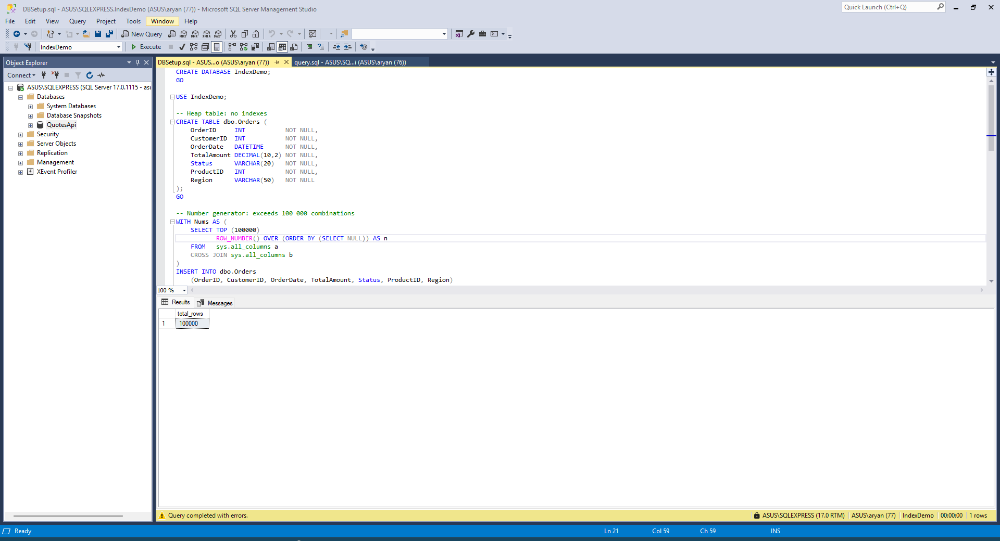
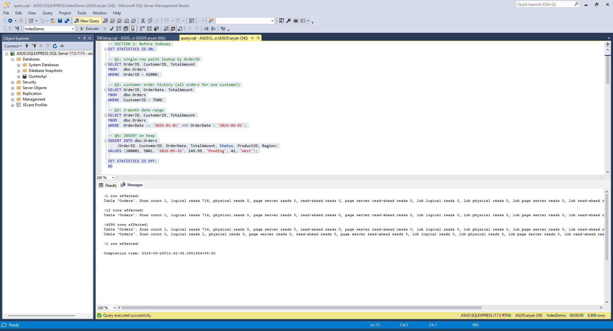
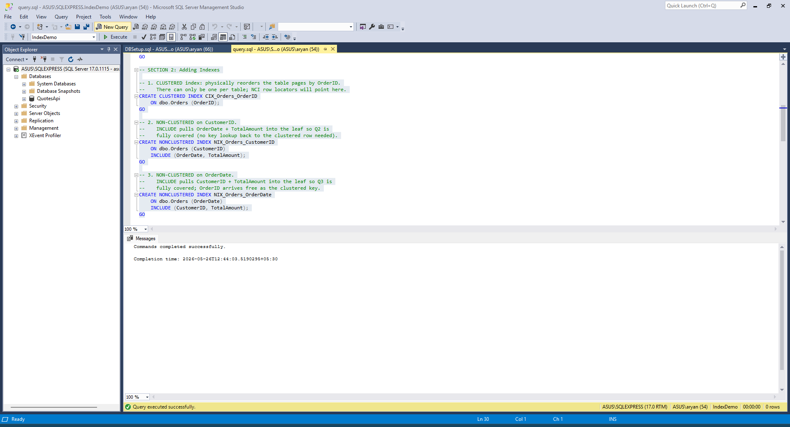
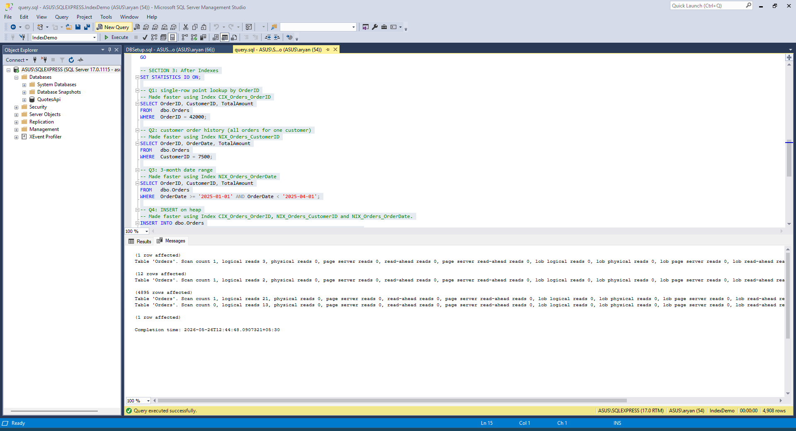

# Index DDL:

```sql
-- 1. CLUSTERED index on OrderID
CREATE CLUSTERED INDEX CIX_Orders_OrderID
    ON dbo.Orders (OrderID);
GO

-- 2. NON-CLUSTERED on CustomerID.
CREATE NONCLUSTERED INDEX NIX_Orders_CustomerID
    ON dbo.Orders (CustomerID)
    INCLUDE (OrderDate, TotalAmount);
GO

-- 3. NON-CLUSTERED on OrderDate.
CREATE NONCLUSTERED INDEX NIX_Orders_OrderDate
    ON dbo.Orders (OrderDate)
    INCLUDE (CustomerID, TotalAmount);
GO
```

# Queries using Indexes:
1. Read Query using CIX_Orders_OrderID:
```sql
-- Q1: single-row point lookup by OrderID
-- Made faster using Index CIX_Orders_OrderID
SELECT OrderID, CustomerID, TotalAmount
FROM   dbo.Orders
WHERE  OrderID = 42000;
```

Logical Reads Before: 716

Statistics IO:
```txt
(1 row affected)
Table 'Orders'. Scan count 1, logical reads 716, physical reads 0, page server reads 0, read-ahead reads 0, page server read-ahead reads 0, lob logical reads 0, lob physical reads 0, lob page server reads 0, lob read-ahead reads 0, lob page server read-ahead reads 0.
```

Logical Reads After: 3

Statistics IO:
```txt
(1 row affected)
Table 'Orders'. Scan count 1, logical reads 3, physical reads 0, page server reads 0, read-ahead reads 0, page server read-ahead reads 0, lob logical reads 0, lob physical reads 0, lob page server reads 0, lob read-ahead reads 0, lob page server read-ahead reads 0.
```

2. Read Query using CIX_Orders_OrderID:
```sql
-- Q2: customer order history (all orders for one customer)
-- Made faster using Index NIX_Orders_CustomerID
SELECT OrderID, OrderDate, TotalAmount
FROM   dbo.Orders
WHERE  CustomerID = 7500;
```

Logical Reads Before: 716

Statistics IO:
```txt
(12 rows affected)
Table 'Orders'. Scan count 1, logical reads 716, physical reads 0, page server reads 0, read-ahead reads 0, page server read-ahead reads 0, lob logical reads 0, lob physical reads 0, lob page server reads 0, lob read-ahead reads 0, lob page server read-ahead reads 0.
```

Logical Reads After: 2

Statistics IO:
```txt
(12 rows affected)
Table 'Orders'. Scan count 1, logical reads 2, physical reads 0, page server reads 0, read-ahead reads 0, page server read-ahead reads 0, lob logical reads 0, lob physical reads 0, lob page server reads 0, lob read-ahead reads 0, lob page server read-ahead reads 0.
```

3. Read Query using CIX_Orders_OrderID:
```sql
-- Q3: 3-month date range
-- Made faster using Index NIX_Orders_OrderDate
SELECT OrderID, CustomerID, TotalAmount
FROM   dbo.Orders
WHERE  OrderDate >= '2025-01-01' AND OrderDate < '2025-04-01';
```

Logical Reads Before: 716

Statistics IO:
```txt
(4895 rows affected)
Table 'Orders'. Scan count 1, logical reads 716, physical reads 0, page server reads 0, read-ahead reads 0, page server read-ahead reads 0, lob logical reads 0, lob physical reads 0, lob page server reads 0, lob read-ahead reads 0, lob page server read-ahead reads 0.
```

Logical Reads After: 21

Statistics IO:
```txt
(4895 rows affected)
Table 'Orders'. Scan count 1, logical reads 21, physical reads 0, page server reads 0, read-ahead reads 0, page server read-ahead reads 0, lob logical reads 0, lob physical reads 0, lob page server reads 0, lob read-ahead reads 0, lob page server read-ahead reads 0.
```

4. Write Query using all 3 indexes. CIX_Orders_OrderID, NIX_Orders_CustomerID and NIX_Orders_OrderDate:
```sql
-- Q4: INSERT on heap
-- Made faster using Index CIX_Orders_OrderID, NIX_Orders_CustomerID and NIX_Orders_OrderDate.
INSERT INTO dbo.Orders
    (OrderID, CustomerID, OrderDate, TotalAmount, Status, ProductID, Region)
VALUES (100002, 5001, '2026-05-26', 149.99, 'Pending', 42, 'West');
```

Logical Reads Before: 1

Statistics IO:
```txt
Table 'Orders'. Scan count 0, logical reads 1, physical reads 0, page server reads 0, read-ahead reads 0, page server read-ahead reads 0, lob logical reads 0, lob physical reads 0, lob page server reads 0, lob read-ahead reads 0, lob page server read-ahead reads 0.

(1 row affected)
```

Logical Reads After: 13

Statistics IO:
```txt
Table 'Orders'. Scan count 0, logical reads 13, physical reads 0, page server reads 0, read-ahead reads 0, page server read-ahead reads 0, lob logical reads 0, lob physical reads 0, lob page server reads 0, lob read-ahead reads 0, lob page server read-ahead reads 0.

(1 row affected)
```

# Observation on Write side cost:
A single INSERT that cost 1 logical write on the heap now costs 3 logical writes due to the overhead of maintaining the three indexes, thus every index added is a direct tax on write throughput.

Output Screenshots:

1. Database Creation:


2. Queries before Index IO Output:


3. Adding Index:


4. Queries after Index IO Output:
