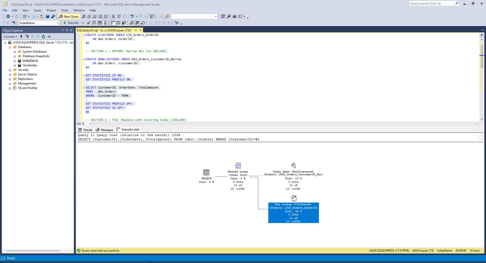
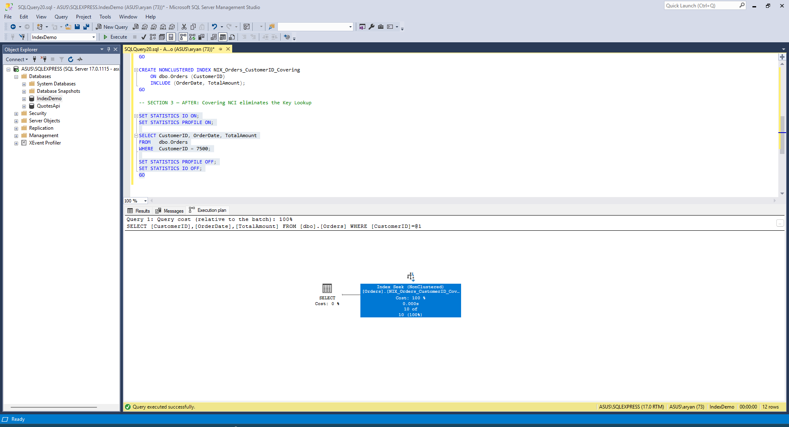

# Execultion Plan Before INCLUDE:


# INCLUDE Query:
```sql
DROP INDEX NIX_Orders_CustomerID_Narrow ON dbo.Orders;
GO

CREATE NONCLUSTERED INDEX NIX_Orders_CustomerID_Covering
    ON dbo.Orders (CustomerID)
    INCLUDE (OrderDate, TotalAmount);
GO
```

# Execution Plan After INCLUDE:


# Logical Reads Delta:

|                | Logical Reads     |
|----------------|-------------------|
| Before INCLUDE | 23                |
| After INCLUDE  | 2                 |
| **Delta**      | **= 23 - 2 = 21** |

# Full Output:

## Before INCLUDE
```sql
-- SECTION 1 — Before INCLUDE
CREATE NONCLUSTERED INDEX NIX_Orders_CustomerID_Narrow
    ON dbo.Orders (CustomerID);
GO
```

```txt
Commands completed successfully.

Completion time: 2026-05-26T17:32:32.8950614+05:30
```

```sql
SET STATISTICS IO ON;
SET STATISTICS PROFILE ON;

SELECT CustomerID, OrderDate, TotalAmount
FROM   dbo.Orders
WHERE  CustomerID = 7500;

SET STATISTICS PROFILE OFF;
SET STATISTICS IO OFF;
GO
```

Statistics IO:

```txt
(7 rows affected)
Table 'Orders'. Scan count 1, logical reads 23, physical reads 0, page server reads 0, read-ahead reads 0, page server read-ahead reads 0, lob logical reads 0, lob physical reads 0, lob page server reads 0, lob read-ahead reads 0, lob page server read-ahead reads 0.

(4 rows affected)

Completion time: 2026-05-26T17:32:58.5937295+05:30
```

Statistics Profile:

| Row | Rows | Executes | StmtText |
|-----|------|----------|----------|
| 1 | 7 | 1 | `SELECT [CustomerID],[OrderDate],[TotalAmount] FROM [dbo].[Orders] WHERE [CustomerID]=@1` |
| 2 | 7 | 1 | `\|--Nested Loops(Inner Join, OUTER REFERENCES:([Uniq1001], [IndexDemo].[dbo].[Orders].[OrderID]))` |
| 3 | 7 | 1 | `\|--Index Seek(OBJECT:([IndexDemo].[dbo].[Orders].[NIX_Orders_CustomerID_Narrow]), SEEK:([IndexDemo].[dbo].[Orders].[CustomerID]=(7500)) ORDERED FORWARD)` |
| 4 | 7 | 7 | `\|--Clustered Index Seek(OBJECT:([IndexDemo].[dbo].[Orders].[CIX_Orders_OrderID]), SEEK:([IndexDemo].[dbo].[Orders].[OrderID]=[IndexDemo].[dbo].[Orders].[OrderID] AND [Uniq1001]=[Uniq1001]) LOOKUP ORDERED FORWARD)` |

## Include 
```sql
-- SECTION 2 — INCLUDE DDL
DROP INDEX NIX_Orders_CustomerID_Narrow ON dbo.Orders;
GO

CREATE NONCLUSTERED INDEX NIX_Orders_CustomerID_Covering
    ON dbo.Orders (CustomerID)
    INCLUDE (OrderDate, TotalAmount);
GO
```
```txt
Commands completed successfully.

Completion time: 2026-05-26T17:34:55.8722372+05:30
```

## After INCLUDE
```sql
-- SECTION 3 — After INCLUDE
SET STATISTICS IO ON;
SET STATISTICS PROFILE ON;

SELECT CustomerID, OrderDate, TotalAmount
FROM   dbo.Orders
WHERE  CustomerID = 7500;

SET STATISTICS PROFILE OFF;
SET STATISTICS IO OFF;
GO
```

Statistics IO:

```txt
7 rows affected)
Table 'Orders'. Scan count 1, logical reads 2, physical reads 0, page server reads 0, read-ahead reads 0, page server read-ahead reads 0, lob logical reads 0, lob physical reads 0, lob page server reads 0, lob read-ahead reads 0, lob page server read-ahead reads 0.

(2 rows affected)

(1 row affected)

Completion time: 2026-05-26T17:36:00.2449850+05:30
```

Statistics Profile:

| Row | Rows | Executes | StmtText |
|-----|------|----------|----------|
| 1 | 7 | 1 | `SELECT [CustomerID],[OrderDate],[TotalAmount] FROM [dbo].[Orders] WHERE [CustomerID]=@1` |
| 2 | 7 | 1 | `\|--Index Seek(OBJECT:([IndexDemo].[dbo].[Orders].[NIX_Orders_CustomerID_Covering]), SEEK:([IndexDemo].[dbo].[Orders].[CustomerID]=CONVERT_IMPLICIT(int,[@1],0)) ORDERED FORWARD)` |