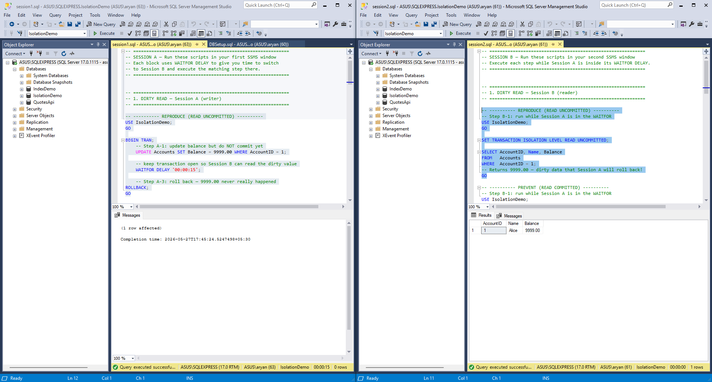
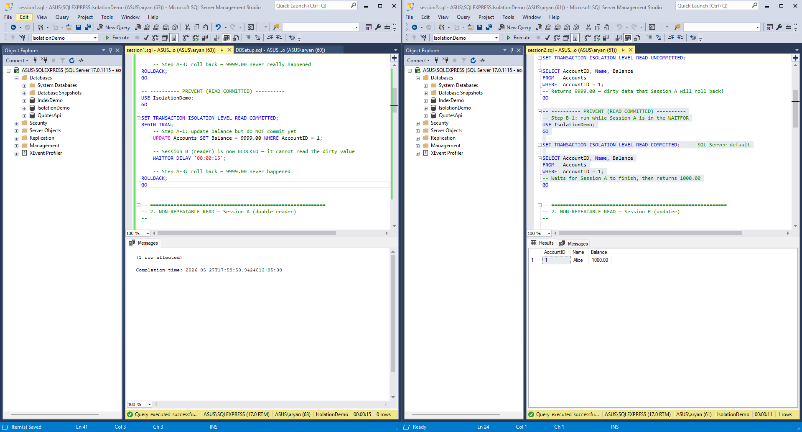
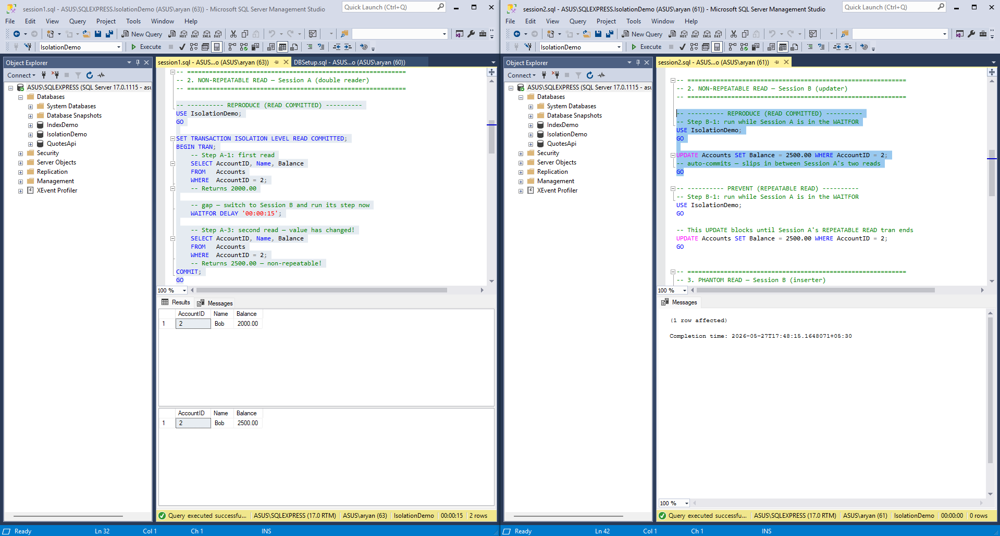
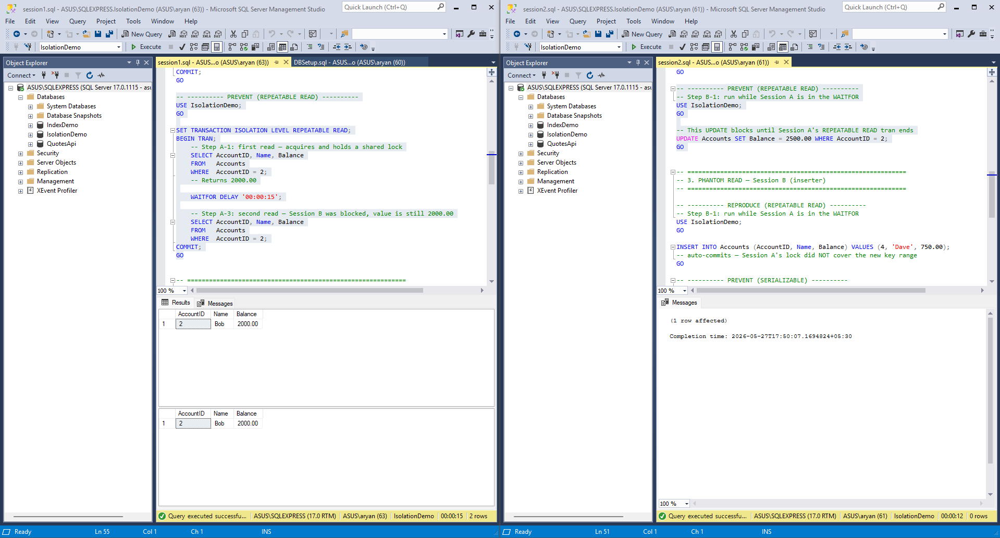
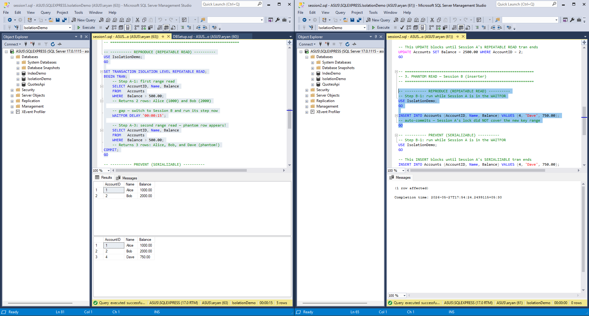
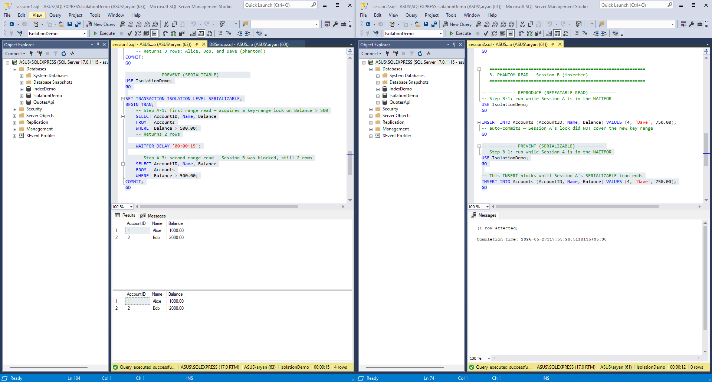

# Queries

## 1. Dirty Read

### Session A (writer)

```sql
-- ---------- REPRODUCE (READ UNCOMMITTED) ----------
USE IsolationDemo;
GO

BEGIN TRAN;
    -- Step A-1: update balance but do NOT commit yet
    UPDATE Accounts SET Balance = 9999.00 WHERE AccountID = 1;

    -- keep transaction open so Session B can read the dirty value
    WAITFOR DELAY '00:00:15';

    -- Step A-3: roll back — 9999.00 never really happened
ROLLBACK;
GO
```

### Session B (reader)

```sql
-- ---------- REPRODUCE (READ UNCOMMITTED) ----------
-- Step B-1: run while Session A is in the WAITFOR
USE IsolationDemo;
GO

SET TRANSACTION ISOLATION LEVEL READ UNCOMMITTED;

SELECT AccountID, Name, Balance
FROM   Accounts
WHERE  AccountID = 1;
-- Returns 9999.00 — dirty data that Session A will roll back!
GO

-- ---------- PREVENT (READ COMMITTED) ----------
-- Step B-1: run while Session A is in the WAITFOR
USE IsolationDemo;
GO

SET TRANSACTION ISOLATION LEVEL READ COMMITTED;   -- SQL Server default

SELECT AccountID, Name, Balance
FROM   Accounts
WHERE  AccountID = 1;
-- Waits for Session A to finish, then returns 1000.00
GO
```

---

## 2. Non-Repeatable Read

### Session A (double reader)

```sql
-- ---------- REPRODUCE (READ COMMITTED) ----------
USE IsolationDemo;
GO

SET TRANSACTION ISOLATION LEVEL READ COMMITTED;
BEGIN TRAN;
    -- Step A-1: first read
    SELECT AccountID, Name, Balance
    FROM   Accounts
    WHERE  AccountID = 2;
    -- Returns 2000.00

    -- gap — switch to Session B and run its step now
    WAITFOR DELAY '00:00:15';

    -- Step A-3: second read — value has changed!
    SELECT AccountID, Name, Balance
    FROM   Accounts
    WHERE  AccountID = 2;
    -- Returns 2500.00 — non-repeatable!
COMMIT;
GO

-- ---------- PREVENT (REPEATABLE READ) ----------
USE IsolationDemo;
GO

SET TRANSACTION ISOLATION LEVEL REPEATABLE READ;
BEGIN TRAN;
    -- Step A-1: first read — acquires and holds a shared lock
    SELECT AccountID, Name, Balance
    FROM   Accounts
    WHERE  AccountID = 2;
    -- Returns 2000.00

    WAITFOR DELAY '00:00:15';

    -- Step A-3: second read — Session B was blocked, value is still 2000.00
    SELECT AccountID, Name, Balance
    FROM   Accounts
    WHERE  AccountID = 2;
COMMIT;
GO
```

### Session B (updater)

```sql
-- ---------- REPRODUCE (READ COMMITTED) ----------
-- Step B-1: run while Session A is in the WAITFOR
USE IsolationDemo;
GO

UPDATE Accounts SET Balance = 2500.00 WHERE AccountID = 2;
-- auto-commits — slips in between Session A's two reads
GO

-- ---------- PREVENT (REPEATABLE READ) ----------
-- Step B-1: run while Session A is in the WAITFOR
USE IsolationDemo;
GO

-- This UPDATE blocks until Session A's REPEATABLE READ tran ends
UPDATE Accounts SET Balance = 2500.00 WHERE AccountID = 2;
GO
```

---

## 3. Phantom Read

### Session A (range reader)

```sql
-- ---------- REPRODUCE (REPEATABLE READ) ----------
USE IsolationDemo;
GO

SET TRANSACTION ISOLATION LEVEL REPEATABLE READ;
BEGIN TRAN;
    -- Step A-1: first range read
    SELECT AccountID, Name, Balance
    FROM   Accounts
    WHERE  Balance > 500.00;
    -- Returns 2 rows: Alice (1000) and Bob (2000)

    -- gap — switch to Session B and run its step now
    WAITFOR DELAY '00:00:15';

    -- Step A-3: second range read — phantom row appears!
    SELECT AccountID, Name, Balance
    FROM   Accounts
    WHERE  Balance > 500.00;
    -- Returns 3 rows: Alice, Bob, and Dave (phantom!)
COMMIT;
GO

-- ---------- PREVENT (SERIALIZABLE) ----------
USE IsolationDemo;
GO

SET TRANSACTION ISOLATION LEVEL SERIALIZABLE;
BEGIN TRAN;
    -- Step A-1: first range read — acquires a key-range lock on Balance > 500
    SELECT AccountID, Name, Balance
    FROM   Accounts
    WHERE  Balance > 500.00;
    -- Returns 2 rows

    WAITFOR DELAY '00:00:15';

    -- Step A-3: second range read — Session B was blocked, still 2 rows
    SELECT AccountID, Name, Balance
    FROM   Accounts
    WHERE  Balance > 500.00;
COMMIT;
GO
```

### Session B (inserter)

```sql
-- ---------- REPRODUCE (REPEATABLE READ) ----------
-- Step B-1: run while Session A is in the WAITFOR
USE IsolationDemo;
GO

INSERT INTO Accounts (AccountID, Name, Balance) VALUES (4, 'Dave', 750.00);
-- auto-commits — Session A's lock did NOT cover the new key range
GO

-- ---------- PREVENT (SERIALIZABLE) ----------
-- Step B-1: run while Session A is in the WAITFOR
USE IsolationDemo;
GO

-- This INSERT blocks until Session A's SERIALIZABLE tran ends
INSERT INTO Accounts (AccountID, Name, Balance) VALUES (4, 'Dave', 750.00);
GO
```

## Isolation Level Ladder (SQL Server)

| Level | Dirty Read | Non-Repeatable Read | Phantom Read |
|---|---|---|---|
| READ UNCOMMITTED | can happen | can happen | can happen |
| READ COMMITTED *(default)* | prevented | can happen | can happen |
| REPEATABLE READ | prevented | prevented | can happen |
| SERIALIZABLE | prevented | prevented |  prevented |

## Anomaly → Lowest Level That Prevents It

| Anomaly | Lowest isolation level that prevents it | Mechanism |
|---|---|---|
| Dirty Read | **READ COMMITTED** | Shared lock held until the read completes; uncommitted rows are never visible |
| Non-Repeatable Read | **REPEATABLE READ** | Shared locks on read rows are **held until the transaction ends**; blocks concurrent UPDATEs on those rows |
| Phantom Read | **SERIALIZABLE** | Key-range locks block INSERTs and DELETEs in the scanned range until the transaction ends |

Outputs:

## 1. Dirty Read 
- Reproduce

- Prevent


## 2. Non-Repeatable Read 
- Reproduce

- Prevent


## 3. Phantom Read 
- Reproduce

- Prevent
