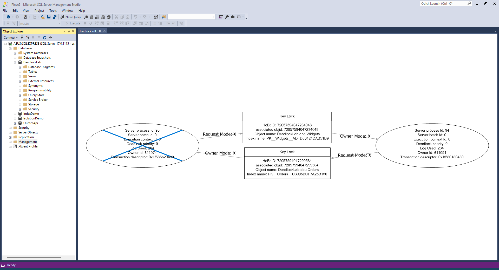

## Repro Scripts

**session1.sql** — lock order: Widgets → Orders
```sql
USE DeadlockLab;
GO
BEGIN TRANSACTION;
    UPDATE dbo.Widgets SET Stock = Stock - 1 WHERE WidgetId = 1;
    WAITFOR DELAY '00:00:05';
    UPDATE dbo.Orders  SET Qty   = Qty   + 1 WHERE OrderId  = 101;
COMMIT TRANSACTION;
```

**session2.sql** — lock order: Orders → Widgets (reversed)
```sql
USE DeadlockLab;
GO
BEGIN TRANSACTION;
    UPDATE dbo.Orders  SET Qty   = Qty   + 1 WHERE OrderId  = 101;
    WAITFOR DELAY '00:00:05';
    UPDATE dbo.Widgets SET Stock = Stock - 1 WHERE WidgetId = 1;
COMMIT TRANSACTION;
```

---

## Deadlock Graph



The victim session receives:
```
Msg 1205, Level 13, State 51, Line 1
Transaction (Process ID 57) was deadlocked on lock resources with another
process and has been chosen as the deadlock victim. Rerun the transaction.
```

## Fix

Both sessions acquire locks in the same order (Widgets → Orders):

```sql
BEGIN TRANSACTION;
    UPDATE dbo.Widgets SET Stock = Stock - 1 WHERE WidgetId = 1;
    UPDATE dbo.Orders  SET Qty   = Qty   + 1 WHERE OrderId  = 101;
COMMIT TRANSACTION;
```

## Why it works: 
Consistent lock ordering breaks the circular wait — Session B blocks on Widgets until Session A commits, so it never holds Orders while waiting, making a cycle impossible.