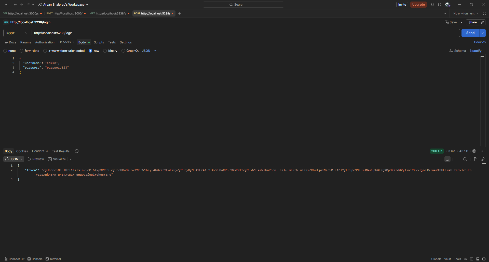
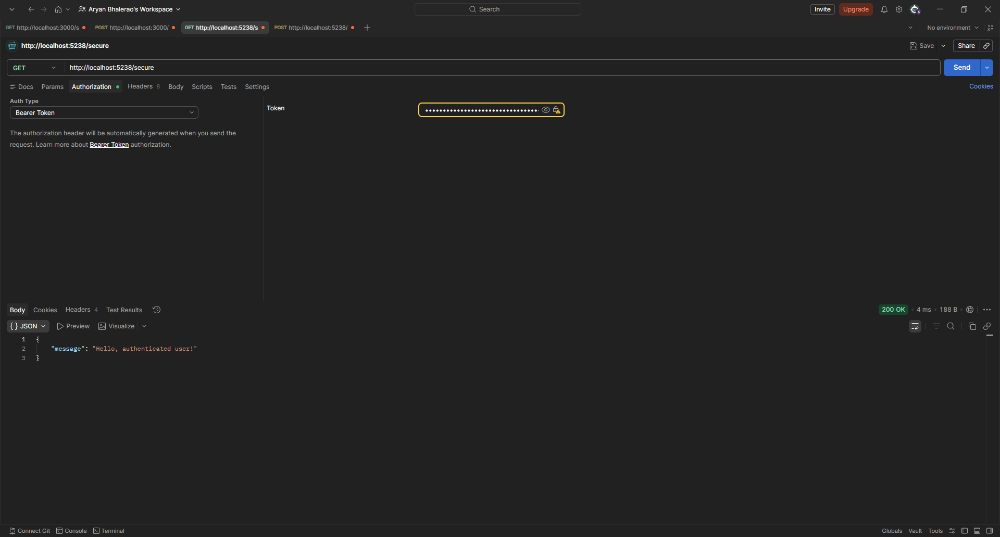
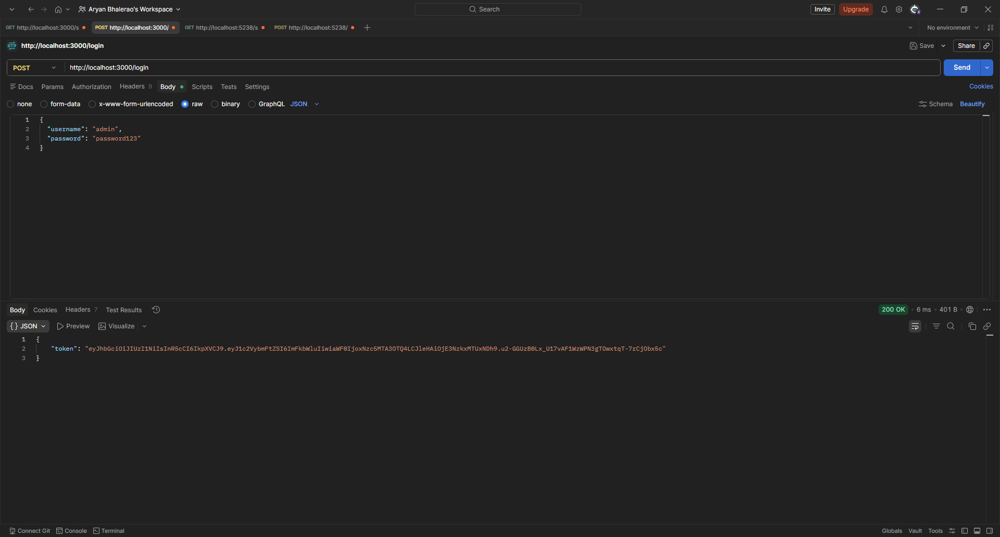
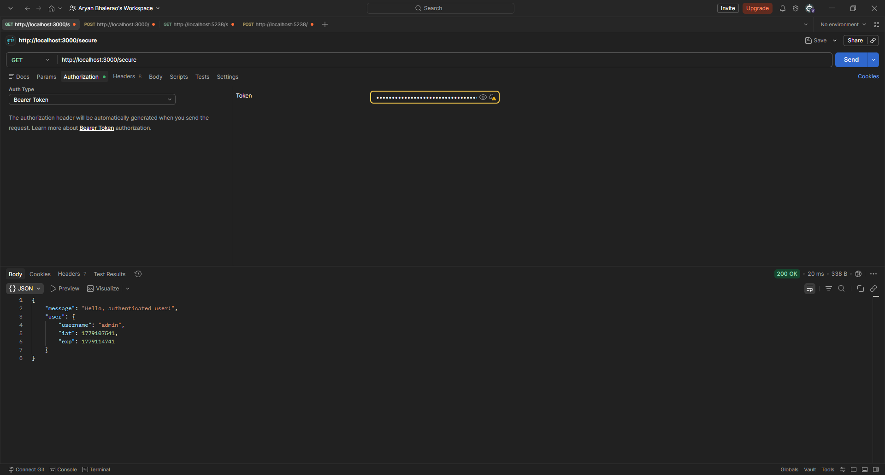

# Day One

## Piece 1
PS C:\Users\aryan> dotnet --version
10.0.300
PS C:\Users\aryan> node --version
v24.15.0
PS C:\Users\aryan> git --version
git version 2.53.0.windows.1
PS C:\Users\aryan> ng version | Select-Object -First 15

     _                      _                 ____ _     ___
    / \   _ __   __ _ _   _| | __ _ _ __     / ___| |   |_ _|
   / Γû│ \ | '_ \ / _` | | | | |/ _` | '__|   | |   | |    | |
  / ___ \| | | | (_| | |_| | | (_| | |      | |___| |___ | |
 /_/   \_\_| |_|\__, |\__,_|_|\__,_|_|       \____|_____|___|
                |___/

Angular CLI       : 21.2.11
Node.js           : 24.15.0
Package Manager   : npm 11.12.1
Operating System  : win32 x64

PS C:\Users\aryan> claude --version
2.1.143 (Claude Code)

## Piece 2
PS C:\Users\aryan\Desktop\Thinkbridge\D1P2> node hello.js
hello
PS C:\Users\aryan\Desktop\Thinkbridge\D1P2> dotnet run hello.cs
hello

## Piece 3
Built a Minimal Login API using ASP .NET 10. 
API Endpoints: 
POST /login 

GET /secure

## Piece 4
Built a minimal Login API using Node.js with typescript strict.
API Endpoints:
POST /login

GET /secure
